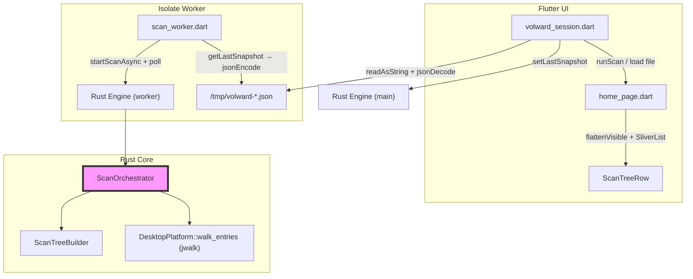
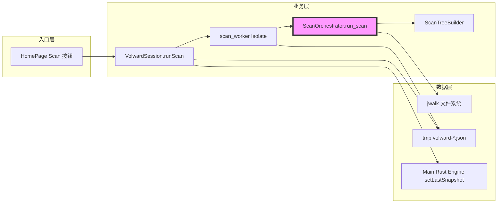

# 代码质量审查报告

## 一、基本信息

| 项目 | 内容 |
| :--- | :--- |
| **分支名称** | main |
| **审查时间** | 2026-07-23 14:01 |
| **变更规模** | 13 files changed (+842/-174)；另含 9 个未跟踪新文件（scan_tree 模块、FDA 配置、设计文档） |
| **变更类型** | 新功能 / 性能优化 / 安全加固 |
| **模型型号** | Composer |

---

## 二、变更说明

### 变更概述

**变更主题**：
1. **全量扫描与目录树 snapshot（v2）**：移除 500 条上限与 MAX_DEPTH，Rust 侧构建 `ScanTreeNode` + `ScanStats`，Flutter 侧树形展示与虚拟滚动
2. **大 snapshot 落盘传输**：Isolate 扫描完成后写 `${tmp}/volward-*.json`，主线程异步读文件加载，避免 SendPort 传递巨型 Map
3. **macOS Full Disk Access 引导**：entitlements 去 sandbox、Swift MethodChannel 打开系统设置、UI 权限说明
4. **Home 页 UI 重构**：flat 列表改为 Finder 风格树（展开/筛选/排序），紧凑化 Apple 组件间距

**核心目的**：让用户在单次 Home（或自选目录）扫描后，能浏览**无条数上限**的目录树与文件元数据，替代原先 500 条 flat 截断列表。

**变更类型**：新功能

### 变更明细

#### 全量扫描与目录树展示 (⚠️)

**改动总结**：Rust `ScanOrchestrator` 在 walk 时为每个目录调用 `ensure_dir`、为每个文件 classify 并 `insert_file`，产出含 `tree` + `entries` + `stats` 的 `StorageSnapshot`；Flutter `home_page` 用 `flattenVisible` + `SliverList.builder` 渲染可展开树，支持 Cache/Deletable 筛选。

**架构图**



**关键改动点**：
- 删除 `MAX_ENTRIES=500` 与 `MAX_DEPTH=8`，`stats.truncated` 仅在 Cancel 时为 true
- 新增 `scan_tree.rs` / `scan_tree.dart` / `scan_tree_filter.dart` / `scan_tree_flatten.dart`
- 扫描完成路径：`Isolate 写盘 → 主线程读盘 → _syncSnapshotToEngine`

**副作用（如有）**：
- **DB**：无
- **缓存**：临时 JSON 文件扫描后读入即删
- **MQ**：无

#### macOS FDA 与权限探测 (👀)

**一句话总结**：去除 App Sandbox、增加 FDA 探测读 `~/Library/Safari/Bookmarks.plist` 与「Open Settings」入口，使 deep scan 可读更多 `~/Library` 路径。

#### UI 紧凑化与 Apple 组件 (👀)

**一句话总结**：收紧 `home_page` / `apple_widgets` 间距与布局，不影响扫描链路。

---

## 三、影响面分析

**影响概述**：
- **对用户**：扫描结果从「最多 500 文件 flat 列表」变为「可展开目录树 + 全量 stats 摘要」；默认扫描 **Home 目录**（非整颗物理磁盘）；需手动点击展开更深层级；Cache 筛选仍按路径规则匹配
- **对业务**：支持按目录层级理解空间占用，删除流程仍依赖 flat `entries` + 主 Engine snapshot
- **对系统**：单次 Home 全扫内存与 JSON 体积显著上升；jwalk 遍历时间与 UI 树构建/排序成本随文件数线性增长

**业务功能影响概述**：
1. **目录树浏览** - 影响高，兼容性需调用方适配（snapshot 新增 `tree`/`stats` 字段），风险点：大 Home 扫描内存与 UI 卡顿
2. **文件分类与删除** - 影响中，兼容性完全兼容（`entries` 结构未变），风险点：主 Engine 需 rehydrate 完整 snapshot
3. **权限与 FDA** - 影响中，兼容性完全兼容，风险点：无 FDA 时部分 `~/Library` 子树仍不可见且**无逐路径提示**

**主链路**：Home 页 Scan → Isolate `volwardScanIsolate` → Rust `run_scan` / jwalk → 写 tmp JSON → `VolwardSession._loadSnapshotFromFile` → `home_page._displayTree` → `SliverList.builder`

**调用链路图**



### 核心影响点明细

| 影响点 | 影响类型 | 风险等级 | 说明 | 验证/缓解 |
| :----- | :------- | :------- | :--- | :-------- |
| 全量 snapshot 内存峰值 | 性能/稳定性 | ❗ | Isolate 内 `getLastSnapshot` 解析整份 JSON 为 Map 再 `jsonEncode` 写盘；主线程再次 `readAsString`+`jsonDecode`+`setLastSnapshot` 序列化 | 大 Home 实机扫描；建议 Rust 直写文件路径 FFI |
| 权限不可见路径 | 功能完整性 | ⚠️ | `walk_entries` 对 jwalk 错误与 metadata 失败静默 `continue`，子树不出现在 tree 中 | 对比 Finder + 查看 `stats.paths_seen`；开启 FDA |
| 树 UI 渲染性能 | 性能 | ⚠️ | 每次 `build()` 调用 `_sortTree` 深拷贝整棵树；`flattenVisible` 在展开大子树时 O(可见节点) | 展开 Documents/Downloads 大目录 profiling |
| 扫描范围语义 | 产品预期 | 👀 | 默认 root 为 `$HOME`，非「整盘」；用户可选文件夹 | 文档/文案说明扫描根 |
| 删除链路 | 功能 | 👀 | 依赖 `_syncSnapshotToEngine` 将完整 snapshot 灌回主 Engine | 选文件 → Delete dry-run → 实删 |

### 风险评估

| 风险点 | 风险等级 | 影响描述 | 缓解措施 |
| :----- | :------- | :------- | :------- |
| 大 Home 扫描 Isolate/主线程 OOM | ❗ | 扫描在 Rust 已完成，但 Flutter 侧无法加载/展示 snapshot，用户看到空结果或崩溃 | Rust 侧写文件跳过 Dart Map；主线程按路径加载或流式解析 |
| 无 FDA 时目录树不完整 | ⚠️ | 用户以为已「全量」浏览，实际缺少受 TCC 保护的 `~/Library` 等路径 | UI 展示 `warnings`/`stats`；FDA banner；可选 skipped 计数 |
| 深层目录默认折叠 | 👀 | 初次仅 auto-expand root + 前 3 个子目录， deeper 需手动点击 | 符合 Finder 预期；可加「Expand all」 |
| 混合未提交改动 | 👀 | 同一 diff 含扫描/FDA/UI/entitlements，审查与回滚粒度粗 | 按功能拆分 commit |

### 兼容性声明（如有）

- **API/DTO**：`StorageSnapshot` 新增 `tree: ScanTreeNode`、`stats: ScanStats`；`entries` 字段与 delete 契约不变；旧客户端忽略新字段仍可读 entries
- **数据**：无持久化 DB；tmp JSON 一次性，读后删除

### 验收结论（针对「能否查阅全盘目录/文件并正常展示」）

| 维度 | 结论 |
| :--- | :--- |
| **扫描范围** | ✅ 扫描 root 内**所有 jwalk 可访问**的路径，无 500 条上限；❌ 默认 **Home 非整盘**；❌ 权限拒绝路径**静默缺失** |
| **目录信息** | ✅ 目录节点含 name/path/aggregated size/fileCount；✅ 空目录通过 `ensure_dir` 保留 |
| **文件信息** | ✅ 叶子节点关联 `entries` 中 category/size/deletable；✅ Cache 筛选可用 |
| **展示能力** | ✅ 树形展开 + 虚拟列表架构正确；⚠️ 大 snapshot 可能无法完成加载或 UI 卡顿；⚠️ 未做 Home 全扫实机验收 |
| **自动化测试** | ✅ `cargo test --workspace` 13 passed；✅ `fvm flutter test` 5 passed |

**综合判定**：在**中等规模 Home**、已授予 FDA、扫描成功落盘的前提下，**可以**查阅扫描 root 下完整（可访问）目录树并正常展示；对**超大 Home** 或**无 FDA** 场景，功能链路已实现但**稳定性与完整性存在明确风险**，合并前建议实机 Home 全扫验收。

---

## 四、问题清单

### 🔴 Critical（必须立即修复）

（无）

### 🟠 High（合并前必须修复）

1. **大 snapshot 内存链路仍可能导致扫描结果无法展示** - `apps/volward/lib/bridge/scan_worker.dart:52-66`、`apps/volward/lib/volward_session.dart:262-267`
   - **问题**：落盘仅避免 SendPort 传递大 Map，但 Isolate 内仍 `getLastSnapshot` 将 Rust 整份 JSON 解析为 Dart `Map` 再 `jsonEncode` 写文件；主线程随后 `readAsString` + `jsonDecode` 再次持有完整树与 entries，并 `_syncSnapshotToEngine` 第三次全量序列化。Home 文件数达十万级时，Isolate 或主线程可能在展示前 OOM/长时间冻结，用户看不到目录树。
   - **建议**：新增 Rust FFI（如 `volward_write_last_snapshot_to_path(engine, path)`）由扫描线程直接写 JSON，Dart 侧只传路径；主 Engine 同样从文件 hydrate，避免多次 Map 拷贝。
   ```dart
   // scan_worker.dart — 理想路径：Rust 直写，Dart 不 parse 整棵 tree
   bridge.writeLastSnapshotToPath(engine, tmpPath);
   progressPort.send({'type': 'done', 'snapshot_path': tmpPath});
   ```

### 🟡 Medium（建议修复）

1. **每次 rebuild 深拷贝并排序整棵树** - `apps/volward/lib/home_page.dart:189-206,350-357`
   - **问题**：`build()` 中 `_displayTree()` → `_sortTree()` 对整棵 `ScanTreeNode` 递归复制排序，与 `flattenVisible` 同帧执行。扫描完成后任意 `setState`（如勾选文件）都会重算，文件量大时滚动/交互明显掉帧，树展示「不正常」。
   - **建议**：将 sorted/pruned tree 缓存到 state，仅在 snapshot 或 filter/sort 变更时 invalidate；`flattenVisible` 结果可配合 `ListenableBuilder` 局部刷新。

### 🟢 Low（可选优化）

1. **[Optional] 权限跳过路径无可观测性** - `crates/platform-desktop/src/desktop.rs:127-128,141-143`
   - **问题**：jwalk 条目错误与 metadata 失败被静默跳过，tree/stats 不包含这些路径，用户无法区分「目录为空」与「不可读」。
   - **建议**：在 `ScanStats` 增加 `paths_skipped` 计数并在 Results 摘要展示。

---
