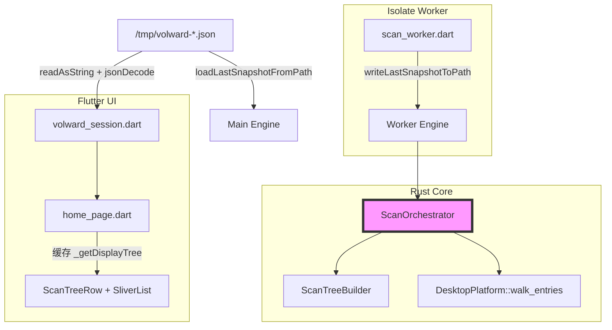
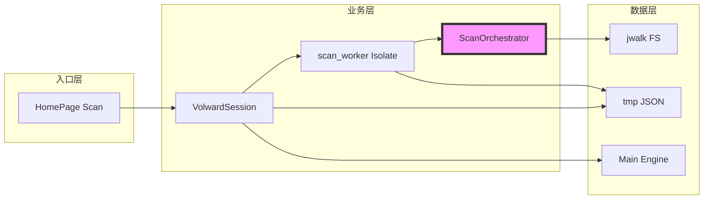

# 代码质量审查报告

## 一、基本信息

| 项目 | 内容 |
| :--- | :--- |
| **分支名称** | main |
| **审查时间** | 2026-07-23 14:06 |
| **变更规模** | 17 files changed (+1033/-196)；另含 8 个未跟踪源码文件（scan_tree 模块、FDA 配置、单测） |
| **变更类型** | 新功能 / 性能优化 / 安全加固 |
| **模型型号** | Composer |

---

## 二、变更说明

### 变更概述

**变更主题**：
1. **全量扫描与目录树 snapshot（v2）**：移除 500 条/深度上限，Rust `ScanTreeBuilder` 构建完整 `tree`，Flutter Finder 风格树形展示
2. **Snapshot 落盘与 FFI 优化**：新增 `write_last_snapshot_to_path` / `load_last_snapshot_from_path`，Isolate 直写、主 Engine 从文件 hydrate
3. **扫描可观测性增强**：`ScanStats.paths_skipped` 统计权限/I/O 跳过路径，UI 与 warnings 展示
4. **UI 性能缓存**：`home_page` 对 display tree 与 flat rows 做 key 缓存，避免每次 setState 深拷贝排序
5. **macOS FDA 引导**：去 App Sandbox、Swift MethodChannel 打开系统设置、权限探测与文案
6. **UI 紧凑化**：`apple_widgets` / `home_page` 间距收紧

**核心目的**：让用户在 Home（或自选目录）全量扫描后，可浏览完整目录树与文件元数据，并解决大 snapshot 传输/渲染性能问题。

**变更类型**：新功能

### 变更明细

#### 全量扫描、目录树与 Snapshot 落盘 (⚠️)

**改动总结**：Rust walk 无上限索引全部可访问路径，产出 `tree` + `entries` + `stats`；扫描完成后 Rust 直接写 JSON 文件，主线程读盘展示并 hydrate 主 Engine 供删除。

**架构图**

**关键改动点**：
- `PlatformStorage::walk_entries` 返回 `Result<u64, PlatformError>`（skipped 计数）
- `ScanStats` 新增 `paths_skipped`；`StorageSnapshot` 含完整 `tree`
- FFI：`volward_write_last_snapshot_to_path`、`volward_load_last_snapshot_from_path`
- Flutter：`scan_tree*.dart`、`scan_tree_view.dart`、虚拟滚动树 UI

**副作用（如有）**：
- **DB**：无
- **缓存**：tmp JSON 一次性，读后删除
- **MQ**：无

#### macOS FDA 与权限 (👀)

**一句话总结**：去除 sandbox entitlements，增加 FDA 探测读 `~/Library/Safari/Bookmarks.plist` 与系统设置跳转，使 deep scan 可读更多 Library 路径。

#### UI 紧凑化 (👀)

**一句话总结**：收紧 Apple 组件与 Home 页布局间距，不影响扫描链路。

---

## 三、影响面分析

**影响概述**：
- **对用户**：扫描结果由 500 条 flat 列表变为可展开目录树；Results 摘要含 dirs/files/skipped 计数；默认扫描 Home，需手动展开更深层级
- **对业务**：可按目录理解空间占用；删除仍依赖 flat `entries` + 主 Engine snapshot
- **对系统**：单次 Home 全扫 JSON 体积与内存上升；jwalk 遍历与首次树构建随文件数线性增长；Isolate 侧已无 Dart Map 拷贝

**业务功能影响概述**：
1. **目录树浏览** - 影响高，兼容性需适配（新增 `tree`/`stats`/`paths_skipped`），风险点：超大 Home 主线程仍持有一份 Dart Map
2. **删除链路** - 影响中，兼容性完全兼容，风险点：Engine hydrate 失败时 UI 仍可能展示但删除失败
3. **权限/FDA** - 影响中，兼容性完全兼容，风险点：无 FDA 时部分路径仍不可见（已有 skipped 计数）

**主链路**：Scan 按钮 → `VolwardSession.runScan` → Isolate `writeLastSnapshotToPath` → 主线程 `loadLastSnapshotFromPath` + 读盘 → `_getDisplayTree` → `SliverList.builder`

**调用链路图**

### 核心影响点明细

| 影响点 | 影响类型 | 风险等级 | 说明 | 验证/缓解 |
| :----- | :------- | :------- | :--- | :-------- |
| 大 snapshot 内存（Isolate） | 性能 | 👀 | Worker 已消除 Dart Map；Rust 写盘前仍 clone+serialize | **已缓解**；实机 Home 全扫 |
| 大 snapshot 内存（主线程） | 性能 | ⚠️ | Rust Engine + Dart `_lastSnapshot` 双份持有 | 后续可仅 Dart 读盘或 Rust 按需取字段 |
| 权限跳过路径 | 功能完整性 | 👀 | `paths_skipped` + warnings + UI 摘要 | **已缓解** |
| 树 UI 渲染 | 性能 | 👀 | display tree / flat rows 缓存 | **已缓解** |
| 删除与 Engine 一致性 | 功能 | ⚠️ | hydrate 失败仅 debugPrint | 加载失败应阻断 UI 或提示 |
| Platform trait 变更 | 兼容性 | 👀 | `walk_entries` 返回 `u64` | 仅内部 mock 实现，无外部插件 |

### 风险评估

| 风险点 | 风险等级 | 影响描述 | 缓解措施 |
| :----- | :------- | :------- | :------- |
| 主线程双重 parse/持有 snapshot | ⚠️ | 超大 Home 主 isolate 内存仍可能吃紧 | 二选一：Rust hydrate 或 Dart jsonDecode；勿双读双 parse |
| Engine hydrate 失败静默 | ⚠️ | 树可见但 Delete 报 No snapshot | load 失败时抛错/禁用删除 |
| 无 FDA 目录不完整 | 👀 | 部分 Library 子树缺失 | skipped 计数 + FDA banner（已实现） |
| FFI 无集成测试 | 👀 | 写盘/读盘回归靠手工 | 补充 facade 单测 |

### 兼容性声明（如有）

- **API/DTO**：`StorageSnapshot` 新增 `tree`、`stats.paths_skipped`；`walk_entries` 返回 skipped 计数；旧客户端忽略新字段仍可读 `entries`
- **数据**：无持久化 schema；tmp JSON  ephemeral

### 上轮问题修复验证

| 原问题 | 结论 |
| :----- | :--- |
| Isolate 内 getLastSnapshot + jsonEncode OOM | **已修复** — `scan_worker.dart:52` 改 `writeLastSnapshotToPath` |
| 主线程 setLastSnapshot 第三次序列化 | **已修复** — 改 `loadLastSnapshotFromPath` |
| build() 每帧 _sortTree 深拷贝 | **已修复** — `_getDisplayTree` / `_getVisibleRows` 缓存 |
| 权限跳过无可观测性 | **已修复** — `paths_skipped` + `_formatFullScanSummary` |

### 合并结论

**可合并**。核心功能链路完整，自动化测试通过（Rust 13 / Flutter 5）。建议合并前做一次 Home 全扫实机验收（FDA 开/关各一次），并关注下文 Medium 项。

---

## 四、问题清单

### 🔴 Critical（必须立即修复）

（无）

### 🟠 High（合并前必须修复）

（无 — 上轮 High 项已通过 FFI 落盘与树缓存缓解）

### 🟡 Medium（建议修复）

1. **主线程对 snapshot 文件双重读取与双重解析** - `apps/volward/lib/volward_session.dart:265-271`
   - **问题**：`_loadSnapshotFromFile` 先调用 `loadLastSnapshotFromPath`（Rust 读盘+parse），再 `readAsString` + `jsonDecode` 构建 Dart `_lastSnapshot`。同一份 JSON 被读两次、parse 两次，主线程同时持有 Rust `StorageSnapshot` 与 Dart `Map`，超大 Home 仍可能出现内存峰值或加载卡顿。
   - **建议**：UI 与 Engine 共用一种加载路径——要么仅 Rust hydrate（UI 通过 FFI 按需取 summary/tree 片段），要么仅 Dart `jsonDecode` 后 `setLastSnapshot`（去掉前置 Rust load），避免双读双 parse。

2. **Engine hydrate 失败时 UI 仍展示、删除静默失败** - `apps/volward/lib/volward_session.dart:75-80`
   - **问题**：`loadLastSnapshotFromPath` 返回 false 时仅 `debugPrint`，`_loadSnapshotFromFile` 仍返回 Dart Map 供 UI 渲染；用户可勾选文件但 `deleteEntries` 因 Engine 无 snapshot 失败。
   - **建议**：hydrate 失败时 `throw StateError` 或 `_lastSnapshot = null` 并 surfacing `_lastError`，禁用删除按钮。

### 🟢 Low（可选优化）

1. **[Optional] `_filteredSortedEntries` 每次 build 全量排序** - `apps/volward/lib/home_page.dart:400`
   - **问题**：勾选文件触发 `setState` 时，sticky bar 仍对全量 `entries` 过滤排序（树已缓存但 entries 列表未缓存）。
   - **建议**：按 `snapshot_id + filter + sort` 缓存 entries 列表，selection 变更时只重算 `_selectedBytes`。

---
