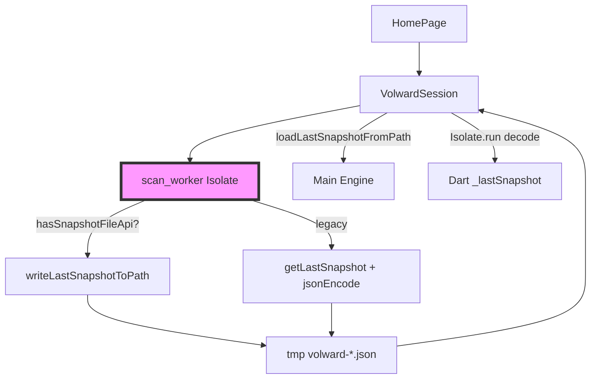
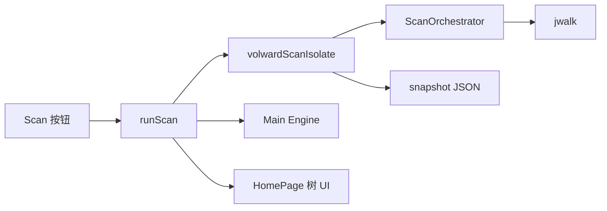

# 代码质量审查报告

## 一、基本信息

| 项目 | 内容 |
| :--- | :--- |
| **分支名称** | main |
| **审查时间** | 2026-07-23 15:40 |
| **变更规模** | 18 files changed (+1249/-223)；另含 8 个未跟踪源码文件 |
| **变更类型** | 新功能 / Bug修复 / 性能优化 |
| **模型型号** | Composer |

---

## 二、变更说明

### 变更概述

**变更主题**：
1. **全量扫描目录树 v2**：Rust `ScanTreeBuilder` + Flutter 树形 UI（无 500 条上限）
2. **Snapshot 落盘 FFI**：`write/load_last_snapshot_to_path`，Isolate 写盘、主 Engine hydrate
3. **dylib 版本兼容与构建**：可选符号 lookup + legacy fallback；`build_rust.sh` 支持独立拷贝至 `.app/Frameworks`
4. **扫描可观测性与容错**：`paths_skipped`、进度阶段（Saving/Loading）、elapsed 计时、Isolate 启动 try/catch
5. **macOS FDA 引导** + **UI 紧凑化**

**核心目的**：实现 Home/自选目录全量扫描与 Finder 树展示；修复旧 dylib 导致 Isolate 崩溃与 30min 超时；改善大扫描进度可见性。

**变更类型**：新功能 / Bug修复

### 变更明细

#### 扫描链路、FFI 与 dylib 兼容 (⚠️)

**改动总结**：Worker 扫描完成后 Rust 直写 JSON；主线程 `loadLastSnapshotFromPath` + Isolate 解码供 UI；旧 dylib 无新符号时 fallback 至 `getLastSnapshot` + `jsonEncode`。

**架构图**

**关键改动点**：
- `VolwardNativeBridge._tryLookupWriteSnapshot()` 可选绑定，避免 symbol not found 崩溃
- `volwardScanIsolate` 在 `open()` 外包 try/catch，错误经 SendPort 回传
- `build_rust.sh` 在无 Xcode 环境变量时拷贝至 `build/macos/.../Frameworks`

**副作用（如有）**：
- **DB**：无
- **缓存**：tmp JSON ephemeral
- **MQ**：无

#### 全量扫描与目录树 (⚠️)

**改动总结**：`walk_entries` 返回 skipped 计数；`ScanStats.paths_skipped`；Flutter `flattenVisible` + 树缓存。

#### macOS FDA / UI (👀)

**一句话总结**：权限探测、系统设置跳转、Apple 组件间距收紧。

---

## 三、影响面分析

**影响概述**：
- **对用户**：全量树形结果；扫描进度含 items/耗时/阶段；旧 dylib 不再立即崩溃（fallback 或明确 error）
- **对业务**：删除仍依赖主 Engine snapshot；legacy 路径大扫描仍可能 OOM
- **对系统**：Home/`/` 大目录扫描耗时长；`/` 受 TCC 与 protected_prefixes 限制，可见数据有限

**业务功能影响概述**：
1. **扫描完成链路** - 影响高，兼容性向后兼容（legacy fallback），风险点：dylib 未重建时走慢路径
2. **Cancel 扫描** - 影响中，兼容性行为变更，风险点：UI 状态与 `runScan` Future 不同步
3. **删除** - 影响低，兼容性完全兼容

**主链路**：Scan → Isolate（Rust walk → persist snapshot）→ `_loadSnapshotFromFile` → `_getDisplayTree` → UI

**调用链路图**

### 核心影响点明细

| 影响点 | 影响类型 | 风险等级 | 说明 | 验证/缓解 |
| :----- | :------- | :------- | :--- | :-------- |
| dylib 符号缺失 | 可靠性 | 👀 | 可选 lookup + legacy fallback + build_rust.sh | **已缓解**；`bash build_rust.sh` + R 重启 |
| Isolate 崩溃无回传 | 可靠性 | 👀 | open() try/catch + error SendPort | **已修复** |
| Cancel 与 runScan 竞态 | 并发 | ⚠️ | cancelScan 置 scanning=false 但 Future 仍挂起 | 见问题清单 |
| 大 snapshot 内存 | 性能 | ⚠️ | legacy fallback 仍 getLastSnapshot 全量 Map | 确保新 dylib |
| `/` 根目录扫描范围 | 功能 | 👀 | protected_prefixes + 权限跳过 | 文档/UX 引导用 Home |

### 风险评估

| 风险点 | 风险等级 | 影响描述 | 缓解措施 |
| :----- | :------- | :------- | :------- |
| Cancel 后可重复 Start | ⚠️ | 两次 Isolate 并行，Rust/资源竞态 | runScan 互斥或 Cancel 完成 completer |
| legacy 路径大扫描 OOM | ⚠️ | 旧 dylib 下 worker 仍全量 Dart Map | 强制 rebuild dylib |
| 主线程双读 snapshot 文件 | 👀 | load + Isolate decode 各读一次 | 后续二选一 |
| 无 FFI 集成测试 | 👀 | 回归靠手工 | 补充 facade 写盘/读盘测试 |

### 兼容性声明（如有）

- **API/DTO**：新增 `tree`、`stats.paths_skipped`；FFI 新增写/读文件符号；旧 dylib 自动 fallback
- **数据**：无持久化 schema 变更

### 实现层面验收结论

| 模块 | 结论 |
| :--- | :--- |
| Rust 扫描/建树/写盘 | ✅ 逻辑正确；12 unit tests passed |
| FFI capi/engine | ✅ 符号导出与错误字符串契约一致 |
| Dart bridge fallback | ✅ 可选 lookup 实现正确；hasSnapshotFileApi 需 write+load 同时存在 |
| scan_worker 生命周期 | ✅ 正常/错误/finally freeEngine；⚠️ Cancel 后主 session 仍 await |
| volward_session 加载 | ✅ 新/旧 dylib 双路径；⚠️ 新路径双读文件 |
| Flutter 树 UI + 缓存 | ✅ 5 tests passed；逻辑自洽 |
| 构建脚本 | ✅ 独立运行可更新 Frameworks dylib |

**综合判定**：**实现层面基本正确，可合并**；需 rebuild dylib 后验收。存在 1 个 ⚠️ 并发问题（Cancel 竞态）建议修复，非阻塞首次发布。

---

## 四、问题清单

### 🔴 Critical（必须立即修复）

（无）

### 🟠 High（合并前必须修复）

（无 — 用户报告的 symbol not found 已通过 optional lookup + build_rust.sh 缓解；需操作层面 rebuild + 全量重启）

### 🟡 Medium（建议修复）

1. **Cancel 后 UI 允许再次 Start，但首次 `runScan` Future 仍未结束** - `apps/volward/lib/volward_session.dart:340-348`、`apps/volward/lib/volward_session.dart:163-256`
   - **问题**：`cancelScan()` 立即 `_scanning = false`，底部 Start 按钮重新可用，但第一次 `runScan()` 仍阻塞在 `completer.future`（最长 30min）。用户可再次点击 Start，spawn 第二个 Isolate，与尚未结束的第一次扫描并行。
   - **建议**：增加 `_scanRunToken` 或 `_activeScanCompleter`；Cancel 时 `completer.completeError(Cancelled)` 并禁止重入；或 `_scanning` 直到 Future 真正结束才清零。

### 🟢 Low（可选优化）

1. **[Optional] 新 dylib 路径仍双读 snapshot 文件** - `apps/volward/lib/volward_session.dart:311-323`
   - **问题**：`loadLastSnapshotFromPath`（Rust 读盘 parse）后，`Isolate.run(_decodeSnapshotJsonFile)` 再次读同一文件。大 snapshot 多余 I/O。
   - **建议**：UI 只保留 Dart decode，Engine 只保留 Rust load，二选一。

2. **[Optional] legacy fallback 仍全量 `getLastSnapshot` 进 Dart Map** - `apps/volward/lib/bridge/scan_worker.dart:128-137`
   - **问题**：旧 dylib 下大 Home 扫描完成后 worker 仍将整棵 JSON 解析为 Map，OOM 风险与改前相同。
   - **建议**：启动时若 `!hasSnapshotFileApi` 在 UI 显示 blocking banner，禁止大目录扫描。

---
