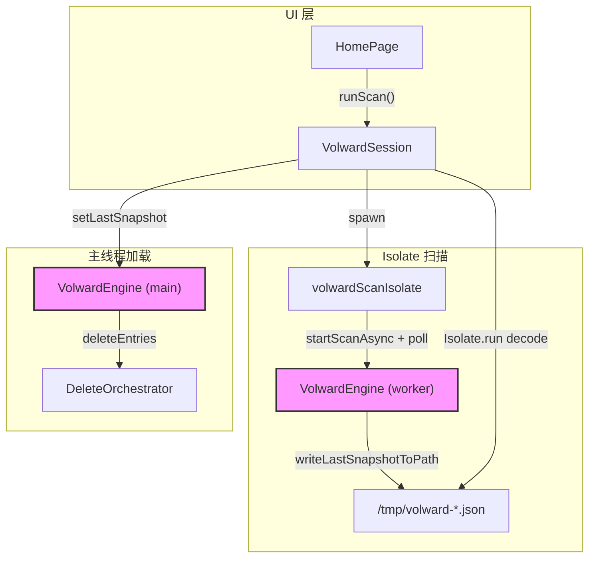
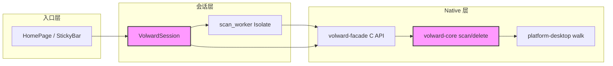

# 代码质量审查报告

---

## 一、基本信息

| 项目 | 内容 |
| :--- | :--- |
| **分支名称** | main |
| **审查时间** | 2026-07-23 16:21 |
| **变更规模** | 26 tracked files (+1539/-455)；另含 8 个新增源文件（scan_tree、column UI、macos_settings、Rust scan_tree 等） |
| **变更类型** | 新功能 |
| **模型型号** | Claude (Cursor Agent) |

---

## 二、变更说明

### 变更概述

**变更主题**：
1. **全量扫描与快照管线**：Rust 移除 500 条上限，构建目录树与 `ScanStats`，新增文件级 snapshot FFI；Dart Isolate 写临时 JSON 后主线程加载
2. **扫描会话与取消竞态修复**：`VolwardSession` 管理 completer/ReceivePort 生命周期，旧 dylib 检测与禁用 Scan
3. **Finder 分栏结果 UI**：`ScanColumnView` 替换列表树，筛选/排序/删除/Preview 面板闭环
4. **macOS 工程与平台**：CocoaPods 移除改 SPM、Build Rust 脚本 input/output、FDA 探测与窗口激活

**核心目的**：支持全量目录扫描、Finder 风格浏览、可靠的大快照传输，并修复扫描 cancel/旧 dylib/构建 warning 等问题。

**变更类型**：新功能

### 变更明细

#### 全量扫描与快照管线 (⚠️)

**改动总结**：扫描不再截断 entries，Rust 同步构建 `ScanTreeBuilder` 树；Isolate 完成后通过 `writeLastSnapshotToPath` 落盘，主线程 `Isolate.run` 解码后 `setLastSnapshot` 注入引擎供删除使用。

**架构图**



**关键改动点**：
- `scan.rs`：全量 entries + `ScanTreeBuilder` + `paths_skipped`/`truncated` 统计
- `capi.rs` / `engine.rs`：`volward_write/load_last_snapshot_to_path`
- `scan_worker.dart`：Isolate 内独立 engine，完成后写文件而非跨 Isolate 传大 Map
- `volward_session.dart`：completer 防重入、cancel 关闭 channel、30min 超时

**副作用（如有）**：
- **DB**：无
- **缓存**：无；临时 snapshot 文件读后删除
- **MQ**：无

#### Finder 分栏 UI 与删除闭环 (👀)

**一句话总结**：`home_page` 用 `_columnChain` + `ScanColumnView` 展示 Rust/Dart 树，筛选走 `pruneTree`，删除 dry-run → 确认 → trash → 自动 rescan，逻辑与 sticky bar 状态联动。

#### macOS 工程迁移 (👀)

**一句话总结**：`pod deintegrate` + 移除 Podfile；Build Rust 声明 input/output；`AppDelegate`/`MainFlutterWindow` 主动激活窗口消除 foreground warning。

---

## 三、影响面分析

**影响概述**：
- **对用户**：扫描结果以 Finder 分栏浏览；全量文件可见；FDA 引导更清晰；删除后自动 rescan
- **对业务**：从「采样 500 条」升级为「全量扫描 + 目录树」，产品能力显著增强
- **对系统**：大目录扫描内存/磁盘占用上升；依赖新版 `libvolward_facade.dylib`（旧版显式禁用 Scan）

**业务功能影响概述**：
1. 全量扫描 — 影响**高**，兼容性**需 rebuild dylib**，风险点：超大目录内存与序列化耗时
2. 分栏浏览/筛选/删除 — 影响**中**，兼容性**完全兼容**（纯 UI），风险点：大树 prune/sort 主线程耗时
3. macOS 构建 — 影响**低**，兼容性**需无 CocoaPods 环境**，风险点：首次需 `flutter pub get` 再生 SPM

**主链路**：HomePage Start Scan → Isolate 扫描 → 写 tmp JSON → 主线程加载 → Column 浏览 → 勾选 → dry-run delete → Trash → rescan

**调用链路图**



### 核心影响点明细

| 影响点 | 影响类型 | 风险等级 | 说明 | 验证/缓解 |
| :----- | :------- | :------- | :--- | :-------- |
| 全量 entries + tree 内存 | 性能/稳定性 | ⚠️ | 移除 500  cap 后 HOME/根目录扫描可能占用数 GB 内存 | Rust 单测 200 文件通过；建议大目录实测监控内存 |
| 快照文件 FFI | 兼容性 | ⚠️ | 旧 dylib 缺符号会导致 Scan 禁用 | `hasSnapshotFileApi` + UI banner；需 rebuild Rust |
| Cancel 扫描 | 并发/状态 | 👀 | cancel 关闭 channel + completeError，finally 复位 `_scanning` | 逻辑闭环；极早期 cancel 可能漏发 worker cancel |
| 删除 → rescan | 业务流程 | 👀 | `rescanAfterDelete: true` 自动刷新 snapshot | delete 单测 + UI 清 selection |
| CocoaPods → SPM | 构建 | 👀 | 仅 `file_selector_macos`，已支持 SPM | `flutter build macos` 已通过 |

### 风险评估

| 风险点 | 风险等级 | 影响描述 | 缓解措施 |
| :----- | :------- | :------- | :------- |
| 超大目录 OOM / 长时间 Saving | ⚠️ | 全量 JSON 序列化+Dart 解码峰值内存高 | 已有 30min 超时；后续可考虑流式或分页 snapshot |
| 旧 dylib 未 rebuild | ⚠️ | Scan 按钮不可用 | UI 红色 banner + 明确 rebuild 指引 |
| build_rust.sh 默认代理 | 👀 | 无本地代理环境时 cargo 网络可能失败 | 见问题清单 Medium #1 |
| 主线程 prune 大树 | 👀 | 筛选时 `_computeDisplayTree` 可能卡顿 | 已有 `_cachedDisplayTree` 缓存 |

### 兼容性声明（如有）

- **API/DTO**：`StorageSnapshot` 新增 `tree`、`stats` 字段；旧客户端读新 snapshot JSON 需忽略未知字段（serde/Dart Map 均兼容）
- **FFI**：新增 `volward_write/load_last_snapshot_to_path`；旧 dylib 通过 optional lookup 降级，Scan 被禁用而非崩溃
- **数据**：无持久化 schema 迁移；临时 snapshot 文件读后删除

---

## 四、问题清单

### 逻辑闭环验证（审查结论）

| 链路 | 原行为 | 新行为 | 结论 |
| :--- | :--- | :--- | :--- |
| 扫描完成 | Isolate 传整个 snapshot Map | 写 tmp 文件 → 主线程 decode → setLastSnapshot | ✅ 闭环；删除可用同一 snapshot_id |
| 扫描取消 | 可能 hang / 竞态 | cancelScan 关 channel + completeError(ScanCancelledException) | ✅ 闭环 |
| 旧 dylib | symbol not found 崩溃 | optional lookup + 禁用 Scan + banner | ✅ 已缓解 |
| 删除 | dry-run → delete | 不变，rescan 刷新 UI | ✅ 闭环 |
| UI 筛选 | 列表 flatten | pruneTree + column chain 重置 | ✅ 闭环 |

**测试**：`cargo test` volward-core 12 passed；`flutter test` 5 passed；`flutter build macos` 无 CocoaPods/Build Rust warning。

**综合结论**：**无 Critical/High 阻塞项，逻辑闭环完整，可合并。**

---

### 🔴 Critical（必须立即修复）

（无）

### 🟠 High（合并前必须修复）

（无）

### 🟡 Medium（建议修复）

1. **build_rust.sh 强制默认 HTTP 代理** - `apps/volward/macos/build_rust.sh:7-10`
   - **问题**：脚本将 `http_proxy`/`https_proxy` 默认设为 `http://127.0.0.1:7890`，在未运行该代理的机器上 Xcode Build Rust 阶段 cargo 网络请求会失败，导致 dylib 未更新、Scan 被禁用。
   - **建议**：移除默认值，仅继承已有环境变量；或改为可选 `VOLWARD_HTTP_PROXY` 显式开启。
   ```bash
   # 仅当用户显式设置时才 export，不要写死 7890
   : "${http_proxy:=}"
   : "${https_proxy:=}"
   ```

2. **大目录快照加载双份内存峰值** - `apps/volward/lib/volward_session.dart:342-361`
   - **问题**：`_loadSnapshotFromFile` 在 Isolate 中 `jsonDecode` 得到完整 Map，再 `setLastSnapshot` 序列化传入 Rust，超大 snapshot 时主线程可能出现双倍内存峰值与长时间 LoadingResults 卡顿。
   - **建议**：主 engine 改用已有 `loadLastSnapshotFromPath`，Isolate 仅负责路径校验或省略 decode；或 Rust 侧流式读取。

### 🟢 Low（可选优化）

1. **[Optional] 极早期 Cancel 可能无法传递到 worker** - `apps/volward/lib/volward_session.dart:364-375`
   - **问题**：用户在 Isolate 注册 `_workerCancelPort` 之前点击 Cancel，仅关闭主线程 channel，worker 仍会继续扫描直到自然结束。
   - **建议**：spawn 前设置 `_scanning` 守卫已足够大多数场景；可选在 spawn 完成后再允许 Cancel 按钮。

---

*审查范围：当前工作区全部未提交变更（含新增文件）。*
