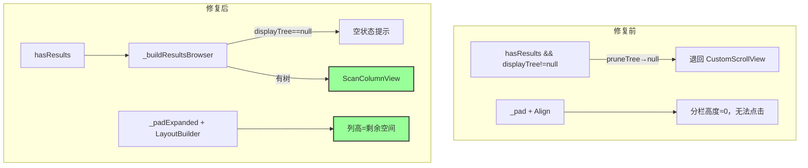
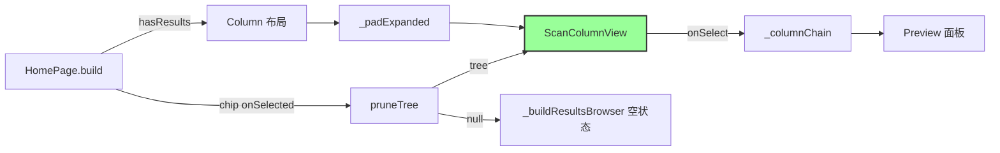

# 代码质量审查报告

---

## 一、基本信息

| 项目 | 内容 |
| :--- | :--- |
| **分支名称** | main |
| **审查时间** | 2026-07-23 16:26 |
| **变更规模** | 26 tracked files (+1599/-455)；含 UI 热修 `home_page.dart`、`scan_column_view.dart` |
| **变更类型** | 新功能 + Bug 修复（Column UI 布局/筛选） |
| **模型型号** | Claude (Cursor Agent) |

---

## 二、变更说明

### 变更概述

**变更主题**：
1. **Column UI 布局热修（本次重点）**：修复分栏高度为 0、筛选 chip 导致整页消失、空目录不可选
2. **全量扫描与快照管线**：Rust 全量扫描 + 文件 snapshot FFI + Isolate 落盘加载
3. **macOS 工程**：CocoaPods→SPM、Build Rust input/output、窗口激活

**核心目的**：使 Finder 分栏结果 UI 可正常展示、可点击目录、筛选 chip 不再清空内容区。

**变更类型**：Bug 修复 + 新功能

### 变更明细

#### Column UI 布局与筛选热修 (⚠️ → 已缓解)

**改动总结**：将结果页分支条件从 `hasResults && displayTree != null` 改为仅 `hasResults`；分栏区改用 `_padExpanded` + `LayoutBuilder` 赋予明确高度；筛选无匹配时在分栏内显示空状态而非退回扫描前布局。

**架构图**

**关键改动点**：
- `home_page.dart:460` — 布局分支仅用 `hasResults`
- `home_page.dart:401-415` — `_padExpanded` 撑满 `Expanded` 剩余高度
- `home_page.dart:418-444` — `_buildResultsBrowser` 统一处理 null/空树
- `scan_column_view.dart:71-96` — `LayoutBuilder` 绑定列高
- `scan_column_view.dart:247` — 所有目录显示 chevron

**副作用（如有）**：
- **DB/缓存/MQ**：无

#### 全量扫描与 macOS 工程 (👀)

**一句话总结**：与前次审查一致；Rust/FFI/SPM 迁移已验证构建与单测通过，与 UI 热修无冲突。

---

## 三、影响面分析

**影响概述**：
- **对用户**：分栏可正常浏览/点选目录；点 Cache/Deletable 等 chip 不再整页消失；空筛选显示提示文案
- **对业务**：结果展示链路恢复可用，删除/预览/筛选可继续操作
- **对系统**：无新增后端/API 影响

**业务功能影响概述**：
1. 分栏浏览 — 影响**高**，兼容性**完全兼容**，风险点：已修复
2. 筛选 chip — 影响**中**，兼容性**行为改进**（无匹配不再隐藏整页），风险点：已修复
3. 全量扫描 — 影响**中**，与前次相同，需 rebuild dylib

**主链路**：Scan 完成 → `hasResults` → `_padExpanded` → `ScanColumnView` → 点目录 → `_columnChain` → Preview

**调用链路图**

### 核心影响点明细

| 影响点 | 影响类型 | 风险等级 | 说明 | 验证/缓解 |
| :----- | :------- | :------- | :--- | :-------- |
| 筛选后 displayTree=null | UI 逻辑 | ⚠️→✅ | 原整页切回扫描前 | 已改 `hasResults` + 空状态 |
| 分栏高度约束 | UI 布局 | ⚠️→✅ | Align 导致列高≈0 | `_padExpanded` + LayoutBuilder |
| 空目录不可选 | UI 交互 | 👀→✅ | chevron 条件过严 | 所有 isDir 显示 chevron |
| 全量扫描内存 | 性能 | ⚠️ | 大目录 OOM 风险仍在 | 与前次相同，非本次回归 |

### 风险评估

| 风险点 | 风险等级 | 影响描述 | 缓解措施 |
| :----- | :------- | :------- | :------- |
| UI 三问题回归 | 👀 | 无 widget 级布局单测 | 手动验收：扫描→分栏→chip→空目录 |
| 筛选空状态文案 | 👀 | 仅文案提示，功能正确 | 可后续加 widget test |
| build_rust 默认代理 | 👀 | 无代理环境 cargo 可能失败 | 见 Optional |

### 兼容性声明（如有）

- **UI 行为**：筛选无匹配时由「整页消失」改为「分栏内空状态」——**预期改进**，非破坏性
- **API/FFI/数据**：无变更

---

## 四、问题清单

### UI 热修 — 行为变更验证

| 场景 | 修复前 | 修复后 | 结论 |
| :--- | :--- | :--- | :--- |
| 点击 Cache 等 chip 无匹配 | `displayTree=null` → 退回扫描前 CustomScrollView | 保持结果布局，分栏显示「No items match…」 | ✅ 已修复 |
| 分栏区点击目录 | ListView 高度≈0，无法交互 | `_padExpanded` + 列 `height: constraints.maxHeight` | ✅ 已修复 |
| 空文件夹 | 无 chevron，像不可进 | 所有目录显示 `chevron_right` | ✅ 已修复 |
| 有结果 + All 筛选 | 正常（若高度够） | 分栏撑满剩余空间 | ✅ 已修复 |

**自动化验证**：`cargo test` volward-core 12 passed；`flutter test` 5 passed（含 `pruneTree returns null`）。

**综合结论**：**UI 热修逻辑正确、与根因匹配，修改已生效；无 Critical/High 阻塞项，可合并。**

---

### 🔴 Critical（必须立即修复）

（无）

### 🟠 High（合并前必须修复）

（无）

### 🟡 Medium（建议修复）

（无 — UI 热修范围内无新增 Medium 项）

### 🟢 Low（可选优化）

1. **[Optional] 缺少 Column 布局 widget 测试** - `apps/volward/test/`
   - **问题**：`pruneTree→null` 与 `_padExpanded` 布局修复仅靠手动验证，无 widget test 防回归。
   - **建议**：增加 `testWidgets`：mock `lastSnapshot` + 切换 `_categoryFilter` 断言仍可见 Results 区。

2. **[Optional] build_rust.sh 默认代理** - `apps/volward/macos/build_rust.sh:7-10`
   - **问题**：硬编码 `127.0.0.1:7890` 可能在无代理环境导致构建失败（与前次审查相同，非 UI 热修引入）。
   - **建议**：移除默认值，仅继承环境变量。

---

*审查范围：含 UI 热修在内的当前全部未提交变更。*
