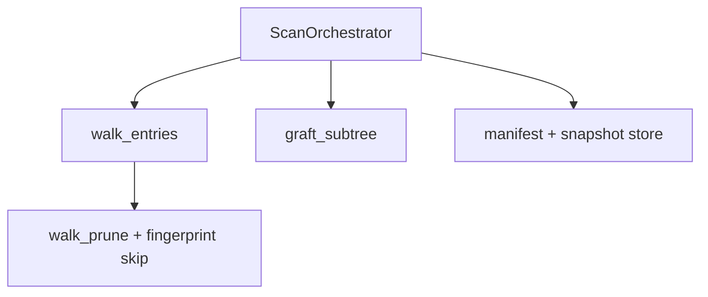
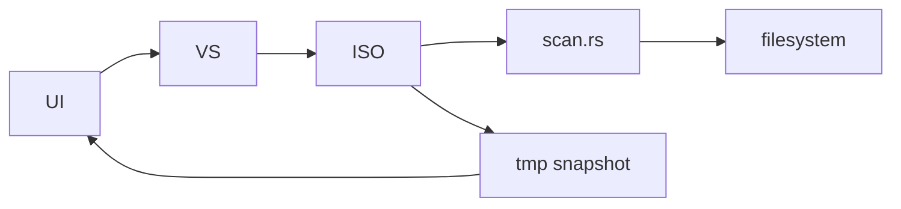

# 代码质量审查报告

## 一、基本信息

| 项目 | 内容 |
| :--- | :--- |
| **分支名称** | main |
| **审查时间** | 2026-07-23 17:42 |
| **变更规模** | 31 files changed, +2745 insertions, -607 deletions |
| **变更类型** | 新功能 / 性能优化 / 代码重构 |
| **模型型号** | Claude (Cursor Agent) |

---

## 二、变更说明

### 变更概述

**变更主题**：
1. 全盘扫描性能优化（Classify 快路径、流式 JSON、walk 剪枝、ScanTreeBuilder 索引）
2. 增量扫描 E2（manifest/snapshot 缓存、子树跳过、graft、Flutter 开关）
3. Finder Column UI + Isolate snapshot 文件 I/O
4. macOS 工程/启动修复

**核心目的**：提升全盘与二次扫描速度，并以 Finder 式目录树展示全量 scan tree，保持 Cache 筛选与删除闭环。

**变更类型**：新功能 + 性能优化

### 变更明细

#### 主题1：扫描性能与增量复用 (⚠️)

**改动总结**：见 review-report；Rust 主链路 `ScanOrchestrator → walk_entries(WalkOptions) → graft_subtree → FileSnapshotStore`。

**架构图**



**关键改动点**：`Classifier` 快路径、`WalkOptions`、增量 graft 与 entries 合并。

**副作用**：缓存默认在系统 temp。

#### 主题2：Finder UI 与 Dart 链路 (⚠️)

**改动总结**：Column 分栏、tree/entries 分离、snapshot 文件 API。

#### 主题3：macOS 工程 (👀)

**一句话总结**：CocoaPods 移除、Rust build script、窗口 activate。

---

## 三、影响面分析

**影响概述**：
- **对用户**：扫描更快、可选增量、Finder 式浏览
- **对业务**：删除/Cache 筛选仍基于 entries + tree
- **对系统**：大扫描 JSON/tree 内存与 I/O 仍随规模线性增长

**业务功能影响概述**：
1. 扫描（全量/增量）— 影响高，兼容
2. 结果展示/筛选 — 影响高，兼容
3. 删除 — 影响中，依赖 engine 内 snapshot，兼容

**主链路**：UI → Isolate → Rust scan → tmp JSON → load → ColumnView

**调用链路图**



### 核心影响点明细

| 影响点 | 影响类型 | 风险等级 | 说明 | 验证/缓解 |
| :----- | :------- | :------- | :--- | :-------- |
| 增量指纹粒度 | 正确性 | ⚠️ | mtime+count 不足以检测文件内容变更 | 见问题清单 |
| FFI/dylib 版本 | 兼容性 | ⚠️ | 新符号需 rebuild | 运行时检测 |
| 全量 tree 规模 | 性能 | ⚠️ | 极大 root 仍重 | 已做 P1 优化 |

### 风险评估

| 风险点 | 风险等级 | 影响描述 | 缓解措施 |
| :----- | :------- | :------- | :------- |
| 增量 stale graft | ⚠️ | 指纹未变但文件已改 | 产品说明；后续增强指纹 |
| 旧 dylib | ⚠️ | 扫描/增量不可用 | rebuild + 检测 |

### 兼容性声明（如有）

- **FFI**：新增 `*_with_options`，旧符号保留
- **数据**：`ScanManifest.snapshot_path` optional；旧 manifest 可读

---

## 四、问题清单

### 功能闭环与语法验证结论

| 检查项 | 结论 |
| :----- | :--- |
| Rust 单元/集成测试 | ✅ `volward-core` 25 passed、`platform-desktop` 7 passed、`volward-facade` 1 passed |
| Dart 静态分析 | ✅ `dart analyze lib` 无 error（5 条 info 级 `prefer_const`） |
| 扫描 → 落盘 → 加载 → UI | ✅ Isolate tmp JSON + `setLastSnapshot` + `_getDisplayTree` 链路完整 |
| 增量扫描 E2 | ✅ 全量 seed → 增量 reuse 有集成测试；生产需 rebuild dylib |
| 删除闭环 | ✅ 仍走 `deleteEntries` + engine snapshot，未改语义 |
| Critical/High 阻塞项 | ✅ 无 |

**行为变更摘要（关键路径）**：

| 变更点 | 原行为 | 新行为 |
| :----- | :----- | :----- |
| `classify_path` | 每文件分配 Unknown entry | 非 interesting 路径返回 `None`，仅进 tree |
| `walk_entries` | 无参数 | 增 `WalkOptions`，增量时跳过未变子树 |
| `files_in_snapshot` | 等于 files_seen | 等于 classified entries 数 |
| 扫描完成 | 仅内存 snapshot | 额外写 manifest + snapshot 缓存 |
| Flutter Scan | 全量 | 可选 `incrementalScan` 传 Isolate |

---

### 🔴 Critical（必须立即修复）

*无*

---

### 🟠 High（合并前必须修复）

*无*

---

### 🟡 Medium（建议修复）

1. **增量指纹过粗可能导致子树数据过期** - `crates/platform-desktop/src/desktop.rs:161-170` / `crates/volward-core/src/scan.rs:147-154`

   - **问题**：目录复用条件仅为 `mtime_secs + children_count` 相等。在 macOS 上，目录内文件内容变更但子项数量不变、且目录 mtime 未更新时，增量扫描会 skip walk 并 graft 旧 snapshot，UI 展示的大小/结构与磁盘不一致。
   - **建议**：在 `DirFingerprint` 中增加 `max_child_mtime_secs`（read_dir 时采样），或 UI 在启用增量时提示「仅当文件夹结构未变时加速」；变更检测失败时强制 re-walk 该目录。

   ```rust
   // desktop.rs process_read_dir 中扩展指纹
   pub struct DirFingerprint {
       pub mtime_secs: i64,
       pub children_count: u32,
       pub max_child_mtime_secs: i64, // 新增
   }
   ```

2. **[Optional] 增量开关在旧 dylib 下无用户可见反馈** - `apps/volward/lib/bridge/scan_worker.dart:52-59`

   - **问题**：`hasScanOptionsApi == false` 时仍允许打开「增量扫描」，但实际始终全量 walk，用户无法感知。
   - **建议**：`home_page` 在 `!_s.hasScanOptionsApi` 时 disable chip 或显示「需 rebuild Rust」提示（与 `hasSnapshotFileApi` 一致）。

---

### 🟢 Low（可选优化）

*无（const 建议属 info 级，按审查规范不列入）*

---

### 审查结论

**可合并**：是（无 Critical/High；Medium 为增量特性已知局限，不阻塞主链路）。

**合并前建议**：执行 `cd apps/volward/macos && bash build_rust.sh` 并 **R 全量重启** 以加载新 FFI；手动验证「全量扫描 → 开增量 → 再扫」及 Column 筛选/删除各一次。
