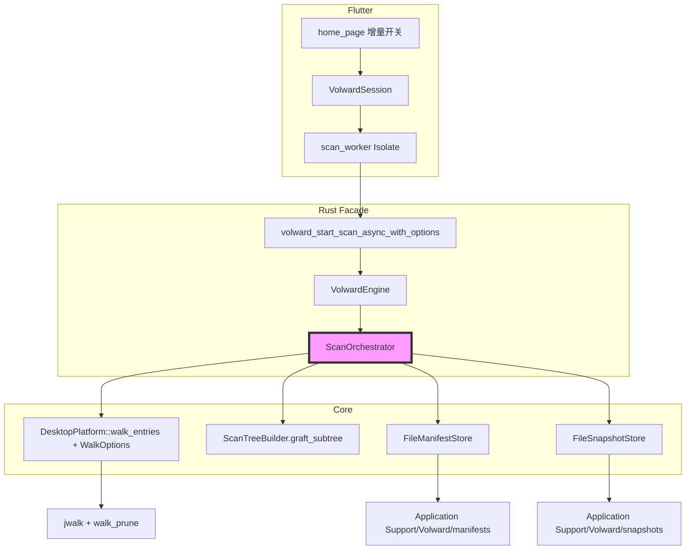
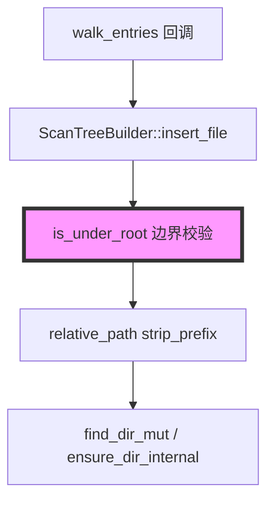
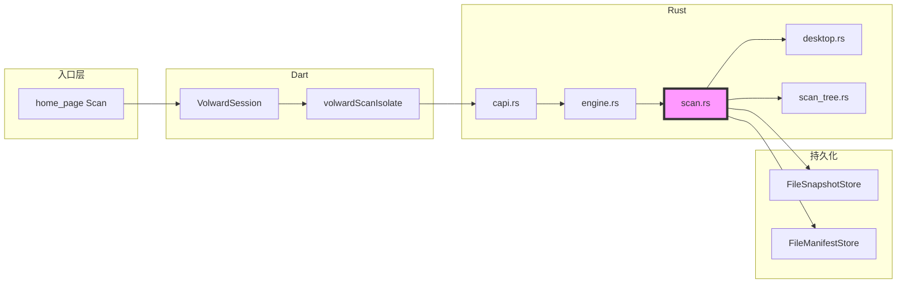

# 代码质量审查报告

## 一、基本信息

| 项目 | 内容 |
| :--- | :--- |
| **分支名称** | main |
| **审查时间** | 2026-07-23 21:05 |
| **变更规模** | 31 files changed, +2895 insertions, -608 deletions；另含 15 个未跟踪新文件（Rust/Dart/文档） |
| **变更类型** | 新功能 / 性能优化 / Bug修复 |
| **模型型号** | Composer |

---

## 二、变更说明

### 变更概述

**变更主题**：
1. **全盘扫描性能优化（P1）**：Classify 快路径、流式 JSON 落盘、walk 剪枝、ScanTreeBuilder 索引加速
2. **增量扫描（P2）**：目录指纹 manifest、Application Support 持久缓存、子树跳过与 tree/entries graft、Flutter 增量开关
3. **Finder 式扫描结果 UI**：Column 分栏浏览、tree 模型、筛选/排序、Isolate 文件落盘加载
4. **scan_tree 路径前缀崩溃修复**：`is_under_root` + 安全 `relative_path`，消除 `/Users/me` vs `/Users/meeting` 误判 panic
5. **macOS 工程与启动**：移除 CocoaPods、build_rust.sh 修复、窗口置前、FDA 设置入口

**核心目的**：缩短全盘/二次扫描耗时；以 Finder 式目录树展示结果；修复扫描线程因路径 slice 越界 panic 导致 Dart 30 分钟超时。

**变更类型**：新功能 + 性能优化 + Bug修复

### 变更明细

#### 主题1：扫描性能与增量复用 (⚠️)

**改动总结**：Rust 侧减少 classify/排序/序列化开销；walk 剪枝 dev/索引目录；增量模式对比 manifest 指纹跳过未变子树，从缓存 snapshot graft tree 与 entries；默认缓存迁至 `~/Library/Application Support/Volward`。

**架构图**

**关键改动点**：
- `Classifier::path_might_match_rules` 零分配预检；`needs_regex_fallback` 与 `desktop.yaml` 对齐
- `write_last_snapshot_to_path` 改为 `BufWriter` + `serde_json::to_writer`
- `WalkOptions.baseline_fingerprints` 驱动子树跳过；`DirFingerprint.max_child_mtime_secs` 增强指纹
- 扫描完成后 manifest + snapshot 原子落盘，增量扫描加载并 graft

**副作用（如有）**：
- **缓存**：默认 Application Support，可用 `VOLWARD_CACHE_DIR` 覆盖；首次增量无缓存时退化为全量 walk

#### 主题2：scan_tree 路径安全 (⚠️)

**改动总结**：用边界感知的 `is_under_root` 替代 naive `starts_with`；`relative_path` 改用 `strip_prefix`，消除 false prefix 与 `[1..]` slice 越界 panic。

**架构图**

**关键改动点**：
- `insert_file` / `ensure_dir` 不再对 `/Users/meeting` 等误判路径做 tree 写入
- 单元测试覆盖 false prefix 与 root=`/` 场景

#### 主题3：Finder 式结果展示 (⚠️)

**改动总结**：`StorageSnapshot.tree` + 精简 `entries`；Isolate 写 tmp JSON → 主线程 hydrate；Column 分栏 + 筛选 prune。

**一句话总结（macOS 工程）(👀)**：Podfile 移除改 SPM；`build_rust.sh` 补 input/output；AppDelegate/MainFlutterWindow 主动 activate。

---

## 三、影响面分析

**影响概述**：
- **对用户**：扫描更快且不再因路径 bug panic 超时；可选增量扫描；Finder 分栏展示
- **对业务**：Cache/Temp 筛选与删除仍依赖 `entries`；增量复用不改变删除语义
- **对系统**：tree JSON 体积随文件规模增长；manifest/snapshot 持久化到 Application Support

**业务功能影响概述**：
1. 全量/指定目录扫描 — 影响高，完全兼容，路径 panic 已修复
2. 增量扫描 — 影响中，需先全量落盘，指纹粒度有已知局限
3. 结果浏览/筛选/删除 — 影响高，完全兼容，旧 dylib 有 FFI 检测降级
4. macOS 构建/启动 — 影响中，需 rebuild Rust dylib

**主链路**：Home Scan → Isolate → Rust walk/classify/tree → tmp JSON → Dart load → Column UI → Delete FFI

**调用链路图**

### 核心影响点明细

| 影响点 | 影响类型 | 风险等级 | 说明 | 验证/缓解 |
| :----- | :------- | :------- | :--- | :-------- |
| scan_tree 路径前缀 | 正确性/崩溃 | ⚠️ | 已修复 false prefix + slice 越界 | 单元测试 8/8 通过 |
| Walk 全量 tree 构建 | 性能/内存 | ⚠️ | 百万文件时 tree JSON 仍大 | UI 仅渲染可见列 |
| 增量指纹匹配 | 正确性 | ⚠️ | mtime+children+max_child_mtime，极端情况仍可能漏检 | Tooltip + 关闭增量 |
| FFI 符号版本 | 兼容性 | ⚠️ | 缺符号时扫描/增量禁用并提示 rebuild | hasSnapshotFileApi 检测 |
| Application Support 缓存 | 可用性 | 👀 | 比 temp 更持久 | VOLWARD_CACHE_DIR 可覆盖 |

### 风险评估

| 风险点 | 风险等级 | 影响描述 | 缓解措施 |
| :----- | :------- | :------- | :------- |
| scan_tree panic | ⚠️ | **已缓解**：`is_under_root` + 安全 relative_path | 测试 + 全量重启 dylib |
| 增量展示过期子树 | ⚠️ | 指纹未变但内容变时复用旧 tree | max_child_mtime + 用户可关增量 |
| 旧 native dylib | ⚠️ | 未 rebuild 缺符号 | UI/StateError 提示 rebuild |
| 权限跳过路径 | 👀 | walk 错误静默 continue | warnings + paths_skipped |

### 兼容性声明（如有）

- **API/DTO**：`StorageSnapshot` 含 `tree`；`ScanManifest.snapshot_path` optional；旧 manifest 可反序列化
- **FFI**：保留 `volward_start_scan_async`，新增 `volward_start_scan_async_with_options(incremental)`
- **数据**：增量依赖同 root 的上次 manifest+snapshot；snapshot_id 不匹配退化为全量

---

## 四、问题清单

### 🔴 Critical（必须立即修复）

（无）

### 🟠 High（合并前必须修复）

（无）

### 🟡 Medium（建议修复）

（无）

### 🟢 Low（可选优化）

1. **[Optional] Rust panic 未映射为 Dart 友好错误** - `volward_session.dart:303-304`
   - **问题**：若未来 Rust 线程再次 panic，Dart 仍会空等 30 分钟 timeout
   - **建议**：FFI 层用 `catch_unwind` 包装扫描入口，panic 时通过 progress channel 发送 error

---

**审查结论**：整体改动功能闭环完整，scan_tree 崩溃根因已修复，`cargo test` 全通过（29/29），`dart analyze` 无 error。无 Critical/High 功能问题，**可合并**。
