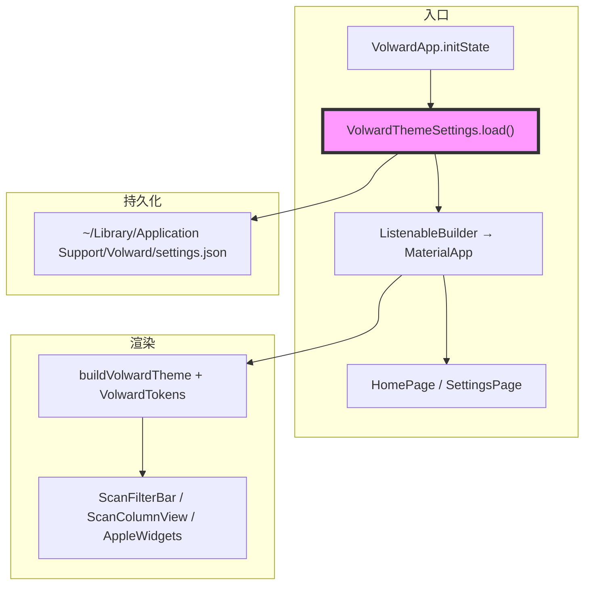
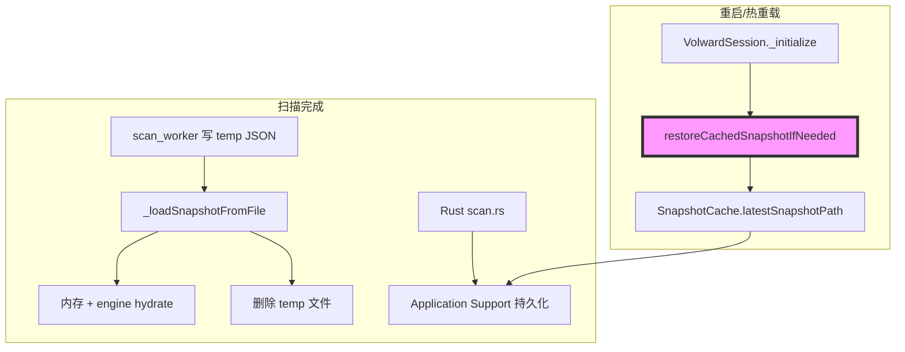
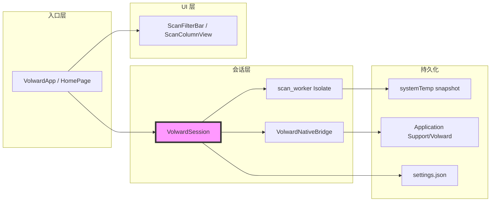

# 代码质量审查报告

## 一、基本信息

| 项目 | 内容 |
| :--- | :--- |
| **分支名称** | main |
| **审查时间** | 2026-07-24 14:17 |
| **变更规模** | 15 files changed（9 modified + 6 new），约 +2001 / -491 lines |
| **变更类型** | 新功能 / Bug修复 / 性能优化 |
| **模型型号** | Composer |

---

## 二、变更说明

### 变更概述

**变更主题**：
1. **主题与设置体系**：新增 Settings 页、主题模式（System/Light/Dark）、accent 色持久化，全 UI 接入 `VolwardTokens`
2. **扫描结果 UI 重构**：紧凑结果区、`ScanFilterBar` 筛选组件、列视图 hover/选中态修复
3. **扫描会话可靠性**：磁盘 snapshot 恢复、进度停滞检测替代硬超时、hot reload 安全的状态存储
4. **性能优化**：`subtreeFileCount` 预计算、display tree 缓存、列导航 `ValueNotifier` 隔离 rebuild

**核心目的**：修复扫描/热重载/筛选/主题相关体验问题，并保证「扫描 → 浏览 → 筛选 → 删除 → 重扫」主链路可用。

**变更类型**：新功能 / Bug修复 / 性能优化

### 变更明细

#### 主题与设置体系 (⚠️)

**改动总结**：引入 `VolwardThemeSettings` + `VolwardTokens` ThemeExtension，`MaterialApp` 绑定 light/dark/themeMode；Home 右上角进入 Settings；各 widget 由硬编码 `AppleColors` 迁移到 `context.volward` / `vw*`  typography。

**架构图**



**关键改动点**：
- `main.dart`：`theme` / `darkTheme` / `themeMode` 与 accent 联动
- `volward_tokens.dart`：语义色 + 文件夹 icon 色 + typography 扩展
- `settings_page.dart`：主题模式三段选择 + 6 色 accent 预设

**副作用（如有）**：
- **DB**：无
- **缓存**：读写 `Application Support/Volward/settings.json`（与 snapshot 同目录）
- **MQ**：无

#### 扫描会话与结果恢复 (⚠️)

**改动总结**：`SnapshotCache` 读取 Rust 持久化的 manifest/snapshot；`VolwardSession.restoreCachedSnapshotIfNeeded()` 在引擎初始化与 hot reload 后恢复内存态；扫描超时改为「进度停滞 20min / Save+Load 2h / 绝对上限 8h」。

**架构图**



**关键改动点**：
- UI 加载路径删除的是 **systemTemp 临时文件**（`scan_worker.dart:94-111`），与 Rust 持久化路径分离，**不影响**重启恢复
- `_awaitScanWithStallGuard` 在 progress 消息上刷新 `_lastScanActivityAt`（`volward_session.dart:366-368`）

#### 结果浏览与筛选 UI (👀)

**一句话总结**：`ScanFilterBar` 替换横向 chip 列表；`_FinderRow` 用 `MouseRegion` 修复选中+hover 白底问题；Home 结果区改为紧凑 chrome + Expanded 列视图。

#### 性能与 hot reload 兼容 (👀)

**一句话总结**：`ScanTreeNode.withAggregatedCounts` 预计算文件数；`_sortIndex` int  backing 避免 enum hot reload 类型错误；列导航用 `_columnNavTick` 减少全页 rebuild。

---

## 三、影响面分析

**影响概述**：
- **对用户**：可切换主题/ accent；扫描结果页布局更紧凑；目录选中态正确；hot reload 后扫描结果可恢复
- **对业务**：完整支持浏览、筛选、多选删除、增量扫描开关、重扫
- **对系统**：新增 settings.json；扫描超时策略变更；UI 层大量 token 化

**业务功能影响概述**：
1. **扫描 → 结果展示** - 影响中，兼容性完全兼容，风险点：Save/Load 阶段长时间无 progress 仍依赖 2h 兜底
2. **筛选 / 排序 / 列导航** - 影响中，兼容性完全兼容，风险点：筛选变更会 reset 列链（符合预期）
3. **主题设置** - 影响低，兼容性完全兼容，风险点：启动时 settings 异步 load 可能短暂默认主题
4. **磁盘 snapshot 恢复** - 影响中，兼容性完全兼容，风险点：manifest 损坏时静默跳过（已有 debugPrint）

**主链路**：启动 → 引擎初始化 →（可选）恢复 snapshot → 扫描 → 筛选/排序 → 列浏览 → 勾选删除 → 重扫

**调用链路图**



### 核心影响点明细

| 影响点 | 影响类型 | 风险等级 | 说明 | 验证/缓解 |
| :----- | :------- | :------- | :--- | :-------- |
| 主题 settings 异步 load | UI/配置 | ⚠️ | 首帧可能用默认 accent/theme | 启动后手动切换验证；建议 await load |
| 扫描停滞检测 | 可靠性 | ⚠️ | 20min 无 progress 才超时，Save 阶段 2h | 大账户 Home 扫描实测 |
| Snapshot 恢复 | 数据 | ⚠️ | 依赖 Rust manifest + snapshots 目录 | `snapshot_cache_test.dart` 覆盖路径解析 |
| 列视图选中+hover | UI | 👀 | `_FinderRow` MouseRegion 替代 InkWell | 点击目录后鼠标不移开应保持 accent 选中色 |
| Display tree 缓存 | 性能 | 👀 | snapId 变更自动失效 | 扫描完成/筛选变更后 spot check |

### 风险评估

| 风险点 | 风险等级 | 影响描述 | 缓解措施 |
| :----- | :------- | :------- | :------- |
| settings load 未 await | ⚠️ | 冷启动短暂默认主题；极端竞态下 load 覆盖用户操作 | `initState` 中 await load 后再首帧 build |
| `_persist` 无 try/catch | ⚠️ | 磁盘写入失败时 UI 已变但设置未保存，且可能未捕获 async 错误 | 包裹 try/catch + debugPrint/回滚 |
| 主链路 UI 测试缺口 | ⚠️ | 主题/筛选/列导航回归靠人工 | 补 widget test（Settings 切换、FilterBar 回调） |
| temp snapshot 删除 | 👀 | 若误删持久化路径会破坏恢复 | **已验证**：仅删 `systemTemp/volward-*.json` |
| `_FinderRow` 每行 StatefulWidget | 👀 | 超大列表 hover 状态开销 | 目前可接受；必要时 hover 提升到 column 级 |

### 兼容性声明（如有）

- **API/DTO**：无对外 API；`HomePage` 构造函数新增必填 `themeSettings`（仅 app 内部）
- **数据**：`settings.json` 新增；snapshot manifest 格式未变；旧 manifest 仍可通过 hash fallback 解析

---

## 四、问题清单

### 功能闭环结论

**主链路审查通过**：扫描完成 → 结果展示 → 筛选/排序 → 列导航 → 文件勾选 → 删除并重扫 → 重启/hot reload 恢复 snapshot，各环节代码路径连通，未发现 Critical/High 级断点。

**行为变更核对（节选）**：

| 变更点 | 原行为 | 新行为 |
| :----- | :----- | :----- |
| 扫描超时 | 固定 30min `TimeoutException` | 20min 无 progress 才判停滞；Save/Load 2h；绝对 8h |
| 热重载 snapshot | 内存丢失，需重扫 | `restoreCachedSnapshotIfNeeded` 从磁盘恢复 |
| 列目录 hover | InkWell overlay 盖选中色，呈白底 | 选中优先 `primaryFocus`；hover 仅未选中行 |
| 排序 State | `ScanSortMode` 字段 hot reload 类型崩溃 | `_sortIndex` int backing + getter |

### 🔴 Critical（必须立即修复）

*无*

### 🟠 High（合并前必须修复）

*无*

### 🟡 Medium（建议修复）

1. **主题 settings 异步 load 未与首帧同步** - `main.dart:29`
   - **问题**：`_themeSettings.load()` 未 await，首帧可能渲染默认 Blue/System，用户设置延迟生效
   - **建议**：在 `initState` 中 await load（或 `FutureBuilder`/splash gate）后再展示 `MaterialApp`
   ```dart
   // main.dart — 示意
   late final Future<void> _themeReady;
   @override
   void initState() {
     super.initState();
     _session = VolwardSession();
     _themeSettings = VolwardThemeSettings();
     _themeReady = _themeSettings.load();
   }
   ```

2. **settings 持久化缺少错误处理** - `volward_theme_settings.dart:65-72`
   - **问题**：`_persist()` 写入失败会抛出未捕获 async 异常，UI 状态与磁盘不一致
   - **建议**：try/catch 包裹 `writeAsString`，失败时 `notifyListeners` 回滚或提示
   ```dart
   Future<void> _persist() async {
     try {
       final file = _settingsFile();
       await file.parent.create(recursive: true);
       await file.writeAsString(jsonEncode({...}));
     } catch (e, st) {
       debugPrint('VolwardThemeSettings: persist failed: $e\n$st');
     }
   }
   ```

3. **主题/筛选 UI 缺少自动化测试** - `test/` 目录
   - **问题**：`snapshot_cache_test` / `scan_tree_test` 未覆盖 Settings、ScanFilterBar、列选中态，回归依赖人工
   - **建议**：补 2–3 个 widget test：`themeMode` 切换、`ScanFilterBar` 回调、`_FinderRow` 选中+hover 背景色

### 🟢 Low（可选优化）

1. **`[Optional]` 扫描完成后显式 invalidate 缓存** - `home_page.dart:129-132`
   - **问题**：扫描结束仅清 `_columnChain`，依赖 snapId 变更隐式失效 display cache；逻辑正确但可读性弱
   - **建议**：在 scan complete 分支调用 `_invalidateSnapshotCaches()` 使意图更清晰

---

**审查结论**：当前改动 **功能完整、主流程闭环**，无 Critical/High 阻塞项；建议合并前处理 3 项 Medium（或至少 settings load await + persist 容错）。
