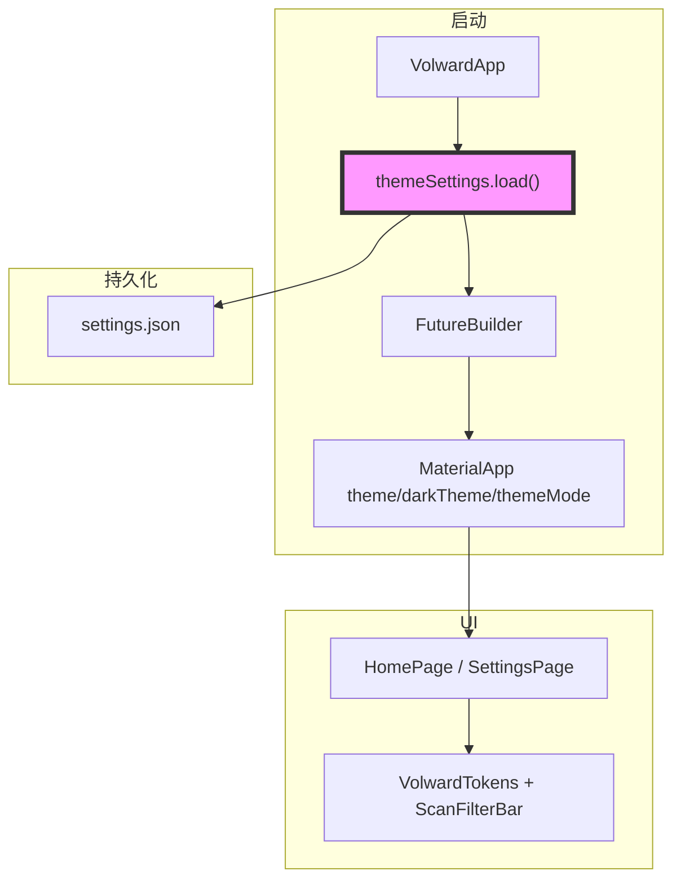
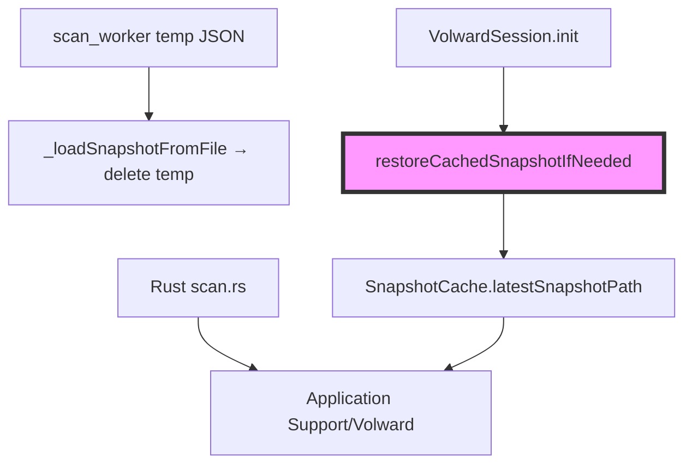

# 代码质量审查报告

## 一、基本信息

| 项目 | 内容 |
| :--- | :--- |
| **分支名称** | main |
| **审查时间** | 2026-07-24 14:24 |
| **变更规模** | 15 files changed（9 modified + 6 new），约 +2100 / -506 lines |
| **变更类型** | 新功能 / Bug修复 / 性能优化 |
| **模型型号** | Composer |

---

## 二、变更说明

### 变更概述

**变更主题**：
1. **主题与设置体系**：Settings 页、System/Light/Dark、accent 色持久化、全 UI `VolwardTokens` 化
2. **扫描结果 UI**：`ScanFilterBar`、紧凑结果区、列视图选中/hover 修复、底部栏去毛玻璃
3. **扫描会话可靠性**：磁盘 snapshot 恢复、进度停滞检测、hot reload 安全状态
4. **审查跟进修复**：theme load 同步、persist 回滚、测试补齐、`snapshot_cache_test` 注入路径

**核心目的**：完成主题/筛选/扫描主链路，并消除前次审查与 UI 反馈中的遗留问题。

**变更类型**：新功能 / Bug修复 / 性能优化

### 变更明细

#### 主题、设置与 UI 一致性 (⚠️ → 已缓解)

**改动总结**：`VolwardThemeSettings` 持久化 settings.json；`main.dart` 用 `FutureBuilder` 等待 load；各 widget 使用 `context.volward` / `vw*` typography；`AppleStickyBar` 移除 `BackdropFilter` 修复 macOS 切应用灰条。

**架构图**



**关键改动点**：
- `main.dart:42-50` — load 完成前不展示主界面
- `volward_theme_settings.dart:54-96` — persist 失败回滚
- `apple_widgets.dart:348-351` — 实心底部栏替代 BackdropFilter

#### 扫描恢复与会话 (⚠️ → 已缓解)

**改动总结**：`SnapshotCache` + `restoreCachedSnapshotIfNeeded`；停滞检测替代 30min 硬超时；扫描结束显式 `_invalidateSnapshotCaches()`。

**架构图**



#### 结果浏览与筛选 (👀)

**一句话总结**：`ScanFilterBar` 替换 chip 列表；`_FinderRow` 用 `MouseRegion` 管理 hover/选中；`_sortIndex` int backing 避免 hot reload enum 崩溃。

---

## 三、影响面分析

**影响概述**：
- **对用户**：主题可切换且持久化；筛选布局清晰；目录选中态正确；切应用无底部灰条
- **对业务**：扫描→浏览→筛选→删除→重扫 闭环可用；重启/hot reload 可恢复 snapshot
- **对系统**：新增 settings.json；扫描超时策略变更；测试覆盖主题/筛选/列视图/snapshot

**业务功能影响概述**：
1. **主题设置** - 影响低，完全兼容，前次 ⚠️ 已修复
2. **扫描恢复** - 影响中，完全兼容，测试已绿
3. **列视图交互** - 影响低，行为改进（选中/hover），无破坏性变更

**主链路**：启动 → load settings → 引擎 init →（可选）恢复 snapshot → 扫描 → 筛选 → 列浏览 → 删除 → 重扫

**调用链路图**

```mermaid
graph LR
    subgraph "入口"
        APP["VolwardApp"]
    end

    subgraph "会话"
        APP --> SES["VolwardSession"]
        SES --> NAT["NativeBridge / Isolate"]
    end

    subgraph "持久化"
        SES --> CACHE["Application Support/Volward"]
        APP --> SET["settings.json"]
    end

    subgraph "UI"
        APP --> UI["HomePage + ScanFilterBar + ScanColumnView"]
    end

    style SES fill:#f9f,stroke:#333,stroke-width:4px
```

### 核心影响点明细

| 影响点 | 影响类型 | 风险等级 | 说明 | 验证/缓解 |
| :----- | :------- | :------- | :--- | :-------- |
| theme load 同步 | UI | ⚠️→✅ | `FutureBuilder` 等待 load | `main.dart:42-50` |
| settings persist 容错 | 数据 | ⚠️→✅ | 失败回滚 + debugPrint | `volward_theme_settings.dart:59-65` |
| 主题/筛选/列视图测试 | 质量 | ⚠️→✅ | 6 个新/修测试全通过 | `fvm flutter test test/` 15/15 |
| snapshot_cache 测试 | 质量 | ⚠️→✅ | `cacheDirForTest` 替代 env 修改 | `snapshot_cache.dart:8-10` |
| 底部灰条 | UI | 👀→✅ | 移除 BackdropFilter | `apple_widgets.dart:348` |
| 目录 hover 白底 | UI | 👀→✅ | MouseRegion 手动 hover | `scan_column_view.dart:235-247` |

### 风险评估

| 风险点 | 风险等级 | 影响描述 | 缓解措施 |
| :----- | :------- | :------- | :------- |
| theme load 未 await | ⚠️ | 前次：首帧默认主题 | **已修复** FutureBuilder |
| persist 无容错 | ⚠️ | 前次：UI/磁盘不一致 | **已修复** try/catch + 回滚 |
| UI 测试缺口 | ⚠️ | 前次：回归靠人工 | **已修复** 新增 3 套 widget/unit test |
| snapshot_cache_test 失败 | ⚠️ | Platform.environment 不可变 | **已修复** cacheDirForTest |
| 冷启动 bootstrap 浅色占位 | 👀 | Dark 用户极短浅色闪屏 | 可选：占位读取 preference 后再首帧 |

### 前次审查问题修复核对

| 问题 | 状态 | 证据 |
| :--- | :--- | :--- |
| settings load 未 await | ✅ 已修复 | `main.dart:30,42-50` |
| `_persist` 无 try/catch | ✅ 已修复 | `volward_theme_settings.dart:83-96` |
| 主题/筛选测试缺口 | ✅ 已修复 | `theme_settings_test.dart` 等 |
| 扫描完成 cache 未 invalidate | ✅ 已修复 | `home_page.dart:132` |
| 底部 BackdropFilter 灰条 | ✅ 已修复 | `apple_widgets.dart:348-351` |
| 目录选中 hover 白底 | ✅ 已修复 | `scan_column_view.dart:213-247` |
| hot reload ScanSortMode 崩溃 | ✅ 已修复 | `home_page.dart:36-58` |

### 兼容性声明（如有）

- **API/DTO**：无对外 API；`HomePage` 新增必填 `themeSettings`（仅 app 内部）
- **数据**：`settings.json` 新增；snapshot manifest 格式未变

---

## 四、问题清单

### 功能闭环结论

**主链路审查通过**；前次 3 项 Medium 及 UI 反馈问题均已修复。`fvm flutter test test/` **15/15 通过**。

**行为变更核对（节选）**：

| 变更点 | 原行为 | 新行为 |
| :----- | :----- | :----- |
| 主题启动 | 立即渲染默认主题 | 等待 settings load 后渲染 |
| settings 写入失败 | 未捕获，UI 已变 | 回滚内存状态 |
| 底部栏 | BackdropFilter 切应用灰条 | 实心 `v.canvas` |
| 列目录 hover+选中 | InkWell 白 overlay | 选中恒为 accent 色 |

### 🔴 Critical（必须立即修复）

*无*

### 🟠 High（合并前必须修复）

*无*

### 🟡 Medium（建议修复）

*无*（前次 3 项均已关闭）

### 🟢 Low（可选优化）

1. **`[Optional]` 冷启动 bootstrap 占位仅用浅色主题** - `main.dart:46-48`
   - **问题**：load 完成前的 `_ThemeBootstrapPlaceholder` 固定 `Brightness.light`，Dark 偏好用户可能有极短浅色闪屏
   - **建议**：load 完成后即切主界面已足够；若需消除闪屏，可在 load 内先读 preference 再决定 bootstrap 亮度

---

**审查结论**：**可合并**。前次审查 Medium 问题、底部灰条、目录 hover、测试缺口均已修复；无新增阻塞项。
