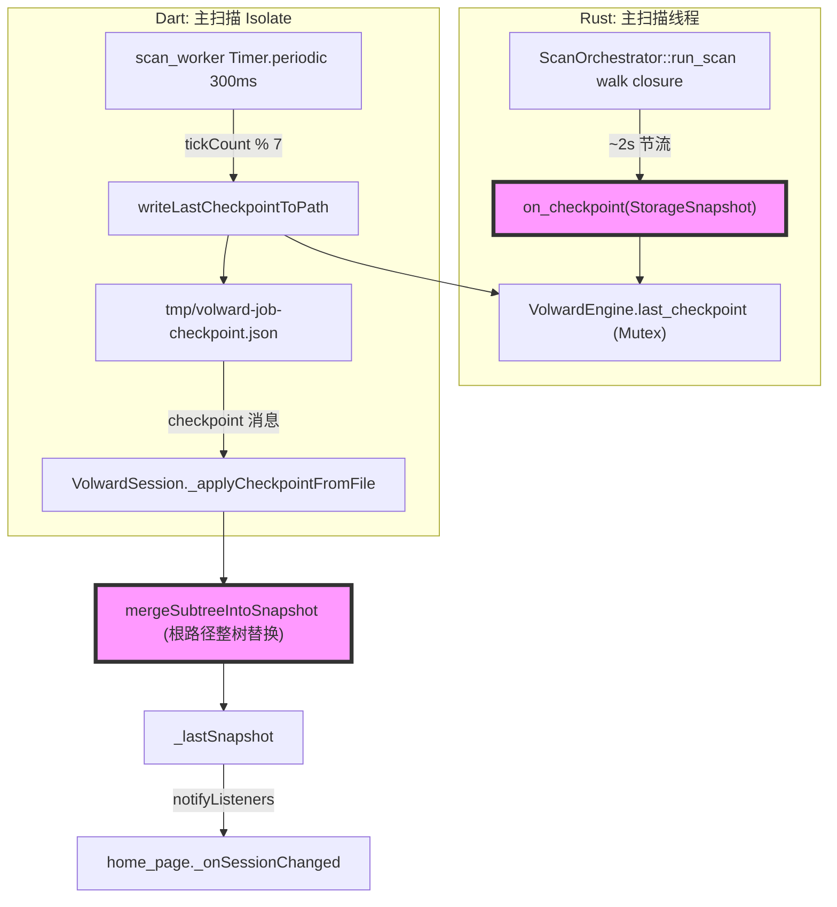
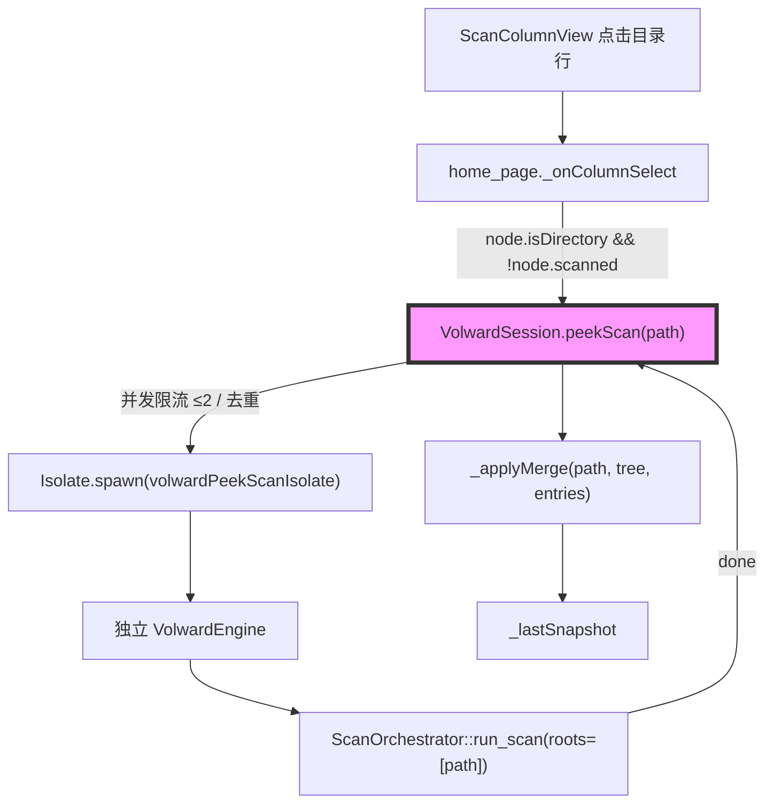
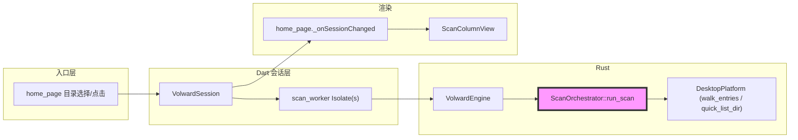

# 代码质量审查报告

---

## 一、基本信息

| 项目 | 内容 |
| :--- | :--- |
| **分支名称** | main |
| **审查时间** | 2026-07-24 16:57 |
| **变更规模** | 26 files changed, +4243 insertions, -46 deletions（含设计文档/计划文档；核心代码 24 files, +1400/-46） |
| **变更类型** | 新功能 / 性能优化 |
| **模型型号** | Claude (Cursor Agent) |

---

## 二、变更说明

### 变更概述

**变更主题**：
1. **渐进式扫描 Wave 1（预览 + 后台 checkpoint 流式渲染）**：`quick_list_dir`（单层非递归列目录）+ `peek_snapshot`（非破坏性树快照）+ `run_scan` 周期性 checkpoint 回调，Dart 侧 `previewTarget()`/`mergeSubtreeIntoSnapshot()` 把中间态渐进合并进正在浏览的结果树，UI 不再阻塞等待全量扫描完成。
2. **渐进式扫描 Wave 2（点击优先分片扫描）**：新增独立 Isolate `volwardPeekScanIsolate`（自带 native engine，与主扫描完全隔离），`VolwardSession.peekScan()` 带并发限流（≤2）与去重；列视图点击一个 `scanned == false` 的目录时触发分片扫描并渲染 loading 占位。
3. **`ScanTreeNode.scanned` 语义贯通**：新增字段并在 `withAggregatedCounts`/`pruneTree`/`_sortTree` 等所有节点重建路径上透传，作为 UI 判断"是否已扫描"的唯一依据。

**核心目的**：把"选目录 → 点击开始 → 阻塞等待全量结果"的单次同步扫描体验，改造为"选目录即预览 → 确认后台跑全量 → 浏览中逐步变实 → 点未扫到的目录可插队"的渐进式体验，同时不降低"全量、不截断"的最终数据完整性承诺。

**变更类型**：新功能

### 变更明细

#### 主题1：Checkpoint 流式渲染与预览（Wave 1） (⚠️)

**改动总结**：`ScanOrchestrator::run_scan` 在 walk 闭包内按墙钟时间（≥2s 且每 200 条）触发 `on_checkpoint(StorageSnapshot)`；`VolwardEngine` 用 `Arc<Mutex<Option<StorageSnapshot>>>` 暂存最近一次 checkpoint 并通过新 FFI 导出；`scan_worker.dart` 主扫描 Isolate 每 7 个 tick（≈2s）落盘一次 checkpoint 并回传路径；`VolwardSession._applyCheckpointFromFile` 反序列化后调用 `mergeSubtreeIntoSnapshot` 把 checkpoint 的 `tree`/`entries` 合并进当前 `_lastSnapshot`（以 checkpoint 的根路径为 `targetPath`）。`home_page.dart` 新增分支：会话变化且用户已进入某一层列导航时，尝试 `refreshColumnChain` 保位重连。

**架构图**



**关键改动点**（1-N条）：
- `ScanTreeBuilder::peek_snapshot()`：克隆 `root` 并 `aggregate_sizes`，不影响 builder 后续继续 `insert_file`/`finalize`
- `run_scan` 新增 `on_checkpoint` 形参，所有既有调用点（`volward-cli`、`volward-facade`、测试）同步补齐空实现
- `mergeSubtreeIntoSnapshot`：当 `targetPath` 命中根节点时，直接整体替换 `children`（`scan_snapshot_merge_test.dart` 中"merging at the root path replaces the whole tree (checkpoint case)"用例已固化此行为）
- `home_page._onSessionChanged` 由两个独立 `if` 改为 `if/else if/else if` 三分支，新增分支在 `_columnChain.isNotEmpty` 时调用 `_invalidateSnapshotCaches()` + `_getDisplayTree()` + `refreshColumnChain`

**副作用（如有）**：
- **临时文件**：每次 checkpoint 在系统 temp 目录写一个 `volward-$jobId-checkpoint.json`，读取后立即 `File(path).delete()`
- **内存/CPU**：`on_checkpoint` 在 walk 线程同步调用，`entries.clone()` + `tree_builder.peek_snapshot()`（含树遍历聚合）随扫描进度增长，成本随时间递增

#### 主题2：点击优先分片扫描（Wave 2） (⚠️)

**改动总结**：`volwardPeekScanIsolate` 用独立 native engine 对用户点击的单一路径跑一次完整 `run_scan`，完成后把结果通过 `resultPort` 回传给 `VolwardSession.peekScan()`，再走同一条 `_applyMerge` 路径合并进 `_lastSnapshot`；`home_page._onColumnSelect` 在点击目录节点且 `!node.scanned` 时触发。

**架构图**



**关键改动点**（1-N条）：
- `peekScan` 用 `_peekInFlight`/`_peekCompleted` 两个 `Set<String>` 做去重与并发限流，`runScan()` 起始时清空
- 分片扫描与主扫描各自持有独立 native engine，互不阻塞，也不复用 `DirFingerprint` 去重（设计文档已标注为可接受的非目标）

**副作用（如有）**：
- **CPU/IO**：分片扫描可能与主扫描后续扫到同一子树时重复 walk（设计已知悉并接受）

#### 主题3：`ScanTreeNode.scanned` 字段贯通与 UI 展示 (👀)

**一句话总结**：新增 `scanned` 字段并在所有节点重建路径（`withAggregatedCounts`/`pruneTree`/`_sortTree`）透传，`ScanColumnView` 对 `!scanned` 目录展示 loading 占位替代箭头图标。

---

## 三、影响面分析

**影响概述**：
- **对用户**：选定目录后立即可见顶层结构；开始扫描后结果浏览页不再整页阻塞，数字随后台扫描逐步变实；点击一个明显还没扫到的目录理论上可以插队优先看到内容。
- **对业务**：不改变"全量、不截断"的最终数据口径——最终以 `Done` 快照为准；Cache 分类/可删除统计的最终值不受渐进渲染影响。
- **对系统**：`ScanOrchestrator::run_scan` 增加一个在 walk 线程同步调用的 `on_checkpoint` 回调，随着扫描进度增长其单次调用成本（entries clone + 树聚合）也在增长；Dart 侧新增两条与快照合并/导航保位相关的状态机分支。

**业务功能影响概述**：
1. 后台扫描期间浏览体验 — 影响高，兼容性完全兼容（旧 dylib 通过 `hasCheckpointApi`/`hasQuickListApi` 优雅降级为今天的阻塞流程），风险点：`_onSessionChanged` 新分支在每次 `notifyListeners()`（含普通进度 tick，非仅 checkpoint）都会触发全量缓存失效与树重算，与设计文档"只失效受影响子树缓存"的既定原则不一致
2. 点击优先分片扫描（Wave 2） — 影响中，兼容性完全兼容，风险点：`scanned` 字段仅在 Dart 侧手工构造的预览/合并结果里被显式置为 `false`，Rust 原生 `ScanTreeNode`（`model.rs`）从未序列化该字段；一旦某个目录出现在任意一次 checkpoint 里就默认 `scanned=true`，与 Task 19 手动回归清单期望的"后台扫描未到达的深层目录显示 loading 占位"存在不一致
3. 最终扫描结果完整性 — 影响低，兼容性完全兼容，风险点：无（`Done` 消息仍走原有 `_loadSnapshotFromFile` 路径，未改动）

**主链路**：选择目录 → `previewTarget()`/`quick_list_dir` 预览 → `runScan()` 后台全量 walk → 周期性 `on_checkpoint` → `mergeSubtreeIntoSnapshot` 合并 → `_onSessionChanged` 刷新 UI → `Done` 落地最终快照

**调用链路图**



### 核心影响点明细

| 影响点 | 影响类型 | 风险等级 | 说明 | 验证/缓解 |
| :----- | :------- | :------- | :--- | :-------- |
| `_onSessionChanged` 新增的"保位刷新"分支 | 性能 | ⚠️ | 在任何 `notifyListeners()`（含 300ms 一次的普通进度 tick）都会执行 `_invalidateSnapshotCaches()` + 全树重算，而非仅在 checkpoint/peek 真正合并新数据时 | 未覆盖此场景的单测；建议加"快照是否变化"判定后再失效缓存 |
| Rust `ScanTreeNode` 未序列化 `scanned` | 正确性/UX | ⚠️ | checkpoint/最终快照里的目录节点在 Dart 侧一律回退为 `scanned=true`，无法反映"walker 已建节点但未递归完子树"的中间态 | `scan_snapshot_merge_test.dart` 显式测试并固化了"根路径整树替换"行为，未覆盖该语义缺口 |
| `mergeSubtreeIntoSnapshot` 命中根路径时整体替换 `children` | 正确性 | ⚠️ | 若某子树刚被 Wave 2 分片扫描合并为完整数据，随后主扫描的下一次 checkpoint（根路径）到达时，会用主扫描自身尚不完整的视图整体覆盖，可能回退该子树的展示状态 | 无自动化测试覆盖"分片扫描后紧跟一次根 checkpoint"的顺序场景 |
| dylib 版本探测降级 | 兼容性 | 👀 | `hasQuickListApi`/`hasCheckpointApi` 为 false 时静默回退今天的阻塞流程 | 复用既有 `hasSnapshotFileApi` 模式，已有先例 |

### 风险评估

| 风险点 | 风险等级 | 影响描述 | 缓解措施 |
| :----- | :------- | :------- | :------- |
| 浏览期间高频全量缓存失效 | ⚠️ | 用户在后台扫描期间钻取到某一层浏览时，每 300ms 触发一次全树排序/过滤/聚合重算，扫描耗时越长、树越大，主线程（UI isolate）CPU 占用越高，可能出现卡顿 | 建议仅在 `_lastSnapshot` 引用真正变化（如比较 `snapshot_id`）时才失效缓存并刷新导航 |
| checkpoint 语义无法区分"已建节点但未扫完" | ⚠️ | Wave 2 "点击未扫描目录触发优先扫描"在首个 checkpoint 落地后基本失效（几乎所有可见目录都会被判定为 `scanned=true`），与设计文档手动回归清单的预期行为不符 | 需要 Rust 侧在 checkpoint tree 中标记"仅建节点、子树未完成 walk"的目录，或改为增量合并而非整树替换 |
| 分片扫描结果被后续 checkpoint 覆盖 | 👀 | 极端情况下用户体感到"点开的目录短暂显示了内容又变回占位/更小的数字" | 影响面小（最终 `Done` 结果不受影响，只是中间态展示可能短暂回退） |

### 兼容性声明（如有）

- **API/DTO**：`ScanOrchestrator::run_scan` 新增 `on_checkpoint` 形参（破坏性签名变更，仅限内部 crate 调用，所有调用点已同步更新）；`RawFsEntry` 新增 `Serialize`；`PlatformStorage::quick_list_dir` 提供默认 `Unsupported` 实现，不影响未实现该方法的既有测试平台
- **FFI**：新增 `volward_write_last_checkpoint_to_path`、`volward_quick_list_dir_json` 均为可选符号，旧 dylib 通过 `hasCheckpointApi`/`hasQuickListApi` 探测降级，不影响现有符号
- **数据**：`ScanTreeNode`（Dart）新增 `scanned` 字段，JSON 缺失时默认 `true`，向后兼容旧快照文件

---

## 四、问题清单

### 🔴 Critical（必须立即修复）

*无*

### 🟠 High（合并前必须修复）

1. **后台扫描浏览期间每次进度 tick 都触发全量缓存失效与树重算** - `apps/volward/lib/home_page.dart:125-149`
   - **问题**：`_onSessionChanged` 新增的第三分支 `else if (_columnChain.isNotEmpty)` 挂在 `widget.session.addListener(_onSessionChanged)` 上，而 `VolwardSession.runScan()` 对**每一条** `progress` 消息都会 `notifyListeners()`（`volward_session.dart:444-448`，由 `scan_worker.dart` 里 300ms 一次的 `Timer.periodic` 驱动），并非只在 checkpoint 真正合并新数据时才触发。当用户在扫描期间已经钻取到某一层（`_columnChain.isNotEmpty`）时，这个分支会在扫描全程以约 3 次/秒的频率调用 `_invalidateSnapshotCaches()`（清空 `_cachedDisplayTree`/`_cachedResolvedTree`/`_cachedFilteredEntries`/`_cachedEntriesById` 等全部缓存）并立即 `_getDisplayTree()` 重新执行 `pruneTree` + `_sortTree` + `ScanTreeNode.withAggregatedCounts` 对整棵树排序聚合——即使 `_lastSnapshot` 根本没有变化。这与设计文档 `docs/superpowers/specs/2026-07-24-progressive-scan-design.md:130` 明确写的"checkpoint 消息到达时，只失效受影响子树的缓存，不重置当前列导航选择"不一致（既没有"只失效受影响子树"，也没有限定"仅 checkpoint 到达时"），对于 Home 目录这种大树场景会让本次渐进式扫描本想解决的"浏览期间保持流畅"目标打折扣，且与此前专门为避免"O(n) 递归重建"引入的缓存机制（`_cachedDisplayTree`/`ValueNotifier` 隔离）方向相悖。
   - **建议**：在 `_onSessionChanged` 中增加"快照是否真的变化"的判定（例如比较 `_s.lastSnapshot?['snapshot_id']` 与上次记录的值）后再执行失效与刷新，避免在纯进度 tick 上做全树重算。
   ```dart
   String? _lastRefreshedSnapshotId;

   void _onSessionChanged() {
     if (!_prevScanning && _s.scanning) {
       setState(() {
         _selected.clear();
         _scanStatus = null;
         _columnChain.clear();
         _columnNavTick.value++;
         _invalidateSnapshotCaches();
       });
     } else if (_prevScanning && !_s.scanning && _s.lastSnapshot != null) {
       _columnChain.clear();
       _columnNavTick.value++;
       _invalidateSnapshotCaches();
     } else if (_columnChain.isNotEmpty) {
       final snapId = _s.lastSnapshot?['snapshot_id']?.toString();
       if (snapId != null && snapId != _lastRefreshedSnapshotId) {
         _lastRefreshedSnapshotId = snapId;
         _invalidateSnapshotCaches();
         final freshRoot = _getDisplayTree();
         if (freshRoot != null) {
           _setColumnChain(refreshColumnChain(freshRoot, _columnChain));
         }
       }
     }
     _prevScanning = _s.scanning;
     setState(() {});
   }
   ```

2. **checkpoint 无法区分"目录已建节点但子树未扫完"，Wave 2 点击优先在扫描早期之后基本失效** - `crates/volward-core/src/model.rs:63-71`、`apps/volward/lib/volward_session.dart:588-633`
   - **问题**：Rust 侧 `ScanTreeNode`（`model.rs:63-71`）从未包含 `scanned` 字段，`run_scan` 的 `on_checkpoint`（`scan.rs:205-223`）和最终 `StorageSnapshot` 里的每个目录节点都只是"walker 目前已知的状态"，无法表达"这个目录刚被 `ensure_dir` 建了节点、但它自己的子文件/子目录还没被递归到"。Dart 侧 `ScanTreeNode.fromSnapshotJson` 在 JSON 缺少 `scanned` 键时默认回退为 `true`（`scan_tree.dart:65-68`，本次改动本身即如此设计）。而 `_applyCheckpointFromFile`（`volward_session.dart:588-612`）拿到的 `rootPath` 永远是**整棵树的根路径**，`_applyMerge` 因此总是以根路径去调用 `mergeSubtreeIntoSnapshot`，命中 `scan_snapshot_merge.dart:58-64` 的根节点分支，**整体替换 `children`**（这一行为已被 `scan_snapshot_merge_test.dart` 的 "merging at the root path replaces the whole tree (checkpoint case)" 用例显式固化为“预期行为”）。三者叠加的结果是：一旦背景扫描产生第一次 checkpoint（默认 ~2 秒后），预览阶段里 `scanned=false` 的目录节点会被整棵替换为 checkpoint 数据，而 checkpoint 数据里任何"当前已存在于树中"的目录节点，无论其自身子树是否已经被完整 walk，都会被 `ScanTreeNode.fromSnapshotJson` 判定为 `scanned=true`。这直接导致 Wave 2 的核心交互——"点击一个还没被主扫描覆盖的目录展示 loading 占位并触发优先扫描"（`home_page.dart:328-332` 里 `if (node.isDirectory && !node.scanned)`）——在扫描开始几秒后基本不会再触发，因为几乎所有可见目录行都会报告 `scanned=true`。这与本 PR 计划文档 Task 19 手动回归清单里明确列出的验收标准（"click into a deep folder that clearly hasn't been reached yet ... its row shows the small spinner instead of a chevron"）直接矛盾，属于本次交付的核心功能之一（Wave 2 点击优先）实质上无法按预期工作。
   - **建议**：至少二选一：(a) Rust 侧在 `ensure_dir` 时区分"仅建节点的占位目录"与"已完成本级枚举/递归的目录"，checkpoint 序列化时带上等价的 `scanned`/`complete` 标记；(b) 若短期内不改 Rust 模型，Dart 侧 `mergeSubtreeIntoSnapshot` 在命中根节点时改为按路径逐个 upsert 子节点而非整体替换 `children`，对 checkpoint 里"上一版本存在但本次不存在（尚未被 walk 到）"的子节点保留原有 `scanned` 状态，而不是无条件采信 checkpoint 的整棵子树。

### 🟡 Medium（建议修复）

1. **`on_checkpoint` 在 walk 线程同步调用，单次成本随扫描进度线性增长** - `crates/volward-core/src/scan.rs:205-223`
   - **问题**：`on_checkpoint` 回调在 walk 闭包内同步执行，每次都会 `entries.clone()`（`entries: entries.clone()`，克隆整个已发现的 `Vec<StorageEntry>`）以及 `tree_builder.peek_snapshot()`（克隆并遍历聚合整棵已知树），且直接写在负责真正 walk 的同一线程上。对 Home 目录或全盘扫描这类目标条目数可能达到数十万乃至更多的场景，扫描后期每 ~2 秒触发一次的 checkpoint 克隆成本会随条目数增长而增长，在扫描时长较长时会累积成不可忽视的额外 CPU/内存开销，与近期"全盘扫描性能优化"的既有目标存在一定张力。
   - **建议**：可考虑降低大树场景下的 checkpoint 频率（如按已发现条目数动态拉长间隔），或将 checkpoint 的克隆/序列化转移到独立线程异步执行，避免拖慢主 walk 线程。

### 🟢 Low（可选优化）

*无*

---

**结论**：Wave 1（预览 + checkpoint 流式渲染）主干链路完整、自动化测试充分；Wave 2（点击优先分片扫描）的代码路径本身正确，但受限于 Rust 侧未传递"目录节点是否已完整扫描"的信息，实际交互效果与设计意图存在差距，建议在合并前至少解决上述两个 High 问题中的第 2 项（否则 Wave 2 功能名不副实），第 1 项建议一并修复以避免长时间扫描时的浏览卡顿。
