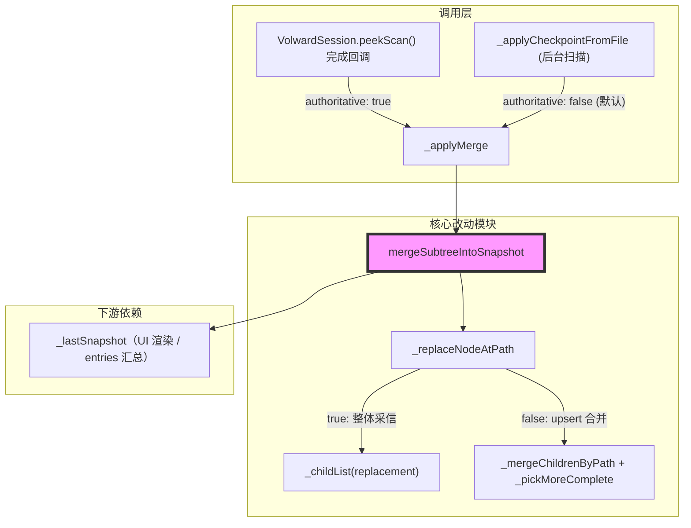
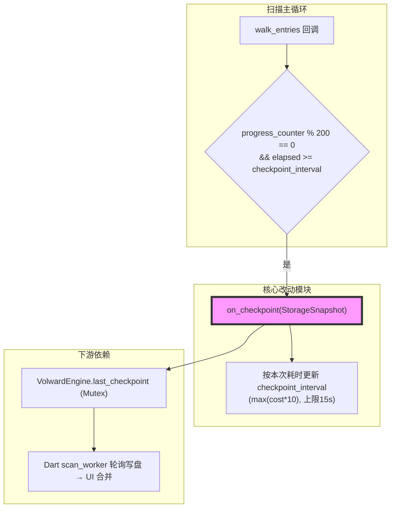
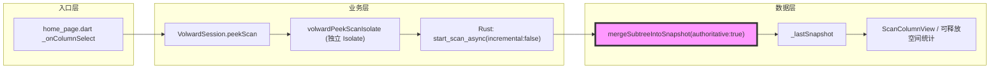

# 代码质量审查报告

---

## 一、基本信息

| 项目 | 内容 |
| :--- | :--- |
| **分支名称** | main |
| **审查时间** | 2026-07-24 17:29 |
| **变更规模** | 5 files changed, 366 insertions(+), 26 deletions(-) |
| **变更类型** | Bug 修复 / 性能优化 |
| **模型型号** | Claude Sonnet 5 |
---

## 二、变更说明

### 变更概述

**变更主题**：
1. Peek 权威合并：区分「后台扫描 checkpoint（非权威）」与「Wave-2 peek 扫描（权威）」两类合并来源，权威结果的子级整体采信（含"消失即删除"语义），修复此前 size 兜底策略可能误保留已删除文件数据的问题
2. Rust checkpoint 自适应节流：根据每次 checkpoint 实际耗时动态调整下一次的检查点间隔上限，避免大目录场景下 `entries.clone()` + `peek_snapshot()` 的克隆开销随扫描规模无界增长

**核心目的**：修复上一轮 `/code-review` 中识别出的两个 Medium 级问题（`_pickMoreComplete` 可能残留过时数据、checkpoint 克隆开销无界增长），使渐进式扫描功能在数据正确性与性能上闭环。

**变更类型**：Bug 修复 + 性能优化

### 变更明细

#### 主题1：Peek 权威合并 (⚠️)

**改动总结**：`mergeSubtreeIntoSnapshot` / `_replaceNodeAtPath` 新增 `replacementIsAuthoritative` 参数。为 `true`（仅 `peekScan` 完成后调用）时，目标节点的 `children` 整体采信 `replacement` 的最新列表（不再与旧数据做 size 比较，天然正确反映删除）；为 `false`（后台 checkpoint 的默认路径）时，维持原 `_mergeChildrenByPath` + `_pickMoreComplete` 的 upsert 策略。

**架构图**



**关键改动点**：
1. `mergeSubtreeIntoSnapshot`/`_replaceNodeAtPath` 新增 `replacementIsAuthoritative`（默认 `false`，向后兼容）
2. `volword_session.dart` 的 `peekScan` 完成分支显式传入 `authoritative: true`；`_applyCheckpointFromFile` 保持默认值不变
3. 新增单测覆盖"权威合并正确丢弃已删除文件"场景

**副作用（如有）**：
- **DB/缓存/MQ**：无，纯内存快照合并逻辑，不涉及持久化

#### 主题2：Rust checkpoint 自适应节流 (⚠️)

**改动总结**：`ScanOrchestrator::run_scan` 中，原固定 2s 的 `checkpoint_interval` 改为自适应：每次生成 checkpoint 后，按本次 `on_checkpoint` 回调（含 `entries.clone()` + `tree_builder.peek_snapshot()`）的实际耗时的 10 倍来更新下一次的间隔，并设 15s 上限，使 checkpoint 自身开销占比不随扫描规模无界增长。

**架构图**



**关键改动点**：
1. `checkpoint_interval` 由 `let` 改为 `mut`，新增 `MAX_CHECKPOINT_INTERVAL = 15s`
2. checkpoint 耗时测量范围覆盖 `on_checkpoint` 整个回调（含 clone + 聚合 + Mutex 写入）
3. 间隔只增不减（`.max(...)`），符合"扫描进度越深、树越大，克隆代价越高"这一单调增长的实际情况

**副作用（如有）**：
- **DB/缓存/MQ**：无。对 UI 的影响是后台扫描进度越深，checkpoint（进度可见性）更新频率会自适应降低，属预期取舍

---

## 三、影响面分析

**影响概述**：
- **对用户**：已删除文件不再被残留展示或计入"可释放空间"预估（Wave-2 场景）；大目录扫描时后台线程不会因固定高频克隆而持续消耗 CPU
- **对业务**：渐进式扫描功能的数据正确性与性能表现进一步收敛，具备可交付质量
- **对系统**：不引入新的并发原语/线程，改动局限于既有合并函数与既有回调节流点，风险可控

**业务功能影响概述**：
1. Wave-2 目录点击展开 - 影响中，兼容性完全兼容（新增可选具名参数，默认值保持旧行为），风险点：权威合并未清理 `entries` 中对应已删除路径的过时项（见问题清单）
2. 大目录/全盘后台扫描 - 影响中，兼容性完全兼容，风险点：checkpoint 更新频率随扫描规模自适应降低，属预期但需在大盘场景做一次实测验证

**主链路**：用户点击未扫描目录 → `peekScan` 触发独立 Isolate 完整重扫该目录 → 结果通过 `_applyMerge(authoritative: true)` 整体覆盖对应子树 → `home_page.dart` 依据 `snapshot_id` 变化刷新列导航与展示树

**调用链路图**



### 核心影响点明细

| 影响点 | 影响类型 | 风险等级 | 说明 | 验证/缓解 |
| :----- | :------- | :------- | :--- | :-------- |
| `_replaceNodeAtPath` 权威分支 | 行为变更 | ⚠️中 | 权威合并时子级不再走 size 兜底，整体采信新数据 | 单测覆盖 + `flutter test` 全量通过 |
| `mergeSubtreeIntoSnapshot` 的 `entries` 合并 | 数据一致性 | ⚠️中 | 权威合并未联动清理 `entries` 中已消失路径的过时项 | 未缓解，见问题清单 Medium-1 |
| `run_scan` checkpoint 节流 | 性能 | ⚠️中 | 间隔自适应升高，大盘场景克隆开销占比受控 | `cargo test --workspace` 全量通过（含既有 `checkpoints_are_monotonically_increasing_subsets_of_final_result`） |

### 风险评估

| 风险点 | 风险等级 | 影响描述 | 缓解措施 |
| :----- | :------- | :------- | :------- |
| 权威 peek 合并未清理 `entries` 陈旧项 | ⚠️中 | 已删除文件对应的 entry 可能残留在 `snapshot['entries']`，使"可释放空间"数字虚高，直至本次扫描 Done 才自愈 | 建议按 targetPath 前缀过滤陈旧 entries（见问题清单） |
| checkpoint 间隔只增不减 | 👀低 | 若早期出现一次异常耗时的 checkpoint，后续间隔会被拉高且不回落，属有界（≤15s）的渐进式体验降级，非数据错误 | 暂不处理，影响有界且符合克隆成本随扫描深入单调增长的实际情况 |

### 兼容性声明（如有）

- **API/DTO**：`mergeSubtreeIntoSnapshot`/`_applyMerge` 新增的 `replacementIsAuthoritative`/`authoritative` 均为具名可选参数且默认值等于旧行为，无破坏性
- **数据**：不涉及历史快照文件格式变化；Rust 侧 `StorageSnapshot`/`ScanTreeNode` 结构未变

---

## 四、问题清单

### 🟡 Medium（建议修复）

1. **权威 peek 合并遗漏清理 `entries` 中的陈旧项，导致"可释放空间"虚高** - `apps/volward/lib/scan_snapshot_merge.dart:39-53`
   - **问题**：`mergeSubtreeIntoSnapshot` 中 `entries` 合并逻辑（`byId` 构建）无论 `replacementIsAuthoritative` 是否为 `true`，都只做"按 id 新增/覆盖"，从不删除。当 Wave-2 peek 权威地确认某目录下一个文件已被删除时，`tree` 侧已正确从 `children` 中移除该节点（本次改动生效），但该文件此前若已被分类为可清理项（`entries` 中带有对应 `id`），其条目会一直残留在 `snapshot['entries']` 里，因为 peek 返回的 `subtreeEntries` 里自然不会再包含这个已删除文件的 id，合并逻辑也就没有机会删除它。
   - **后果**：`reclaimable_estimate_bytes` 由 `mergedEntries` 现算得出（`scan_snapshot_merge.dart:55-57`），并直接展示为首页"可释放空间"（`apps/volward/lib/home_page.dart:707`）。文件已被外部删除后，这个数字会持续虚高，且该陈旧 entry 仍可能被用户在"批量清理"中选中，直到本次扫描完全结束、加载最终权威快照后才会自愈。
   - **建议**：`replacementIsAuthoritative` 为 `true` 时，额外按 `targetPath` 前缀过滤一遍 `entries`：凡是路径落在该子树下、但未出现在本次 `subtreeEntries` 中的旧 entry，一并从 `byId` 中移除。
   ```dart
   for (final e in subtreeEntries) {
     final id = e['id']?.toString();
     if (id != null) byId[id] = e;
   }
   if (replacementIsAuthoritative) {
     final prefix = targetPath.endsWith('/') ? targetPath : '$targetPath/';
     final freshIds = subtreeEntries
         .map((e) => e['id']?.toString())
         .whereType<String>()
         .toSet();
     byId.removeWhere((id, e) {
       final p = e['path_or_uri']?.toString();
       if (p == null) return false;
       final underTarget = p == targetPath || p.startsWith(prefix);
       return underTarget && !freshIds.contains(id);
     });
   }
   ```

### 🟢 Low（可选优化）

1. **`checkpoint_interval` 自适应增长逻辑缺少单测** - `crates/volward-core/src/scan.rs:158-238`
   - **问题**：新增的自适应节流（按耗时更新 `checkpoint_interval` 并封顶 15s）目前只被既有的 `checkpoints_are_monotonically_increasing_subsets_of_final_result` 间接覆盖，该测试数据量小，`checkpoint_cost` 恒趋近 0，实际不会触发间隔增长分支。
   - **建议**：`[Optional]` 可补一个直接调用 `run_scan` 并在 `on_checkpoint` 回调里人为 `sleep` 模拟耗时的测试，断言后续 `last_checkpoint_at.elapsed()` 门槛确实被拉高（例如统计 checkpoint 触发次数随耗时增大而减少）。非必须，不影响本次合并。
