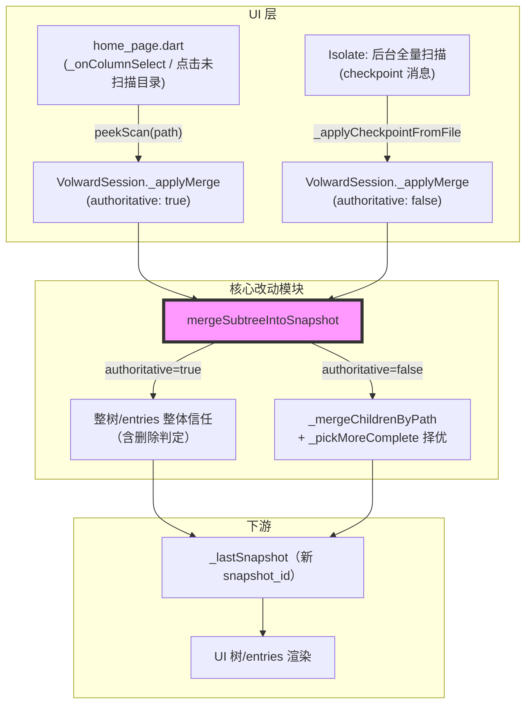
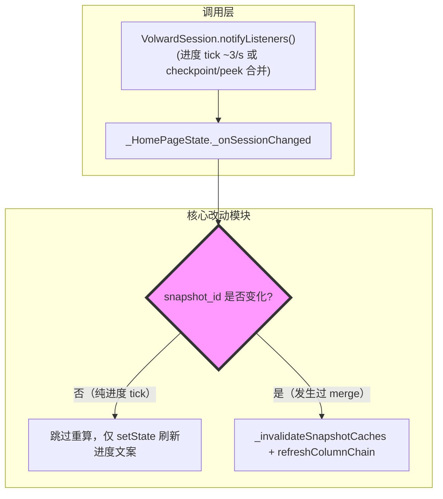

# 代码质量审查报告

---

## 一、基本信息

| 项目 | 内容 |
| :--- | :--- |
| **分支名称** | main |
| **审查时间** | 2026-07-24 17:52 |
| **变更规模** | 5 files changed, +437 insertions, -26 deletions |
| **变更类型** | 新功能 / 性能优化 |
| **模型型号** | Claude Sonnet 5 |
---

## 二、变更说明

### 变更概述

**变更主题**：
1. **快照合并语义分化**：区分「后台扫描 checkpoint（非权威）」与「Wave-2 peek 扫描（权威）」两类合并策略，并让权威合并正确处理"文件被删除"场景（`scan_snapshot_merge.dart` + `volward_session.dart`）
2. **UI 浏览态缓存去抖**：`home_page.dart` 中仅当 `_lastSnapshot['snapshot_id']` 真正变化时才触发全树重算/列浏览刷新，避免每次进度 tick（约 3 次/秒）都重算
3. **checkpoint 生成间隔自适应**：`scan.rs` 中 checkpoint 间隔从固定 2s 改为按上一次 checkpoint 实际耗时动态放宽（上限 15s），控制大目录扫描时克隆/序列化开销

**核心目的**：支撑"渐进式扫描"体验——用户点击尚未被后台全量扫描覆盖的目录时，通过一次独立的 Wave-2 peek 扫描立即拿到该目录的权威结果；同时后台全量扫描持续推进并通过 checkpoint 增量刷新 UI，两条数据流合并时不能互相"打架"（peek 结果不能被更慢的后台 checkpoint 冲掉，checkpoint 也不能无限膨胀开销）。

**变更类型**：新功能（渐进式扫描）

### 变更明细

#### 主题1：快照合并语义分化（❗高风险）

**改动总结**：`mergeSubtreeIntoSnapshot` 新增 `replacementIsAuthoritative` 参数。`false`（checkpoint，默认值）时改为按 `path` upsert 子节点，并用 `_pickMoreComplete` 在新旧子节点间"择优"（依据 `scanned` 标记 + `size_bytes` 大小），以避免后台主扫描的 checkpoint 用尚未追上的、更不完整的数据覆盖掉已经被 Wave-2 peek 完整解析过的子树；`true`（peek）时整棵子树与相应 `entries` 全部按新结果整体信任，包括"路径缺失即视为已删除"，从而正确处理增量场景下的文件删除。

**架构图**



**关键改动点**：
1. `_replaceNodeAtPath` 新增 `replacementIsAuthoritative` 分支：非权威时子节点走 `_mergeChildrenByPath`（保留未被检查点重新发现的旧子节点），权威时整体替换为 `_childList(replacement)`。
2. `_pickMoreComplete`：非权威合并下，若旧子节点 `scanned != false` 且 `size_bytes` 更大，则保留旧数据，否则采用新数据。
3. `mergeSubtreeIntoSnapshot` 的 `entries` 合并新增权威分支：删除目标路径下"存在于旧 entries 但不在新 `subtreeEntries` 中"的条目，同步修正 `reclaimable_estimate_bytes`。
4. `VolwardSession._applyMerge`/`peekScan` 透传 `authoritative` 参数，`_applyCheckpointFromFile` 保持默认非权威。

**副作用（如有）**：
- **本地内存快照 `_lastSnapshot`**：每次合并都会生成新的 `snapshot_id`（`live-...`），驱动 UI 缓存失效；非权威合并的"择优"逻辑依赖 `scanned` 字段语义，但该字段仅由 Dart 侧在"精确命中合并目标节点"或 `scan_preview.dart` 的预览快照中显式写入，Rust 端 `ScanTreeNode`（`crates/volward-core/src/model.rs:64`）从未序列化过 `scanned` 字段——这是第四章 High 问题「重新扫描期间旧数据覆盖新 checkpoint」的根因。
- **磁盘 checkpoint 文件**：无格式变更，仍由 `_applyCheckpointFromFile` 读取后删除。

#### 主题2：UI 浏览态缓存去抖（⚠️中风险）

**改动总结**：`_onSessionChanged` 新增 `_lastRefreshedSnapshotId` 字段，仅当浏览态非空（`_columnChain.isNotEmpty`）且 `_s.lastSnapshot['snapshot_id']` 相对上次已刷新的值发生变化时，才执行 `_invalidateSnapshotCaches()` + `_getDisplayTree()` + `refreshColumnChain`；纯进度 tick（不触碰 `_lastSnapshot`）被跳过，避免扫描期间浏览列表反复全量重算。

**架构图**



**关键改动点**：
1. 三处更新 `_lastRefreshedSnapshotId` 的分支均与既有的"扫描开始/结束/浏览中收到新数据"分支保持一致，去抖判定条件与 `mergeSubtreeIntoSnapshot` 每次调用都生成新 `snapshot_id` 的行为吻合。
2. `_getDisplayTree()`/`_resolveResultTree()`/`_filteredSortedEntries()` 本身已按 `snapshot_id` 做缓存键，去抖不会导致这些缓存返回过期数据，只是减少了主动触发重算 + `refreshColumnChain` 的频率。

**副作用（如有）**：无额外副作用；`setState(() {})` 仍在每次 tick 触发，重算部分被跳过，但整体 `build()` 因缓存键匹配依然低成本。

#### 主题3：checkpoint 生成间隔自适应（👀低风险）

**一句话总结**：`scan.rs` 将固定 2s 的 checkpoint 间隔改为按上次 checkpoint 实际耗时（`checkpoint_cost * 10`，上限 15s）动态放宽，控制大目录扫描下 `entries.clone()` + `peek_snapshot()` 的开销占比，仅影响 UI 刷新节奏，不改变最终扫描结果。

---

## 三、影响面分析

**影响概述**：
- **对用户**：点击未扫描目录可秒级获得准确结果（Wave-2 peek）；浏览目录时后台扫描不再频繁卡顿重排；但在"重新扫描"（含删除后自动重扫）期间，用户短暂看到的可能是**删除前的旧数据**而非扫描进度的真实反映（见问题清单）。
- **对业务**：直接影响"存储清理"这一核心场景——用户删除文件后期望立刻在扫描进度中看到空间被正确释放，这正是本次改动引入的问题所削弱的场景。
- **对系统**：快照合并从"无脑整树替换"改为"按路径择优合并"，引入了对 `scanned` 字段语义的隐式依赖，而 Rust 序列化格式与该假设不完全匹配。

**业务功能影响概述**：
1. Wave-2 peek 点选目录即时展开 - 影响中，兼容性完全兼容，风险点：无（已有专项单测覆盖，权威合并正确处理文件删除）。
2. 后台扫描 checkpoint 增量刷新 - 影响高，兼容性需调用方留意，风险点：重新扫描（尤其是删除后自动重扫）期间会被旧的完整扫描数据"回退"覆盖，掩盖真实变化直至扫描结束。
3. 扫描中浏览目录树的响应性 - 影响低，兼容性完全兼容，风险点：无。

**主链路**：用户操作（点击目录 / 触发扫描或删除后自动重扫）→ `VolwardSession.peekScan` / 后台扫描 checkpoint 消息 → `_applyMerge` → `mergeSubtreeIntoSnapshot` → `_lastSnapshot` → `home_page.dart` 渲染树/列表。

**调用链路图**


### 核心影响点明细

| 影响点 | 影响类型 | 风险等级 | 说明 | 验证/缓解 |
| :----- | :------- | :------- | :--- | :-------- |
| 后台扫描 checkpoint 非权威合并（`_pickMoreComplete`） | 数据展示准确性 | ❗ | 择优逻辑依赖 `scanned` 标记区分"新鲜度"，但 Rust 端从不产出该字段，导致旧的、已完成扫描的完整数据在"重新扫描"场景下被误判为"更完整"而覆盖真正的新 checkpoint 数据 | 已用独立单测复现（见问题清单），建议修复后补充回归测试 |
| Wave-2 peek 权威合并（含目录节点与 entries 两处删除判定） | 数据正确性 | 👀 | 权威合并整体信任新结果，正确丢弃已删除的子节点和 entries | `cargo test --workspace`、`flutter test` 全部通过，含 4 个新增专项用例 |
| `home_page.dart` 浏览态缓存去抖 | 性能 / UI 响应 | ⚠️ | 依赖 `snapshot_id` 单调变化判断是否需要重算；当前两条写入路径（checkpoint、peek）均正确生成新 id | 代码走查确认逻辑自洽；`flutter analyze` 无新增问题 |
| `scan.rs` checkpoint 间隔自适应（2s→15s） | 性能 | 👀 | 仅影响 UI 刷新节奏，不改变 `finalize()` 产出的最终快照内容 | `cargo test --workspace` 全部通过（31 项，含 scan 模块用例） |

### 风险评估

| 风险点 | 风险等级 | 影响描述 | 缓解措施 |
| :----- | :------- | :------- | :------- |
| 重新扫描（尤其是删除后 `rescanAfterDelete: true` 自动重扫）期间，checkpoint 合并把旧的、完整的历史扫描数据当作"更完整"数据保留，压制了本次扫描的真实进度 | ❗ | 用户在默认工作流（非极端条件）下即可触发：删除文件→自动重扫→扫描期间界面持续显示删除前的旧体积，直至扫描完全结束才纠正，直接违背本次改动"正确处理文件删除"的目标 | 建议 `_pickMoreComplete` 中的 `oldScanned` 判定由 `oldChild['scanned'] != false` 收紧为 `oldChild['scanned'] == true`（已验证：不影响现有全部测试用例，且能正确修复该回退） |
| UI 去抖判断完全依赖 `snapshot_id` 是否变化 | ⚠️ | 若未来新增某条写入 `_lastSnapshot` 但不刷新 `snapshot_id` 的路径，会导致浏览态漏刷新 | 当前两处写入点（checkpoint、peek）均经 `_applyMerge` 统一生成新 id，走查确认无遗漏 |
| checkpoint 间隔最长可放宽到 15s | 👀 | 超大目录扫描时进度提示间隔变长，但不影响最终结果正确性，且有上限兜底 | 已加 `MAX_CHECKPOINT_INTERVAL` 上限，可接受 |

### 兼容性声明（如有）

- **内部数据契约**：`mergeSubtreeIntoSnapshot` 的默认行为（`replacementIsAuthoritative: false`）从"整树替换"变为"按路径择优合并"，属破坏性行为变更；由于该函数仅在 `volward_session.dart` 内部调用，无外部/持久化契约冲击，但其正确性隐式依赖 `scanned` 字段在 Rust 序列化产物中始终缺失这一事实，需在后续修复中显式对齐。
- **数据**：磁盘 checkpoint / 快照 JSON 格式未变更，无需数据迁移。

---

## 四、问题清单

### 🔴 Critical（必须立即修复）

无。

### 🟠 High（合并前必须修复）

1. **重新扫描（尤其删除后自动重扫）期间，checkpoint 合并会用过期的旧完整数据覆盖真正的新进度** - `apps/volward/lib/scan_snapshot_merge.dart:204-213`
   - **问题**：`_pickMoreComplete` 用 `final oldScanned = oldChild['scanned'] != false;`（`apps/volward/lib/scan_snapshot_merge.dart:208`）判断旧子节点是否"已完整"，仅当 `oldScanned && oldSize > newSize` 时才保留旧值。但 Rust 端 `ScanTreeNode`（`crates/volward-core/src/model.rs:63-71`）从未序列化 `scanned` 字段；`scanned` 只在 Dart 侧"精确命中本次合并目标节点"（`_replaceNodeAtPath` 第 95 行 `'scanned': replacement['scanned'] ?? true`）或 `scan_preview.dart` 的预览快照中才会被显式写入。因此，一个来自**上一次已完整扫描结果**（或从磁盘恢复的历史快照）、本身从未被显式标记过 `scanned` 的目录子节点，`oldChild['scanned']` 恒为 `null`，`null != false` 恒为 `true`——即 `oldScanned` 对几乎所有普通目录节点永远为 `true`。当用户点击"Rescan"，或在 `home_page.dart` 的 `_confirmDelete()` 中删除文件后触发 `deleteEntries(..., rescanAfterDelete: true)`（`apps/volward/lib/home_page.dart:508-511` → `apps/volward/lib/volward_session.dart:557` `await runScan()`）时，`runScan()` 并不会清空 `_lastSnapshot`（`apps/volward/lib/volward_session.dart:426-437`），于是新一轮扫描的第一个 checkpoint 到达时，`_applyCheckpointFromFile` 会把**上一次扫描遗留的、体积更大的旧数据**与本次刚开始、体积更小的新 checkpoint 逐子节点比较：由于 `oldSize(旧，大) > newSize(新，小)` 且 `oldScanned` 恒真，`_pickMoreComplete` 会持续选择保留旧值，直到本次扫描进度追上旧值为止——若用户正是为了确认"删除后体积变小"而重扫，这段时间内 UI 会持续展示**删除前的错误数据**，直至整个扫描完全结束（走 `_loadSnapshotFromFile` 整体替换）才纠正。已通过独立单测复现：构造"旧完整快照 Documents=5000（无 `scanned` 字段）+ 新 checkpoint Documents=800（模拟删除后重扫）"，合并结果仍为 `5000`（预期应为 `800`）。
   - **建议**：将 `oldScanned` 的判定从"不等于 `false`"收紧为"严格等于 `true`"，使其只在真正被 Wave-2 peek 或 checkpoint 合并显式标记过的节点上生效，而不是对所有"缺失该字段"的历史/完整数据默认放行。已验证该收紧不影响 `scan_snapshot_merge_test.dart` 中全部现有用例（含新增的"保留已 peek 数据"用例，因为该场景下 `scanned` 均被显式设为 `true`），并能正确修复上述回退问题。建议同时补充一个"模拟重新扫描（旧数据无 `scanned` 字段且体积更大）"的回归测试，避免同类问题再次引入。
   ```dart
   Map<String, dynamic> _pickMoreComplete(
     Map<String, dynamic> oldChild,
     Map<String, dynamic> newChild,
   ) {
     // Only trust "old wins" when the old child was itself an exact merge
     // target before (peek, or a prior checkpoint's root) — a plain node
     // straight from Rust JSON (including a fully-finished previous scan)
     // never carries this key and must not be treated as authoritative.
     final oldScanned = oldChild['scanned'] == true;
     final oldSize = (oldChild['size_bytes'] as num?)?.toInt() ?? 0;
     final newSize = (newChild['size_bytes'] as num?)?.toInt() ?? 0;
     if (oldScanned && oldSize > newSize) return oldChild;
     return newChild;
   }
   ```

### 🟡 Medium（建议修复）

无。

### 🟢 Low（可选优化）

无。
