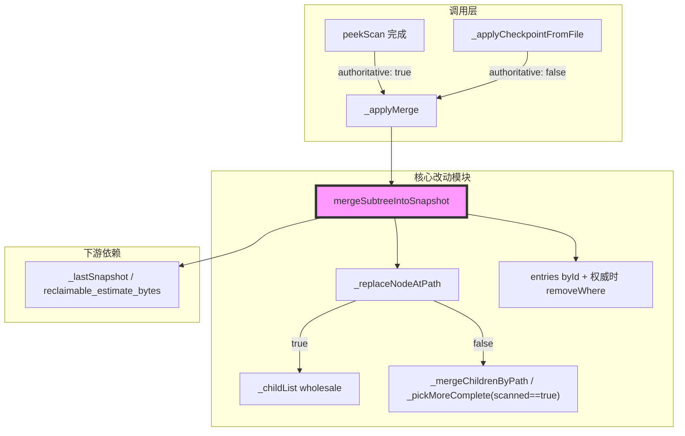
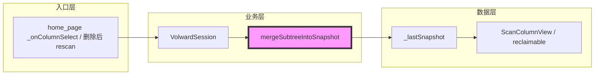

# 代码质量审查报告

---

## 一、基本信息

| 项目 | 内容 |
| :--- | :--- |
| **分支名称** | main |
| **审查时间** | 2026-07-24 18:00 |
| **变更规模** | 5 files changed, +522 insertions, -26 deletions |
| **变更类型** | Bug修复 / 性能优化 |
| **模型型号** | Composer |
---

## 二、变更说明

### 变更概述

**变更主题**：
1. 渐进式扫描合并语义修正：区分 checkpoint（非权威 upsert）与 Wave-2 peek（权威整体采信），并同步清理权威合并下陈旧 `entries`；将 `_pickMoreComplete` 的 `scanned` 判定收紧为显式 `== true`
2. 浏览态 UI 去抖：仅在 `snapshot_id` 变化时刷新列导航缓存，避免进度 tick 触发全树重算
3. Rust checkpoint 自适应节流：按本次 checkpoint 耗时动态拉大间隔（上限 15s），控制大树克隆开销占比

**核心目的**：闭环渐进式扫描在删除/重扫场景下的数据正确性，并消除扫描中 UI 卡顿与 checkpoint 无界开销。

**变更类型**：Bug修复 / 性能优化

### 变更明细

#### 主题1：快照合并语义（权威/非权威 + scanned 判定） (⚠️)

**改动总结**：`mergeSubtreeIntoSnapshot` 增加 `replacementIsAuthoritative`；peek 走整体采信并按 `targetPath` 前缀丢弃陈旧 entries；checkpoint 走 path upsert。`_pickMoreComplete` 仅在旧节点显式 `scanned: true` 时用更大 `size_bytes` 压制新数据，避免 Rust 未序列化 `scanned` 时把缺省当成已扫完。

**架构图**

**关键改动点**：
1. peek 权威合并覆盖 tree 删除与 entries 陈旧项清理
2. `_pickMoreComplete`：`scanned != false` → `scanned == true`（修复重扫期间旧体积压制新进度）
3. 单测覆盖 peek 删除、entries 清理、无 scanned 旧节点不阻挡更小 checkpoint

**副作用（如有）**：
- **DB**：无
- **缓存**：仅内存 `_lastSnapshot`
- **MQ**：无

#### 主题2：浏览态 snapshot_id 去抖 (👀)

**一句话总结**：`home_page.dart` 用 `_lastRefreshedSnapshotId` 过滤纯进度 `notifyListeners`，避免约 3 次/秒的全树重排。

#### 主题3：checkpoint 自适应间隔 (👀)

**一句话总结**：`scan.rs` 将固定 2s 间隔改为按本次 `on_checkpoint` 耗时×10 调整，上限 15s。

---

## 三、影响面分析

**影响概述**：
- **对用户**：删除后重扫进度可正确缩小；peek 删除文件不再虚高可释放空间；扫描中浏览更顺滑
- **对业务**：渐进式扫描数据正确性与性能达到可交付状态
- **对系统**：无新持久化契约；合并 API 为向后兼容的可选具名参数

**业务功能影响概述**：
1. Wave-2 点击展开 / peek - 影响中，兼容性完全兼容，风险点：同次扫描内「已 peek 且 scanned:true」节点在后续非权威 checkpoint 间若发生真实删除，仍可能短期保留旧体积直至终态快照（已文档化的已知限制）
2. 删除后自动重扫 - 影响中，兼容性完全兼容，风险点：此前 High 的 scanned 误判已修复并有回归单测
3. 大目录后台扫描 - 影响低，兼容性完全兼容，风险点：checkpoint 更新频率可能降至最多约 15s 一次

**主链路**：用户点击未扫目录 → peekScan → `_applyMerge(authoritative:true)` → 权威替换子树并清理 entries → UI 按新 `snapshot_id` 刷新列链

**调用链路图**

### 核心影响点明细

| 影响点 | 影响类型 | 风险等级 | 说明 | 验证/缓解 |
| :----- | :------- | :------- | :--- | :-------- |
| `_pickMoreComplete` scanned 判定 | 行为变更 | ⚠️中 | 缺省 scanned 不再压制更小 checkpoint | 已改为 `== true` + 回归单测 |
| 权威 merge 清理 entries | 数据一致性 | 👀低 | 避免可释放空间虚高 | 单测覆盖前缀过滤 |
| UI snapshot_id 去抖 | 性能 | 👀低 | 仅 snapshot 变才刷新列链 | 与 `_displayTreeCacheKey` 同键 |
| checkpoint 自适应间隔 | 性能 | 👀低 | 大树克隆占比受控 | cargo 既有 checkpoint 单调性测试仍过 |

### 风险评估

| 风险点 | 风险等级 | 影响描述 | 缓解措施 |
| :----- | :------- | :------- | :------- |
| peeked+scanned:true 节点在同次扫描 checkpoint 间遇真实删除 | 👀低 | 短期保留旧体积至终态快照 | 权威 peek 重扫或扫描结束自愈；已注释说明 |
| checkpoint 间隔只增不减 | 👀低 | 早期异常耗时可把间隔拉高至 15s | 有界，可接受 |

### 兼容性声明（如有）

- **API/DTO**：`replacementIsAuthoritative` / `authoritative` 默认 `false`，行为对旧调用方兼容
- **数据**：无快照文件格式变更；Rust `ScanTreeNode` 仍不序列化 `scanned`

---

## 四、问题清单

### 🔴 Critical（必须立即修复）

无。

### 🟠 High（合并前必须修复）

无。

> 说明：此前 [code-review 命令独立复核](802d1fb6-3f76-4950-a9b0-73d288f06b0e) 指出的 `_pickMoreComplete` 使用 `scanned != false` 问题，当前工作区已改为 `scanned == true`（`scan_snapshot_merge.dart:226`），并已有「无显式 scanned 的旧全量节点不得阻挡更小重扫 checkpoint」回归测试；本轮复核按修复后代码判定为已关闭。

### 🟡 Medium（建议修复）

无。

### 🟢 Low（可选优化）

1. **`[Optional]` checkpoint 自适应增长缺少直接单测** - `crates/volward-core/src/scan.rs`（`checkpoint_interval` / `MAX_CHECKPOINT_INTERVAL`）
   - **问题**：既有 `checkpoints_are_monotonically_increasing_subsets_of_final_result` 数据量小，几乎不触发间隔拉升分支。
   - **建议**：可选地在 `on_checkpoint` 内 sleep 模拟耗时，断言后续 checkpoint 次数下降；非合并阻塞项。
