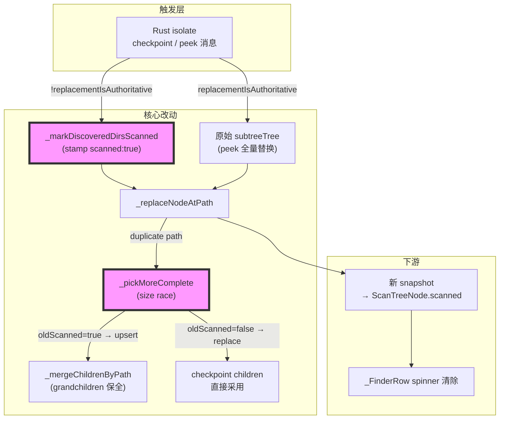
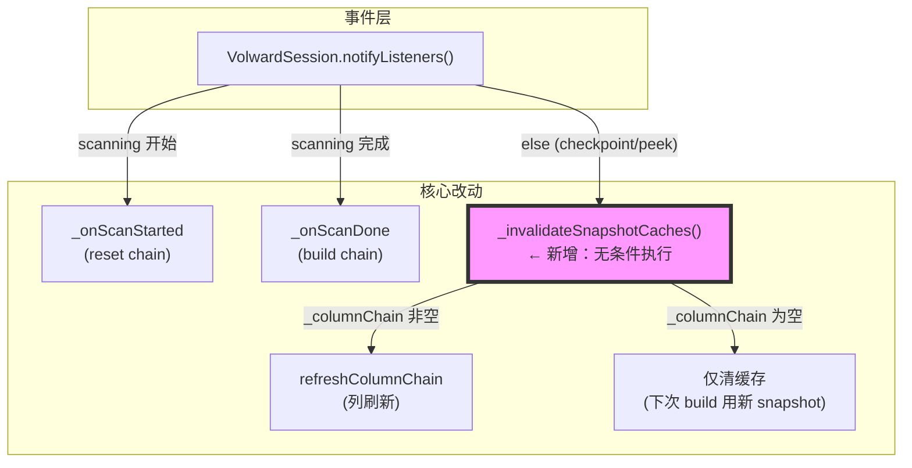
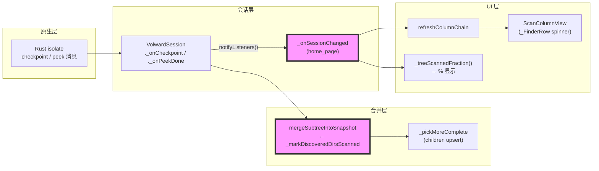

# 代码质量审查报告

---

## 一、基本信息

| 项目 | 内容 |
| :--- | :--- |
| **分支名称** | main |
| **审查时间** | 2026-07-27 03:57 |
| **变更规模** | 5 files changed, +335 insertions, -22 deletions |
| **变更类型** | Bug修复 / 新功能 |
| **模型型号** | claude-opus-4-8 |

---

## 二、变更说明

### 变更概述

**变更主题**：
1. 渐进扫描合并正确性：checkpoint 即时清除 preview spinner + peek 输 size race 时 grandchildren upsert 保全
2. 根列刷新 bug 修复：`_onSessionChanged` 在 `_columnChain` 为空时也执行 `_invalidateSnapshotCaches`
3. 扫描进度可视化：目录旁百分比 + peek 飞行中 accent spinner + sticky bar 状态提示
4. `peekInFlight` 公开 getter 及配套测试覆盖

**核心目的**：修复选择根目录后子目录长期卡在 loading 状态不更新的问题，同时新增实时进度百分比让用户感知扫描进展。

**变更类型**：Bug修复 / 新功能

### 变更明细

#### 主题1：渐进扫描合并正确性 (⚠️)

**改动总结**：checkpoint fragment 进入合并前先由 `_markDiscoveredDirsScanned` 递归 stamp `scanned: true`，让 preview spinner 在路径被后台 walk 重新发现时立即消除，无需等到最终 Done 快照。同时，`_pickMoreComplete` 在 checkpoint 赢得 size race 时，若旧侧是显式 peek（`scanned: true`），则对 children 做 `_mergeChildrenByPath` upsert 而非整体替换，保全 peek 已知的 grandchildren。`peekScan` 新增 `hasScanOptionsApi` guard，防止过旧 dylib 将路径静默写入 `_peekCompleted`，使之永远无法重试。

**架构图**



**关键改动点**：

1. `_markDiscoveredDirsScanned`：纯函数，递归复制 Map 并注入 `scanned: true`；仅对 `is_dir: true` 节点生效，文件节点原样返回；时间复杂度 O(checkpoint subtree size)，单次 checkpoint 通常远小于全树。
2. `_pickMoreComplete` dir 分支：`oldScanned`（旧侧有显式 `scanned: true`）判断为 peek 侧；仅 peek 侧才触发 deep-merge，避免普通 checkpoint 覆盖 checkpoint 时在 UI isolate 做 O(全树) 合并。
3. `peekScan` guard：若 `hasScanOptionsApi` 为 false，打印诊断日志并提前返回，路径**不**加入 `_peekCompleted`，确保 dylib 重建后重试不被阻塞。

**副作用（如有）**：
- **DB**：无
- **缓存**：`_pickMoreComplete` 在 peek 赢（old.size > new.size）时行为不变；仅在 checkpoint 赢且旧侧是 peek 时新增 children upsert 路径，对 non-peek 场景无影响。
- **MQ**：无

---

#### 主题2：根列刷新 bug 修复 (⚠️)

**改动总结**：`_onSessionChanged` 原有 `else if (_columnChain.isNotEmpty)` 短路了 `_invalidateSnapshotCaches()`，导致用户停在根列时 snapshot 更新后缓存未清除，preview spinner 不消失。改为 `else { _invalidateSnapshotCaches(); if (_columnChain.isNotEmpty) { ... } }` 后，缓存始终随 `snapshot_id` 变更失效。

**架构图**



**关键改动点**：
1. 缓存失效从"有列时"提升至"snapshot_id 有变化时"，与 snapshot 生命周期对齐。
2. `_columnChain.isNotEmpty` 条件仍保留，仅控制是否触发 `refreshColumnChain`，不影响缓存清除逻辑。

**副作用（如有）**：
- **缓存**：`_invalidateSnapshotCaches()` 在根列状态下每次 `snapshot_id` 变更均触发（扫描期间约 ~3 次/秒），代价是单次 hash map 清空，无可观测性能影响。

---

#### 主题3：扫描进度可视化 (👀)

**一句话总结**：`_treeScannedFraction()` 同步遍历内存树计算 scanned 目录比例，在 "Home/Custom" 标签旁以 primary 色文字显示百分比；sticky bar 在有 peek 飞行时改为 "N director(y/ies) loading…" 提示；spinner 在 `peekInFlight` 为真时用 accent 色区分主动 peek 与静默 preview。

---

#### 主题4：peekInFlight getter 及测试覆盖 (👀)

**一句话总结**：`VolwardSession.peekInFlight` 公开 `Set.unmodifiable(_peekInFlight)` 供 UI 读取；新增 2 个单元测试分别验证 checkpoint 即时清 spinner 和 peek children upsert 的正确性。

---

## 三、影响面分析

**影响概述**：
- **对用户**：选择根目录后各子目录 spinner 随后台 checkpoint 逐步清除，不再卡在全量 loading；点击目录触发 peek 时 spinner 变色给出反馈；进度百分比提供直观扫描进度感知。
- **对业务**：扫描交互体验从"不透明等待"升级为"渐进式可见进度"，核心路径（选目录 → 浏览内容）恢复正常。
- **对系统**：合并逻辑新增 O(checkpoint subtree) 级别的 map 复制；根列 snapshot_id 变更触发额外 hash map 清空（~3/秒），两者开销均可忽略。

**业务功能影响概述**：
1. 渐进扫描目录列表刷新 - 影响高，兼容完全兼容，风险点：`_markDiscoveredDirsScanned` 对已有 `scanned: true` 节点叠加写入无害（幂等）
2. peek scan 触发与重试 - 影响中，兼容完全兼容，风险点：guard 提前返回时路径不进 `_peekCompleted`，多次点击同一目录不会堆积 isolate（受 `_maxConcurrentPeeks=2` 限制）
3. 根列缓存失效 - 影响中，兼容完全兼容，风险点：缓存失效频率提升，仅涉及 map 清空，无 UI rebuild

**主链路**：Rust checkpoint/peek 消息 → `mergeSubtreeIntoSnapshot` → `_markDiscoveredDirsScanned` → `ScanTreeNode.scanned` → `_FinderRow` spinner 清除

**调用链路图**



### 核心影响点明细

| 影响点 | 影响类型 | 风险等级 | 说明 | 验证/缓解 |
| :----- | :------- | :------- | :--- | :-------- |
| `_pickMoreComplete` 新增 children upsert 路径 | 正确性 | ⚠️ 中 | 仅在旧侧 `scanned: true` 时触发；若旧侧 peek 内容更大则原路返回，无退化 | 单元测试已覆盖两个分支 |
| `_treeScannedFraction` 同步全树遍历 | 性能 | ⚠️ 中 | 每次 notifyListeners (~3/秒) 遍历全内存树；深层目录树 (>5k dirs) 下可能轻微影响 UI 线程 | 当前规模可接受；未来可改为 session 侧增量计数 |
| `_markDiscoveredDirsScanned` map 递归复制 | 性能 | 👀 低 | checkpoint fragment 通常是全树一小部分，开销可忽略 | 大目录扫描 (10k+ dirs) 时可实测确认 |
| `peekScan` guard 提前返回 | 行为变更 | 👀 低 | dylib 旧时 peek 不再静默失败；有 debugPrint 日志，路径不进 `_peekCompleted` | 重建 dylib 后验证 peek 正常触发 |

### 风险评估

| 风险点 | 风险等级 | 影响描述 | 缓解措施 |
| :----- | :------- | :------- | :------- |
| `_pickMoreComplete` children upsert 未经集成测试 | ⚠️ 中 | peek 后收到大 checkpoint 时，若 upsert 逻辑存在 path key 冲突，可能出现重复子项 | 单元测试覆盖 happy path；建议在含 peek 的完整扫描流程上手动验证 |
| `_treeScannedFraction` 同步全树遍历 | ⚠️ 中 | 深层目录树下 ~3/秒全树遍历可能在 UI 线程引入轻微 jank | 未来版本改为 session 侧增量计数；当前规模下可接受 |
| `_markDiscoveredDirsScanned` 对非法 node 结构无防御 | 👀 低 | 若 Rust 未来输出非 Map children，`_childList` 返回空列表，静默跳过 | `_childList` 已有空列表 fallback，无崩溃风险 |

### 兼容性声明（如有）

- **API/DTO**：`VolwardSession.peekInFlight` 为新增只读 getter，不影响现有调用方。`ScanColumnView` 新增 `peekInFlight` 参数默认值为 `const {}`，所有现有构造调用保持兼容。
- **数据**：`mergeSubtreeIntoSnapshot` 输出的 snapshot Map 新增 `scanned: true` 字段写入（原由 Dart 侧 preview 写入 `false`，Rust 不写此字段）。`ScanTreeNode.fromSnapshotJson` 对缺失 `scanned` 字段默认 `true`，新增写入无破坏性影响。

---

## 四、问题清单

### 🔴 Critical（必须立即修复）

无

### 🟠 High（合并前必须修复）

无

### 🟡 Medium（建议修复）

1. **`_markDiscoveredDirsScanned` 使 `_pickMoreComplete` 的 peek/checkpoint 区分失效** - `scan_snapshot_merge.dart:254,263`

   - **问题**：`_markDiscoveredDirsScanned` 在每次 checkpoint merge 时将所有 dir 节点 stamp 为 `scanned: true` 并写入 snapshot。下次 checkpoint 到来时，old side（来自上一次 checkpoint 结果）已有 `scanned: true`，导致 `_pickMoreComplete` 第 254 行 `oldScanned = true` 成立，进而在第 268 行触发 `_mergeChildrenByPath` deep-merge。原设计意图（第 263 行注释：「只有 old side 是明确 peek 时才 deep-merge」）不再成立——checkpoint-vs-checkpoint 冲突同样会触发 O(children) 的 deep-merge，在 checkpoint 密集且目录树有大量重叠时可能累积成 UI isolate 上的可感知开销。

   - **建议**：用独立字段区分 peek 来源与 checkpoint stamp。peek 完成时在节点上写 `peekScanned: true`，`_markDiscoveredDirsScanned` 只写 `scanned: true`；`_pickMoreComplete` 的 deep-merge 判断改为 `oldChild['peekScanned'] == true`，恢复原设计意图并消除性能扩散。

   ```dart
   // scan_snapshot_merge.dart — _markDiscoveredDirsScanned 只写 scanned
   Map<String, dynamic> _markDiscoveredDirsScanned(Map<String, dynamic> node) {
     if (node['is_dir'] != true) return node;
     return {
       ...node,
       'scanned': true,
       // 不写 peekScanned — 只有完整 peek 才有权写该字段
       'children': [
         for (final child in _childList(node)) _markDiscoveredDirsScanned(child),
       ],
     };
   }

   // _pickMoreComplete — deep-merge 仅针对 peek 来源
   final oldPeeked = oldChild['peekScanned'] == true;
   if (newChild['is_dir'] == true) {
     return {
       ...newChild,
       'scanned': true,
       'children': oldPeeked
           ? _mergeChildrenByPath(_childList(oldChild), _childList(newChild))
           : _childList(newChild),
     };
   }
   ```

2. **`_treeScannedFraction` 每次 setState 重新全树遍历** - `home_page.dart:389-409`

   - **问题**：`_onSessionChanged` 在每次 `notifyListeners`（约 3 次/秒）后调用 `setState((){})`，触发 parent rebuild，`_treeScannedFraction` 在 `Builder` 内同步遍历整棵 `ScanTreeNode` 树（第 403 行 `visit(tree)`），无任何缓存。在 Home 目录扫描中目录节点可达 5k–20k，单次遍历约 5k–20k 次对象访问，累计 ~3 次/秒 = 15k–60k 次/秒，全部压在 UI isolate，有引入 frame jank 的风险。

   - **建议**：将分子/分母迁移为 `VolwardSession` 中的增量计数器，merge 时更新，暴露 getter 给 UI。

   ```dart
   // volward_session.dart — 增量维护，O(1) 读取
   int _scannedDirCount = 0;
   int _totalDirCount = 0;
   double? get scannedFraction {
     if (!scanning || _totalDirCount == 0) return null;
     final f = _scannedDirCount / _totalDirCount;
     return f >= 1.0 ? null : f;
   }

   // home_page.dart — Builder 直接读 getter，零遍历
   final frac = _s.scannedFraction;
   ```

### 🟢 Low（可选优化）

无

---

> **可合并结论**：无 Critical / High 问题。2 个 Medium 问题均为性能/设计一致性问题，不影响当前功能正确性，可在后续迭代修复后合并。
