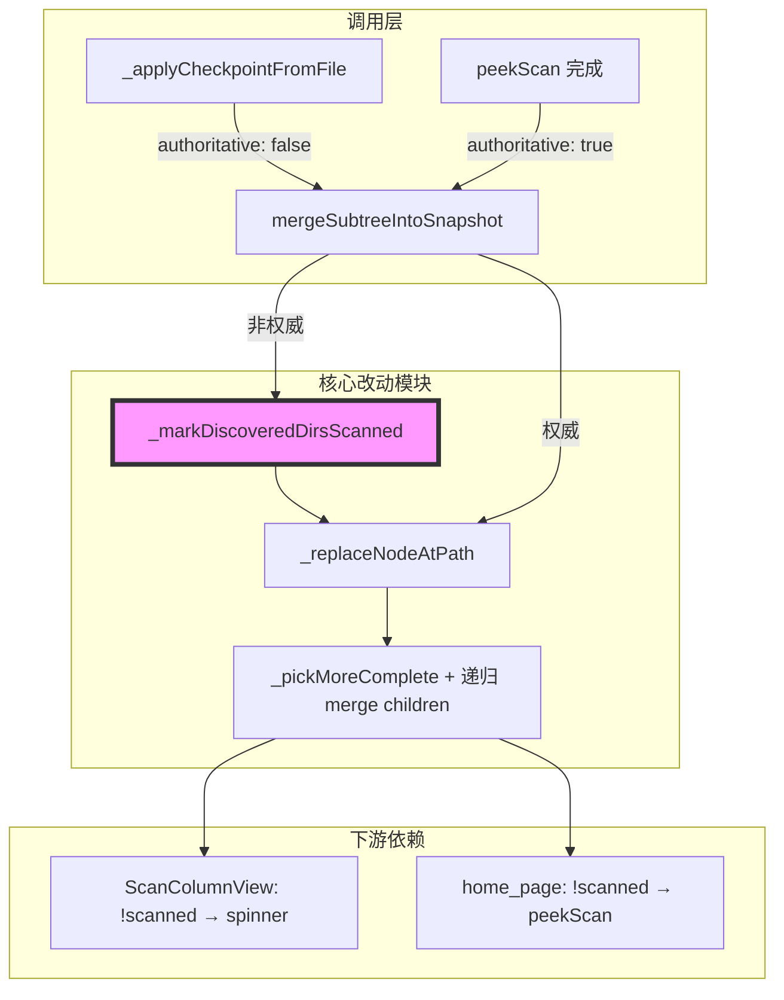
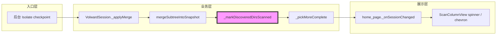

# 代码质量审查报告

---

## 一、基本信息

| 项目 | 内容 |
| :--- | :--- |
| **分支名称** | main |
| **审查时间** | 2026-07-27 09:42 |
| **变更规模** | 3 files changed, +104 insertions, -17 deletions |
| **变更类型** | Bug修复 / 体验优化 |
| **模型型号** | Composer |
---

## 二、变更说明

### 变更概述

**变更主题**：
1. Checkpoint 按目录清除预览 loading：非权威合并前对 checkpoint 树中的目录显式标记 `scanned: true`，使 spinner 在后台 walk 覆盖到该路径时立即消失，而不是拖到全量 Done
2. 目录冲突合并改为子树 upsert：`_pickMoreComplete` 在采纳 checkpoint 目录时递归 `_mergeChildrenByPath`，避免冲掉已 peek 的子树
3. 根列浏览也随 `snapshot_id` 刷新缓存：即使用户仍在根列（`_columnChain` 为空），checkpoint 到达时也会 invalidate，保证 spinner 状态刷新

**核心目的**：解决「loading 像等全量结束才统一消失」的体验问题，改为按目录渐进清除；同时避免为清 spinner 而破坏已有 peek 结果。

**变更类型**：Bug修复 / 体验优化

### 变更明细

#### 主题1：按目录标记 scanned + 子树 upsert 合并 (⚠️)

**改动总结**：`mergeSubtreeIntoSnapshot` 在非权威路径对 `subtreeTree` 调用 `_markDiscoveredDirsScanned`；`_pickMoreComplete` 对目录返回带 `scanned: true` 且 children 经 upsert 合并的节点。权威 peek 路径不打标、仍 wholesale。

**架构图**



**关键改动点**：
1. `_markDiscoveredDirsScanned`：递归给 checkpoint 内所有 `is_dir` 节点写 `scanned: true`
2. `_pickMoreComplete`：目录分支改为 upsert children，而不是整节点替换
3. 新增单测：Documents 被 checkpoint 覆盖后 `scanned: true`，未覆盖的 Downloads 仍为 `false`

**副作用（如有）**：
- **DB**：无
- **缓存**：内存 snapshot / 展示树缓存随 checkpoint 更频繁地按目录更新 `scanned`
- **MQ**：无

#### 主题2：根列也按 snapshot_id 刷新 (👀)

**一句话总结**：`_onSessionChanged` 去掉「仅 `_columnChain.isNotEmpty` 才 invalidate」限制，根列浏览时 spinner 也能随 checkpoint 更新。

---

## 三、影响面分析

**影响概述**：
- **对用户**：Start scan 后，已被 walk 扫到的目录 loading 会逐个消失；未扫到的仍转圈；点击 peek 行为保持
- **对业务**：不改变全量扫描最终语义与删除闭环；只改中间态 `scanned` 与子树合并策略
- **对系统**：每个 checkpoint 增加一次整树标注 + 更深的 children upsert，CPU/分配略增

**业务功能影响概述**：
1. 预览目录 loading 清除时机 - 影响中，兼容性完全兼容，风险点：首次出现在 checkpoint 即标已扫，子项可能仍不完整（渐进展示，符合本次产品意图）
2. 已 peek 子树在后续 checkpoint 下的保留 - 影响中，兼容性完全兼容，风险点：递归 upsert 在大树 checkpoint 上成本更高
3. 根列 UI 刷新 - 影响低，兼容性完全兼容，风险点：与原先「仅列链非空才强刷」相比，根列也会 invalidate（频率仍由 snapshot_id / checkpoint 节流）

**主链路**：后台 `on_checkpoint` → Dart 写盘/读入 → `_applyMerge(authoritative:false)` → `_markDiscoveredDirsScanned` → upsert 合并 → `notifyListeners` → `_onSessionChanged` invalidate → 列视图按 `scanned` 决定 spinner

**调用链路图**



### 核心影响点明细

| 影响点 | 影响类型 | 风险等级 | 说明 | 验证/缓解 |
| :----- | :------- | :------- | :--- | :-------- |
| `_markDiscoveredDirsScanned` | 行为变更 | ⚠️中 | checkpoint 中出现的目录立即 `scanned: true` | 单测覆盖；peek 保护仍靠 size 比较 |
| `_pickMoreComplete` 递归 upsert | 行为/性能 | ⚠️中 | 目录冲突时深合并 children，保 peek、增开销 | 既有 peek 保留单测仍通过 |
| 根列 cache invalidate | 性能 | 👀低 | 空 columnChain 也会随 snapshot_id 刷缓存 | 仍受 checkpoint 频率约束 |

### 风险评估

| 风险点 | 风险等级 | 影响描述 | 缓解措施 |
| :----- | :------- | :------- | :------- |
| 大树 checkpoint 深合并卡顿 | ⚠️中 | Home 级树每次 checkpoint 在 Dart 侧多一次整树标注 + 重叠目录递归 upsert，可能拉长主 isolate 合并耗时 | Rust 侧已有自适应 checkpoint 间隔（≤15s）；建议大目录手测；见问题清单 |
| 过早 `scanned: true` 使该行不再触发 peek | 👀低 | 目录一旦被 checkpoint 覆盖，点击不再 `peekScan` | 与改前「缺省 scanned→true」展示语义一致；未覆盖目录仍可 peek；后续 checkpoint 继续补全子项 |
| 权威 peek 路径误打标 | 👀低 | 若对 peek 结果也 stamp，可能干扰删除语义 | 代码仅在 `!replacementIsAuthoritative` 时调用 `_markDiscoveredDirsScanned` |

### 兼容性声明（如有）

- **API/DTO**：`mergeSubtreeIntoSnapshot` 签名未变；仅非权威合并内部行为增强
- **数据**：不改持久化 snapshot 格式；`scanned` 仍为 Dart 侧展示字段

---

## 四、问题清单

### 🔴 Critical（必须立即修复）

无。

### 🟠 High（合并前必须修复）

无。

> 行为核对（原行为 vs 新行为）：
> - **预览目录被 checkpoint 覆盖**：原 → 缺省无 `scanned`，展示层当已扫，spinner 理论可消但不显式；新 → 显式 `scanned: true`，spinner 必消。功能方向正确。
> - **peek 且 size 更大**：原/新 → 均保留旧节点（`oldScanned && oldSize > newSize`）。未回归。
> - **目录冲突时的 children**：原 → 整节点替换，可能丢掉已 peek 孙树；新 → upsert 保留。功能更稳。

### 🟡 Medium（建议修复）

1. **大树下 `_pickMoreComplete` 递归 upsert 可能加重 checkpoint 合并成本** - `apps/volward/lib/scan_snapshot_merge.dart:258-265`
   - **问题**：每个与旧树重叠的目录在采纳 checkpoint 时都会再跑 `_mergeChildrenByPath`，并可能沿子树递归。配合 `_markDiscoveredDirsScanned` 的整树遍历，单次非权威合并从「按冲突 O(1) 替换」变成「重叠子树 O(n) 深合并 + 额外 O(n) 标注」。在 Home 全量扫描、checkpoint 树已很大时，合并发生在 UI isolate 上，可能造成短暂卡顿。
   - **不修复的后果**：大目录扫描期间，每次 checkpoint 到达时 UI 可能掉帧或短暂停住，抵消「spinner 逐个消失」的体验收益。
   - **建议**：先对手测 Home 扫描做体感确认；若卡顿明显，可改为仅对「旧节点 `scanned == true`（peek）」做 children upsert，普通预览→checkpoint 仍整节点替换（已 stamp `scanned: true`），把深合并限制在少数 peek 路径上。
   ```dart
   if (newChild['is_dir'] == true) {
     final children = oldScanned
         ? _mergeChildrenByPath(_childList(oldChild), _childList(newChild))
         : _childList(newChild);
     return {...newChild, 'scanned': true, 'children': children};
   }
   ```

### 🟢 Low（可选优化）

1. **`[Optional]` `_markDiscoveredDirsScanned` 对文件节点仍先取 children** - `apps/volward/lib/scan_snapshot_merge.dart:201-204`
   - **问题**：`_childList(node)` 在 `isDir` 判断之前执行，文件节点多一次无用分配。
   - **建议**：先判断 `is_dir`，非目录直接 `return node`。
