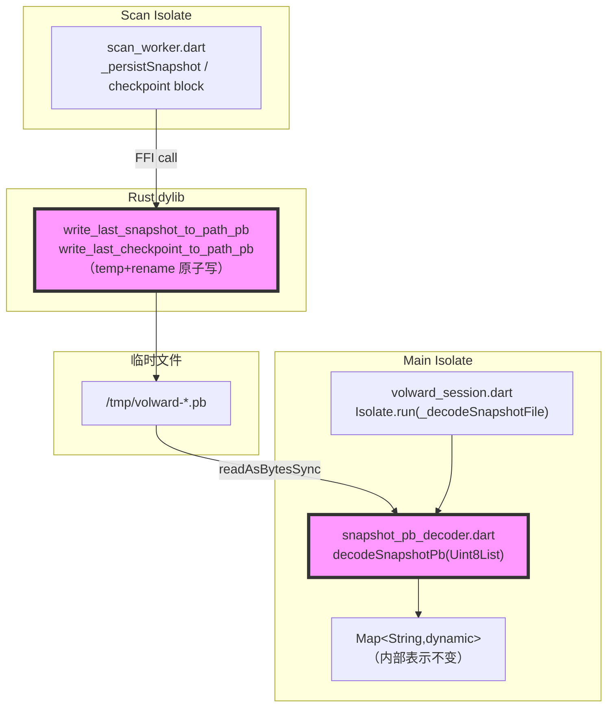
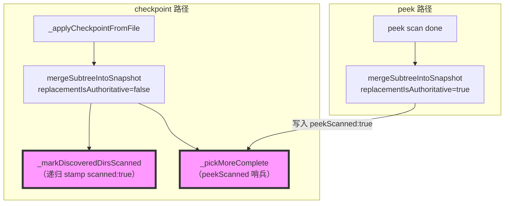

# 代码质量审查报告

---

## 一、基本信息

| 项目 | 内容 |
| :--- | :--- |
| **分支名称** | main |
| **审查时间** | 2026-07-27 13:45 |
| **变更规模** | 7 files changed（含1个新文件），约+600 insertions |
| **变更类型** | 新功能 / 性能优化 |
| **模型型号** | claude-opus-4-8 |

---

## 二、变更说明

### 变更概述

**变更主题**：
1. JSON→Protobuf 快照/检查点文件传输：用 proto3 wire format 替换 Rust→Dart 大体量文件落盘路径
2. 渐进式合并强化：`_markDiscoveredDirsScanned` 递归深层嵌套目录、`_pickMoreComplete` 区分 peek vs checkpoint
3. UI 显示计算节流：给 checkpoint 驱动的 `compute()` 加最小间隔限制，防止大扫描时内存气球

**核心目的**：减少快照文件体积（40–60%）、消除 Rust 端 JSON 串内存峰值、修复 checkpoint merge 上的若干显示回归，并通过节流避免每次 checkpoint 都触发全量重计算。

**变更类型**：新功能 / 性能优化

### 变更明细

#### 主题1：JSON→Protobuf 文件传输 (⚠️)

**改动总结**：新增纯 Dart proto3 解码器 `snapshot_pb_decoder.dart`；在 `native_bridge.dart` 绑定两个 `_pb` FFI 函数；`scan_worker.dart` 的 checkpoint 和 final snapshot 落盘路径优先走 pb；`volward_session.dart` 分发读文件逻辑到 `_decodeSnapshotFile`（按扩展名选 pb/json 解码器）。

**架构图**



**关键改动点**：
- `hasSnapshotFilePbApi` getter：两个 `_pb` 函数都可 lookup 才为 true，旧 dylib 静默降级
- `_persistSnapshot`：优先级链 pb > json file api > 内存 round-trip
- checkpoint block：`usePb` 变量统一控制扩展名和调用路径，pb 写入已是原子的，但仍做 rename 到唯一路径（防下一个 checkpoint 覆写同一路径）
- `_decodeSnapshotFile`：顶层函数（Isolate.run 要求），按 `.pb` 后缀分发

**副作用**：
- **文件 I/O**：pb 文件约比 JSON 小 40–60%；Rust 写盘是 temp+rename 原子操作
- **内存**：Rust 端不再需要将整棵树先序列化为 UTF-8 JSON 字符串再传出

---

#### 主题2：渐进式合并强化 (⚠️)

**改动总结**：`_markDiscoveredDirsScanned` 加递归，确保深层嵌套子目录也被标 `scanned:true`；`_pickMoreComplete` 新增 `peekScanned` 哨兵区分 peek 权威结果与 checkpoint，防止 peek 后出现的 checkpoint 错误降级已完整扫描的目录大小。

**架构图**



**关键改动点**：
- `_markDiscoveredDirsScanned`：从只处理当前节点改为递归 `_childList(node)`
- `_pickMoreComplete`：只有 `peekScanned == true` 的旧节点才能拒绝更小的 incoming checkpoint；普通 checkpoint-stamped 目录仍接受新 checkpoint 数据

---

#### 主题3：测试覆盖增强 (👀)

**一句话总结**：新增"三层嵌套目录 checkpoint rediscovery 递归 stamp"测试用例，直接验证 `_markDiscoveredDirsScanned` 修复。

---

#### 主题4：UI 显示计算节流 (👀)

**一句话总结**：`_scheduleDisplayCompute` 加 `_kLiveComputeMinGap`（3s）节流，防止每次 checkpoint（~2s）都触发全量 isolate compute，减少大扫描时的内存气球和 jank。

---

## 三、影响面分析

**影响概述**：
- **对用户**：快照加载略快，扫描过程 checkpoint 显示更流畅；UI 行为无变化
- **对业务**：wire format 变更对旧 dylib 完全透明（降级到 JSON）
- **对系统**：临时文件从 `.json` 改为 `.pb`；`setLastSnapshot` 仍走 JSON FFI（不变）

**业务功能影响概述**：
1. 快照落盘/读取 - 影响中，兼容性完全兼容（旧 dylib 降级），风险点：pb 解码器字段映射错误会导致快照解析失败
2. 渐进式 checkpoint merge - 影响中，兼容性完全兼容，风险点：`peekScanned` key 命名不一致

**主链路**：scan isolate → Rust pb write → .pb file → Dart Isolate decode → `setLastSnapshot` → UI

**调用链路图**

```mermaid
graph LR
    subgraph "Scan Isolate"
        SI["volwardScanIsolate"]
    end

    subgraph "Rust dylib"
        R["write_last_snapshot_to_path_pb"]
    end

    subgraph "Main Isolate"
        LF["_loadSnapshotFromFile"]
        DF["_decodeSnapshotFile"]
        DPB["decodeSnapshotPb"]
        SLS["setLastSnapshot → Rust"]
    end

    subgraph "UI"
        UI["notifyListeners → build()"]
    end

    SI -->|"FFI"| R
    R -->|".pb file"| DF
    LF --> DF
    DF --> DPB
    DPB -->|"Map"| SLS
    SLS --> UI

    style R fill:#f9f,stroke:#333,stroke-width:4px
    style DPB fill:#f9f,stroke:#333,stroke-width:4px
```

### 核心影响点明细

| 影响点 | 影响类型 | 风险等级 | 说明 | 验证/缓解 |
| :----- | :------- | :------- | :--- | :-------- |
| `decodeSnapshotPb` 字段映射 | 功能正确性 | ⚠️ | 字段号必须与 `proto/volward.proto` 完全匹配 | 已与 .proto 逐字段核对 |
| `peekScanned` key 命名 | 数据一致性 | ⚠️ | 解码器输出 `peek_scanned`，merge 逻辑读 `peekScanned` | 见问题清单 #1 |
| 旧 dylib 兼容 | 兼容性 | 👀 | `hasSnapshotFilePbApi` 为 false 时降级到 JSON | feature flag 已验证 |
| UI 计算节流 | 性能 | 👀 | 3s 间隔可能延迟 checkpoint 数据显示最多 3s | immediate=true 绕过节流 |

### 风险评估

| 风险点 | 风险等级 | 影响描述 | 缓解措施 |
| :----- | :------- | :------- | :------- |
| pb 解码返回 null（文件损坏） | ⚠️ | `StateError('Invalid snapshot file')` 中止扫描 | 外层 try/catch 捕获，和 JSON 路径行为一致 |
| `peekScanned` 命名不一致 | ⚠️ | pb decode 输出的 `peek_scanned` 永远不被 merge 逻辑读取 | 当前无运行时 bug（Rust 不写此字段），见问题清单 |
| pb 解码器无单测 | ⚠️ | 字段映射静默错误只在集成时才暴露 | 见问题清单 #2 |

### 兼容性声明

- **文件格式**：`.pb` 文件仅在 `hasSnapshotFilePbApi == true` 时生成；旧 dylib 始终读写 `.json`，双路径完全隔离
- **内部 Map 结构**：调用方（UI/merge/filter）看到的 `Map<String,dynamic>` shape 不变

---

## 四、问题清单

### 🔴 Critical（必须立即修复）

无

### 🟠 High（合并前必须修复）

无

### 🟡 Medium（建议修复）

1. **`peek_scanned` vs `peekScanned` key 命名不一致** - `snapshot_pb_decoder.dart:186`
   - **问题**：解码器在输出 Map 时使用 `'peek_scanned'`（snake_case），但 `scan_snapshot_merge.dart` 全部通过 `'peekScanned'`（camelCase）读写此字段（第 107、249、260 行）。结果：解码器输出的 `'peek_scanned': false` 是一个永远不会被任何消费方读取的死键；如果将来 Rust 开始持久化此字段，pb 路径解码出的 Map 将无法触发 `_pickMoreComplete` 中的 peek 保护逻辑（第 249 行），导致 checkpoint merge 错误降级已 peek-scanned 的目录大小。
   - **建议**：将解码器输出统一为 `'peekScanned'`，与 merge 逻辑保持一致：
   ```dart
   // snapshot_pb_decoder.dart:186 — 改为 camelCase
   'scanned': scanned,
   if (peekScanned) 'peekScanned': true,   // 只在 true 时写入，匹配 merge 写法
   ```

2. **`decodeSnapshotPb` 无单元测试** - `snapshot_pb_decoder.dart`
   - **问题**：`snapshot_pb_decoder.dart` 是新增的核心解码路径，包含约 300 行手写 proto3 wire 解码逻辑，但没有任何单元测试。字段号、varint 解码、enum 映射的静默错误（例如 `size_bytes` 被错误地截断为有符号范围、enum 值偏移1）只会在完整集成流程中暴露，且表现为 UI 数据异常而非崩溃，难以定位。不修复的后果：字段映射回归无法被 CI 捕获，需人工比对 proto 文件。
   - **建议**：在 `test/` 目录添加 `snapshot_pb_decoder_test.dart`，至少覆盖：
     - 已知字节序列（手工构造或从 Rust `encode_to_vec` 捕获）→ 验证 `snapshot_id`、`size_bytes`、enum 字段、nested tree、`entry_id` absent/present 两种情况
     - 空字节数组 → 返回 null
     - 截断字节数组 → 不崩溃，返回 null

### 🟢 Low（可选优化）

无
