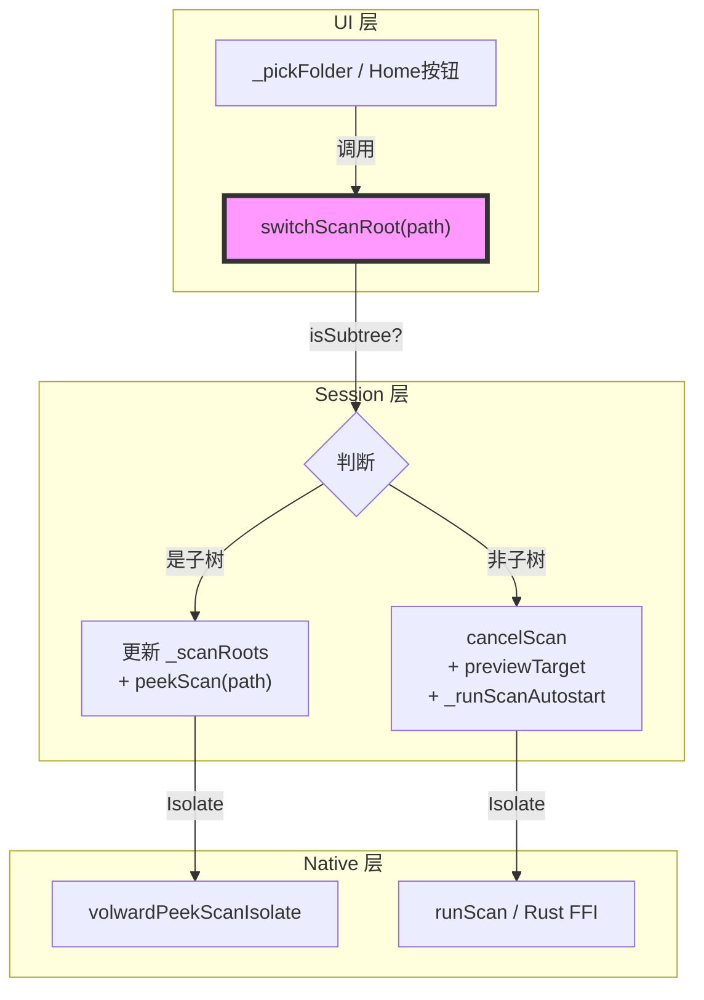
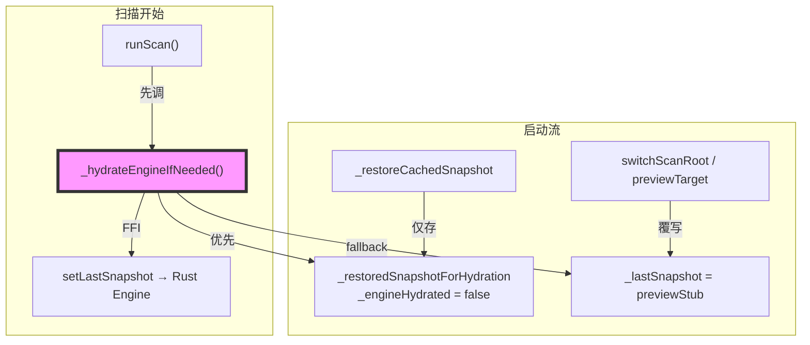
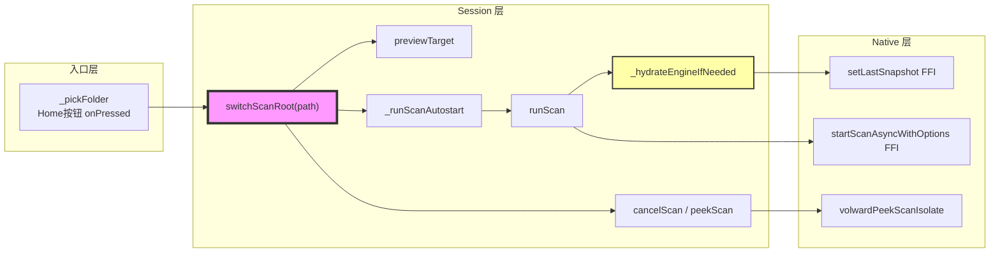

# 代码审查报告

---

## 一、基本信息

| 项目 | 内容 |
| :--- | :--- |
| **分支名称** | main |
| **审查时间** | 2026-07-27 16:07 |
| **变更规模** | 6 files changed, +527 insertions, -109 deletions |
| **变更类型** | 新功能 / Bug修复 / 性能优化 |
| **模型型号** | claude-opus-4-8 |

---

## 二、变更说明

### 变更概述

**变更主题**：
1. Plan B 目录切换：新增 `switchScanRoot` 实现"子目录保持扫描 / 非关联目录取消重扫"的智能切换策略
2. 延迟 FFI 水合：`_restoreCachedSnapshot` 改为延迟调用 `setLastSnapshot`，新增 `_restoredSnapshotForHydration` 防止 preview stub 污染 FFI 入参
3. Progressive 进度计数器：新增 `_scannedDirCount`/`_totalDirCount` O(1) getter，checkpoint 写入时同步标记 `scanned: true`，UI 展示实时进度百分比
4. UI 精简与 peek 可视化：compact chrome 移除冗余进度条，sticky bar 作为唯一进度信息源；列视图高亮 peekInFlight 目录；preview snapshot_id 唯一化避免缓存不刷新

**核心目的**：修复切换目录时进度计数器跳 100%、扫描中出现"failed to hydrate engine"和 PathNotFoundException 两类 exception，以及目录切换后 UI 缓存不刷新等问题；同时增加目录切换的用户体验流畅性。

**变更类型**：新功能 / Bug修复 / 性能优化

---

### 变更明细

#### 主题1：Plan B 目录切换（switchScanRoot） (⚠️)

**改动总结**：新增 `switchScanRoot(String? path)` 替换原来直接 `setScanRoots` + `previewTarget` 的调用方式。切换到当前扫描根的子目录时，保持后台 full scan 运行、仅触发 peekScan；切换到非关联目录时，cancelScan 后重新 previewTarget + 自动启动新扫描。

**架构图**



**关键改动点**：
1. `_pickFolder()` 和两处 Home 按钮全部改用 `switchScanRoot()`，取消扫描中禁用的限制（旧：`onPressed: _s.scanning ? null : _pickFolder`）
2. `_runScanAutostart()` 内部 catch `ScanCancelledException`，避免后续快速切换产生 unhandled future
3. `peekScan` 新增 `hasScanOptionsApi` 前置检查，旧 dylib 直接 return + debugPrint，不再静默进入 `_peekCompleted` 阻止重试

**副作用（如有）**：无 DB/缓存/MQ 影响；`_scanRoots` 状态更新仅在 Dart 侧。

---

#### 主题2：延迟 FFI 水合（_hydrateEngineIfNeeded） (⚠️)

**改动总结**：原来 `_restoreCachedSnapshot` 同步调用 `setLastSnapshot`（主线程 jsonEncode + FFI，大快照几百 ms 卡顿）。改为：restore 时仅设 `_engineHydrated = false`，并把完整的磁盘快照单独存在 `_restoredSnapshotForHydration`；`runScan()` 开始前调 `_hydrateEngineIfNeeded()`，FFI 调用延迟到真正需要时执行，且优先使用完整快照而非可能被 preview stub 覆写的 `_lastSnapshot`。

**架构图**



**关键改动点**：
1. `_restoredSnapshotForHydration ?? _lastSnapshot` — 防止 preview stub（只有顶层目录列表，Rust 无法解析为增量基础）被误传给 FFI
2. hydration 成功后立即置 `_restoredSnapshotForHydration = null` 释放内存
3. `_applyCheckpointFromFile` catch 块过滤 `PathNotFoundException`（Rust 多次发送同一 checkpoint path，第一次读取后删除，后续为预期的 ENOENT）

---

#### 主题3：Progressive 进度计数器 (⚠️)

**改动总结**：原 `scannedFraction` 为 O(树大小) 的全量遍历，每次 checkpoint 都触发完整 walk；改为增量计数器 `_scannedDirCount`/`_totalDirCount`，由 `_recomputeProgressCounters()` 在 `_applyMerge` 结束时、500ms 节流内懒执行，UI 读取为 O(1)。同时 `scan_snapshot_merge.dart` 在 checkpoint merge 时通过 `_markDiscoveredDirsScanned` 立即将重新发现的目录标记 `scanned: true`，进度条实时清除 preview spinner。

**关键改动点**：
1. `_pickMoreComplete` 新增 `peekScanned` 哨兵区分 peek 权威节点（旧用 `scanned: true`，会被 `_markDiscoveredDirsScanned` 误匹配）
2. `scannedFraction` 达到 1.0 时返回 `null`，UI 隐藏进度条而非展示 100%
3. `_scanProgressSummary` clamp 至 99%，移除 `current_path`（避免单行溢出）
4. `peekInFlight` 暴露为不可变 `Set<String>` getter，列视图行高亮正在 peek 的目录

---

#### 主题4：UI 精简 & scan_preview 缓存修复 (👀)

**一句话总结**：compact chrome 移除 `LinearProgressIndicator + Text` 进度块（sticky bar 为唯一信息源）；`buildPreviewSnapshot` 的 `snapshot_id` 改为基于 path + timestamp 的唯一值，修复"Custom → Home"切换时 `_onSessionChanged` 因 id 不变跳过缓存刷新的 bug。

---

#### 主题5：测试补充 (👀)

**一句话总结**：`scan_snapshot_merge_test.dart` 新增 2 个测试：① checkpoint 重新发现的目录立即清除 `scanned: false` spinner；② peekScanned 目录在输给更大 checkpoint 时，孙子节点通过 deep-merge 保留而非被整体覆盖。

---

## 三、影响面分析

**影响概述**：
- **对用户**：扫描中可随时切换目录，不再需要等待扫描完成；进度百分比实时且合理（0-99%）；peek 中的目录有视觉高亮反馈
- **对业务**：目录切换流程全部收拢到 `switchScanRoot`，逻辑统一；旧的 `previewTarget + setScanRoots` 组合调用已清除
- **对系统**：FFI hydration 从启动关键路径移出，消除百毫秒级 UI 卡顿；进度计数器 O(1) 读取，降低 checkpoint 频繁写入时的 CPU 压力

**业务功能影响概述**：
1. 扫描中切换目录 - 影响高，兼容性完全兼容，风险点：非子树切换时 `_engineHydrated` 未重置（见问题清单）
2. 进度展示 - 影响中，兼容性完全兼容，风险点：checkpoint 并发写入时 500ms 节流可能短暂显示过时百分比
3. preview snapshot_id 唯一化 - 影响低，完全兼容，修复既有 bug

**主链路**：用户点击 Folder/Home → `switchScanRoot()` → `cancelScan()/peekScan()` → `_runScanAutostart()` → `runScan()` → `_hydrateEngineIfNeeded()` → Rust FFI

**调用链路图**



### 核心影响点明细

| 影响点 | 影响类型 | 风险等级 | 说明 | 验证/缓解 |
| :----- | :------- | :------- | :--- | :-------- |
| switchScanRoot 非子树切换 | 逻辑正确性 | ⚠️ | 换根后 `_engineHydrated` 未重置，Rust 可能用错误快照做增量扫描 | 需修复，见问题清单 |
| switchScanRoot 并发调用 | 并发安全性 | ⚠️ | `await previewTarget()` 期间可再次触发，两次 `_runScanAutostart` 竞争 | 需修复，见问题清单 |
| `_recomputeProgressCounters` 500ms 节流 | 性能 | 👀 | checkpoint 高频写入时进度百分比可能短暂滞后 | 可接受，scan start/end 均 force=true |
| `peekScanned` 哨兵替换 `scanned` | 逻辑正确性 | 👀 | 修复了 checkpoint 误匹配 peek 权威节点的问题 | 已有测试覆盖 |

### 风险评估

| 风险点 | 风险等级 | 影响描述 | 缓解措施 |
| :----- | :------- | :------- | :------- |
| `_engineHydrated` 未重置导致增量扫描 base 错误 | ⚠️ | 切换到非关联根后，Rust engine 仍持有旧根 snapshot，新根的增量扫描结果可能包含旧根的数据 | 在非子树分支调 cancelScan 后重置标志，见修复建议 |
| switchScanRoot 并发 | ⚠️ | 两次快速切换可能同时触发两个 runScan；_scanRoots 被后来者覆盖，第一次 scan 扫的是错误目录 | 加入 _switchingRoot 互斥标志 |

### 兼容性声明（如有）

- **API/DTO**：`ScanColumnView` 新增 `peekInFlight` 命名参数，默认值 `const {}`，所有现有调用点不受影响（home_page 调用已更新）
- **数据**：`peekScanned` 字段仅写入运行时内存中的快照树，不落盘，无旧数据兼容问题

---

## 四、问题清单

### 🔴 Critical（必须立即修复）

无

### 🟠 High（合并前必须修复）

1. **switchScanRoot 换根后 `_engineHydrated` 未重置** - `volward_session.dart:320-360`
   - **问题**：非子树切换调用 `cancelScan()` 后，`_engineHydrated` 仍为 `true`（只有 `_restoreCachedSnapshot` 会将其设为 false）。`runScan()` 调用 `_hydrateEngineIfNeeded()` 时直接 return，Rust engine 保持旧根的完整快照作为新根扫描的 incremental base。若用户从 ~/Documents 切到 ~/Downloads，Rust 会尝试对 Downloads 做基于 Documents snapshot 的增量扫描，delta 计算结果不正确，产生错误的"已删除"或"已新增"误判。
   - **建议**：在 `switchScanRoot` 的非子树分支，`cancelScan()` 之后立即重置 hydration 状态：

   ```dart
   // Unrelated root: cancel first, then fall through to fresh scan below.
   cancelScan();
   // Reset hydration so the engine doesn't carry the old root's snapshot
   // into the new scan as an incremental base.
   _engineHydrated = false;
   _restoredSnapshotForHydration = null;
   ```

### 🟡 Medium（建议修复）

1. **`switchScanRoot` 缺乏并发防护** - `volward_session.dart:328`
   - **问题**：`await previewTarget()` 是异步等待点（内部启动 Isolate）。若用户在 previewTarget 未完成期间再次点击目录按钮，第二次 `switchScanRoot` 进入时 `_scanning == false`，会覆盖 `_scanRoots` 并触发第二个 `_runScanAutostart()`。结果：第一次 runScan 扫描的是第二次设置的 `_scanRoots`（目录错乱），第二次 runScan 遇到已在运行的扫描后行为取决于 `runScan()` 内部 guard（静默 return 或抛出）。不修复的后果：快速切换目录时可能扫描到错误目录，或产生非预期的错误日志。
   - **建议**：添加 `_switchingRoot` 标志互斥并发调用：

   ```dart
   bool _switchingRoot = false;

   Future<void> switchScanRoot(String? path) async {
     if (_switchingRoot) return; // debounce rapid taps
     _switchingRoot = true;
     try {
       // ... existing logic ...
     } finally {
       _switchingRoot = false;
     }
   }
   ```

### 🟢 Low（可选优化）

无
