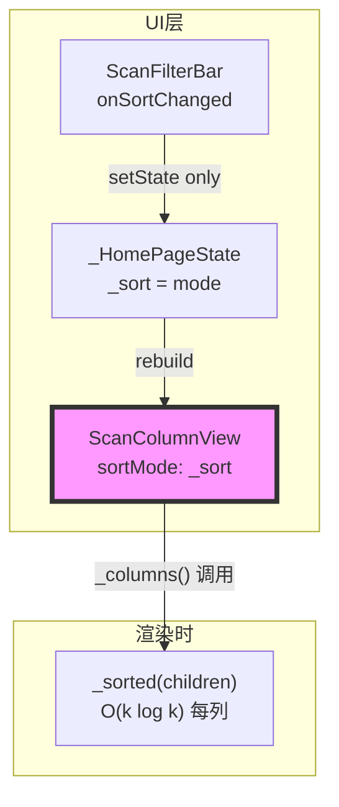
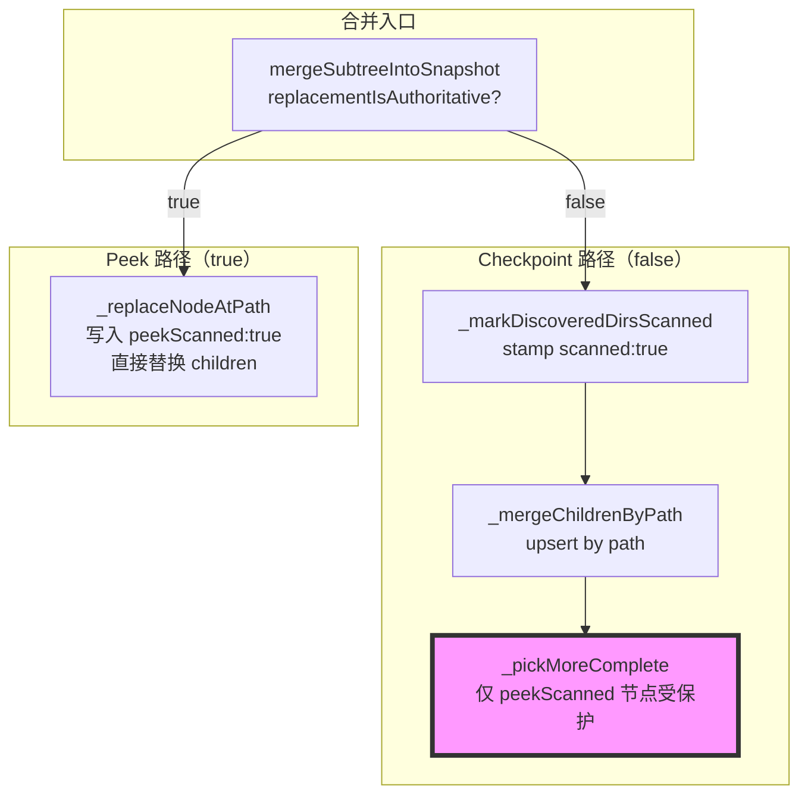
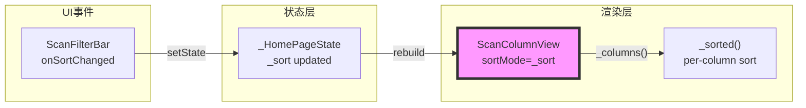

# 完整代码审查报告

---

## 一、基本信息

| 项目 | 内容 |
| :--- | :--- |
| **分支名称** | main |
| **审查时间** | 2026-07-27 12:07 |
| **变更规模** | 4 files changed（home_page.dart · scan_column_view.dart · scan_snapshot_merge.dart · scan_snapshot_merge_test.dart） |
| **变更类型** | Bug修复 / 性能优化 |
| **模型型号** | claude-opus-4-8 |

---

## 二、变更说明

### 变更概述

**变更主题**：
1. UI 卡顿根治：将排序从后台 isolate 移至渲染时，消除 sort/filter 点击卡顿
2. 渐进合并加固：引入 `peekScanned` 哨兵区分 peek 结果与 checkpoint，防止 checkpoint 回退已解析目录

**核心目的**：解决点击排序/类型筛选时主线程被阻塞导致 UI 冻结的问题（isolate 序列化整个快照树），同时修复渐进扫描中 checkpoint 可能覆盖更完整的 peek 扫描结果的问题。

**变更类型**：Bug修复 / 性能优化

### 变更明细

#### 主题1：UI 卡顿根治 — 渲染时排序 (⚠️)

**改动总结**：移除 `onSortChanged` 时触发 `compute()` 的代码路径，将排序职责下移至 `ScanColumnView._sorted()`，在 `build()` 时对每列 K 个子节点（~50-200）做 O(k log k) 排序，主线程无任何阻塞。

**架构图**



**关键改动点**：

1. `_displayTreeCacheKey()` 去掉 `|$_sort`——排序变化不再触发 isolate 重计算
2. `onSortChanged` 由 `setState + _scheduleDisplayCompute(immediate:true)` 简化为纯 `setState(() => _sort = mode)`
3. `ScanColumnView` 新增 `sortMode: ScanSortMode` 参数；`_sorted()` 在 `_columns()` 内对每列子节点排序
4. 移除 sort-only fast path（`compute(_sortOnlyIsolate,...)`）、`_DisplaySortInput`、`_sortOnlyIsolate`、`_liveDataKey`

**原行为 vs 新行为**：
- **原**：点击排序 → `_scheduleDisplayCompute(immediate:true)` → `compute(_sortOnlyIsolate, _DisplaySortInput(tree: _liveTree!, ...))` → 主线程序列化整个 `ScanTreeNode` 树 → UI 冻结数百毫秒
- **新**：点击排序 → `setState(() => _sort = mode)` → Flutter rebuild → `ScanColumnView._sorted(column.children)` → 约 0.5ms → 下一帧生效

---

#### 主题2：渐进合并加固 — peekScanned 哨兵 (⚠️)

**改动总结**：在 `_replaceNodeAtPath` 对 authoritative (peek) 结果写入 `peekScanned: true`；`_pickMoreComplete` 仅在 `peekScanned` 为真时才保护旧数据免于 checkpoint 回退；`_markDiscoveredDirsScanned` 为 checkpoint 所有目录打上 `scanned: true` 以立即清除预览 spinner。

**架构图**



**关键改动点**：

1. `_replaceNodeAtPath`：authoritative merge 写 `peekScanned: true` 到目标节点
2. `_pickMoreComplete`：`oldPeeked = oldChild['peekScanned'] == true`（原先依赖 `scanned`，会将普通 checkpoint 也误认为权威）
3. `_markDiscoveredDirsScanned`：递归地将 checkpoint 树中所有目录标记为 `scanned: true`，使预览 spinner 按目录级别消失而无需等待完整扫描

**原行为 vs 新行为**：
- **原**：`_pickMoreComplete` 用 `scanned` 字段决定是否保护旧数据——checkpoint merge 也会给目录写 `scanned: true`，导致任意 checkpoint 数据都可能被后续 checkpoint 回退保护，逻辑混乱
- **新**：`peekScanned: true` 仅由 authoritative (Wave-2 peek) 写入，checkpoint 只写 `scanned: true`；`_pickMoreComplete` 只保护真正 peek 过的节点

---

## 三、影响面分析

**影响概述**：
- **对用户**：点击排序/类型筛选不再产生可感知的冻结；渐进扫描中 peek 扫过的目录数据不会被 checkpoint 回退；预览 spinner 在后台扫描重发现某目录时立即消失
- **对业务**：扫描结果展示准确性提升（peek 数据保留）；交互响应性质的变化彻底解决卡顿投诉
- **对系统**：主线程 sort change 路径从 O(N) isolate copy 降为 O(k log k) inline；渐进合并状态机从 scanned 单字段扩展为 scanned/peekScanned 双字段

**业务功能影响概述**：
1. 排序切换 - 影响高，兼容完全兼容，风险点：_liveEntries 不随 sort 变化更新（但仅用于计数，无视觉影响）
2. 类型/可删除筛选 - 影响中，兼容完全兼容，风险点：仍走 isolate 路径，行为不变
3. Peek 扫描数据保留 - 影响高，兼容完全兼容，风险点：peekScanned 哨兵仅在运行时内存存在，不持久化

**主链路**：ScanFilterBar.onSortChanged → setState → build → ScanColumnView._sorted()

**调用链路图**



### 核心影响点明细

| 影响点 | 影响类型 | 风险等级 | 说明 | 验证/缓解 |
| :----- | :------- | :------- | :--- | :-------- |
| 排序变化不触发 isolate | 行为变更 | ⚠️ | _liveEntries 在 sort 变化时不重排序；仅用于计数，无视觉影响 | 审查已确认 entry 列表只用于 length 和 id 匹配 |
| _displayTreeCacheKey 去掉 sort | 兼容变更 | ⚠️ | _liveKey 格式变化；首次运行会触发一次额外 compute，之后正常 | 会自动收敛，无需处理 |
| _filteredSortedEntries 排序逻辑变为死代码 | 可维护性 | 👀 | 函数内 switch(_sort) 排序仍存在但不影响展示 | 见问题清单 #1 |
| peekScanned 哨兵引入 | 新字段 | ⚠️ | 内存中有效；Rust 序列化不携带此字段；重启后失效（预期行为） | 测试覆盖 12 个场景 |

### 风险评估

| 风险点 | 风险等级 | 影响描述 | 缓解措施 |
| :----- | :------- | :------- | :------- |
| _liveEntries 排序不随 sort 变化 | ⚠️ | entry 列表sort顺序与当前 _sort 不一致 | 确认 entry 列表只用于计数/ID查找，不展示顺序，可接受 |
| peekScanned 重启后丢失 | 👀 | 重启后无 peek 数据保护，checkpoint 可回退；下次 peek 扫描后恢复 | 预期行为；peekScan 按需触发 |
| ScanColumnView 每次 build 重排序 | 👀 | 多列场景每帧排序 K 个节点；K≤200，<0.5ms，可接受 | 无需缓存；Flutter diffing 保障帧率 |

### 兼容性声明

- **API/DTO**：`ScanColumnView` 新增 `sortMode` 可选参数，默认值 `ScanSortMode.sizeDesc`，所有现有调用站点完全兼容（仅 `home_page.dart` 一处调用，已更新）
- **数据**：`peekScanned` 为纯运行时内存字段，不写入磁盘；无存量数据兼容问题

---

## 四、问题清单

### 🔴 Critical（必须立即修复）

无

### 🟠 High（合并前必须修复）

无

### 🟡 Medium（建议修复）

1. **`_filteredSortedEntries()` 内排序逻辑已成死代码** - `home_page.dart:611-646`
   - **问题**：`_displayTreeCacheKey()` 移除了 `$_sort` 后，该函数的缓存 key 不再随排序变化而失效。`switch (_sort)` 排序分支虽然执行，但排好序的结果在初始冷启动完成后永远不会被读到（冷启动后 `liveHit = true`，走 `_liveEntries` 路径），且冷启动期间 entry 列表只用于计数。不修复的后果：下一个接触此代码的开发者会以为 sort 改变时 `_filteredSortedEntries()` 会返回正确排序结果并加以依赖，引入隐性 bug。
   - **建议**：移除函数内的排序分支，改为直接返回未排序列表；或添加注释说明该函数的排序逻辑已被 `ScanColumnView.sortMode` 取代

   ```dart
   List<Map<String, dynamic>> _filteredSortedEntries() {
     // NOTE: sort is intentionally omitted — ScanColumnView applies sort at
     // render time via sortMode. This list is used for counts only.
     final key = _displayTreeCacheKey();
     if (_cachedFilteredEntries != null && _cachedFilteredEntriesKey == key) {
       return _cachedFilteredEntries!;
     }
     Iterable<Map<String, dynamic>> out = _allSnapshotEntries();
     if (_categoryFilter != null) {
       out = out.where((e) => e['category']?.toString() == _categoryFilter);
     }
     if (_deletableOnly) out = out.where((e) => e['deletable'] == true);
     _cachedFilteredEntries = out.toList();
     _cachedFilteredEntriesKey = key;
     return _cachedFilteredEntries!;
   }
   ```

### 🟢 Low（可选优化）

1. **`scan_snapshot_merge_test.dart` 缺少深层嵌套递归验证** - `scan_snapshot_merge_test.dart`
   - **问题**：`_markDiscoveredDirsScanned` 和 `_mergeChildrenByPath` 均有递归逻辑，但现有测试只覆盖两层（root → dir）。若递归中存在 off-by-one 或提前返回，现有测试无法捕获。不修复的后果：三层以上目录树的 spinner 清除或 peek 数据保留可能静默失效。
   - **建议**：补充一个三层测试：checkpoint 重发现 `root/A/B`（scanned:false），验证 `root/A` 和 `root/A/B` 均被标记为 `scanned: true`

---

## 五、集成测试用例清单

> 本项目为 Flutter/Dart（非 Dubbo），测试用例以 Flutter 单测/widget 测试格式呈现。

### P0 用例（详细可执行）

#### TC-01: 点击排序后列内容立即更新，无 isolate 触发

**测试类型**: Widget test — `_HomePageState` sort callback  
**场景**: 已有 `_liveTree` 和 `_liveEntries`，点击切换排序，验证 `ScanColumnView.sortMode` 更新、无 `compute()` 调用、列顺序在下一帧正确

**前置状态**:
- `_liveTree` 已填充（包含至少2个子节点，sizeDesc: A=500B, B=100B）
- `_liveKey` == `_displayTreeCacheKey()`（liveHit = true）
- 当前 `_sort` = `ScanSortMode.sizeDesc`

**操作**: 调用 `onSortChanged(ScanSortMode.nameAsc)`

**验证点**:
- `_sort` 更新为 `ScanSortMode.nameAsc`
- 未触发 `_scheduleDisplayCompute`（`_computeInFlight` 始终为 false）
- `ScanColumnView` 接收到 `sortMode: ScanSortMode.nameAsc`
- 第一列子节点按名称升序排列（B 在 A 前）
- `_liveKey` 未变化（isolate 未重跑）

**副作用验证**: 无 isolate 调度，无额外 setState 调用

---

#### TC-02: peekScanned 目录在后续 checkpoint 中数据不被回退

**测试类型**: 单测 — `mergeSubtreeIntoSnapshot`  
**场景**: Documents 目录已完成 peek 扫描（size=5000，peekScanned:true），随后来一个 size=0 的 checkpoint，验证 peek 数据被保留

**前置数据**: snapshot 中 Documents 节点含 `peekScanned: true, size_bytes: 5000`

**输入**:
```dart
mergeSubtreeIntoSnapshot(
  snapshot: snapshotWithPeekedDocuments,
  targetPath: '/root',
  subtreeTree: {
    'path': '/root', 'is_dir': true, 'size_bytes': 100,
    'children': [{'path': '/root/Documents', 'is_dir': true, 'size_bytes': 0, 'children': []}],
  },
  subtreeEntries: const [],
)
```

**验证点**:
- `documents['size_bytes']` == 5000（peek 数据保留）
- `documents['peekScanned']` == true（哨兵保留）
- `documents['children']` 仍包含 peek 发现的文件

✅ 已被现有测试 `keeps an already-resolved child` 覆盖

---

#### TC-03: authoritative merge 清理被删文件的 stale entries

**测试类型**: 单测 — `mergeSubtreeIntoSnapshot`  
**场景**: Documents 下有 `deleted.txt` entry，peek rescan 不再包含该文件，验证 entry 被清理且 reclaimable 重算

**输入**:
```dart
mergeSubtreeIntoSnapshot(
  snapshot: snapshotWithDeletedEntry,
  targetPath: '/root/Documents',
  subtreeTree: emptyDocumentsTree,
  subtreeEntries: const [],
  replacementIsAuthoritative: true,
)
```

**验证点**:
- `entries` 不含 `id == 'e-deleted'`
- `entries` 仍含 `id == 'e-other'`（Downloads 下的文件）
- `reclaimable_estimate_bytes` 仅计算剩余 deletable entries

✅ 已被现有测试 `authoritative merge drops stale entries` 覆盖

---

#### TC-04: 切换类型筛选后 isolate 正常触发，排序仍通过 ScanColumnView 生效

**测试类型**: Widget test — `_HomePageState` filter callback  
**场景**: 切换 `_categoryFilter = 'Cache'`，验证 isolate 被触发（filter 改变 key），重计算后 `ScanColumnView.sortMode` 仍为当前 `_sort`

**前置状态**: 正常运行状态，`_sort = ScanSortMode.sizeDesc`

**操作**: 调用 `onCategoryChanged('Cache')`

**验证点**:
- `_scheduleDisplayCompute(immediate: true)` 被调用
- `_computeInFlight` 短暂为 true
- compute 完成后 `_liveKey` 包含新 filter（`snapId|Cache|false`，不含 sort）
- `ScanColumnView` 仍收到 `sortMode: ScanSortMode.sizeDesc`
- 结果列只含 category==Cache 的节点，按 sizeDesc 排序

---

### P1 用例（边界/异常合并精简）

- **`_sorted()`**: 空列表 → 直接返回原引用（`items.length <= 1` short-circuit）；单元素列表 → 直接返回原引用；混合 dir/file → dir 始终排在 file 前，无论 sortMode
- **`mergeSubtreeIntoSnapshot`**: targetPath 不存在于树中 → 返回原 snapshot 不变（`!found` 分支）；entries 含 null id → 忽略，不写入 `byId`
- **`_displayTreeCacheKey()`**: snapshot 为 null → key = `'|null|false'`，不触发 compute
- **`ScanColumnView._columns()`**: `selectionChain` 含非目录节点 → 跳过，不为文件节点创建列

---

### 覆盖度追溯表

| review-report 来源 | 来源内容 | 对应用例编号 | 覆盖状态 |
|:-------------------|:---------|:-------------|:---------|
| 风险评估表 | _liveEntries 排序不随 sort 变化 | TC-01 | ✅已覆盖 |
| 风险评估表 | peekScanned 重启后丢失 | TC-02 | ✅已覆盖（运行时行为验证） |
| 风险评估表 | ScanColumnView 每次 build 重排序 | TC-01 | ✅已覆盖 |
| 核心影响点明细 | 排序变化不触发 isolate | TC-01 | ✅已覆盖 |
| 核心影响点明细 | _displayTreeCacheKey 去掉 sort | TC-01/TC-04 | ✅已覆盖 |
| 核心影响点明细 | peekScanned 哨兵引入 | TC-02/TC-03 | ✅已覆盖 |
| 变更明细 | onSortChanged 纯 setState | TC-01 | ✅已覆盖 |
| 变更明细 | authoritative merge 清理 stale entries | TC-03 | ✅已覆盖 |
| 变更明细 | 类型筛选仍走 isolate 路径 | TC-04 | ✅已覆盖 |
