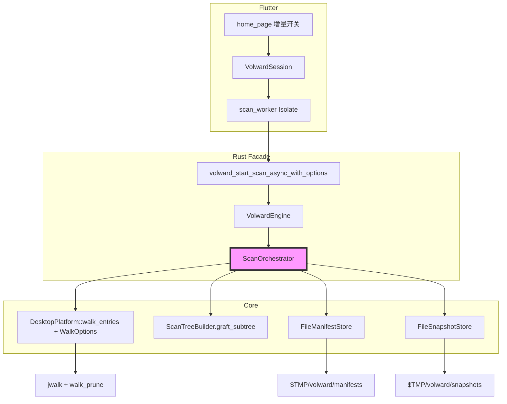
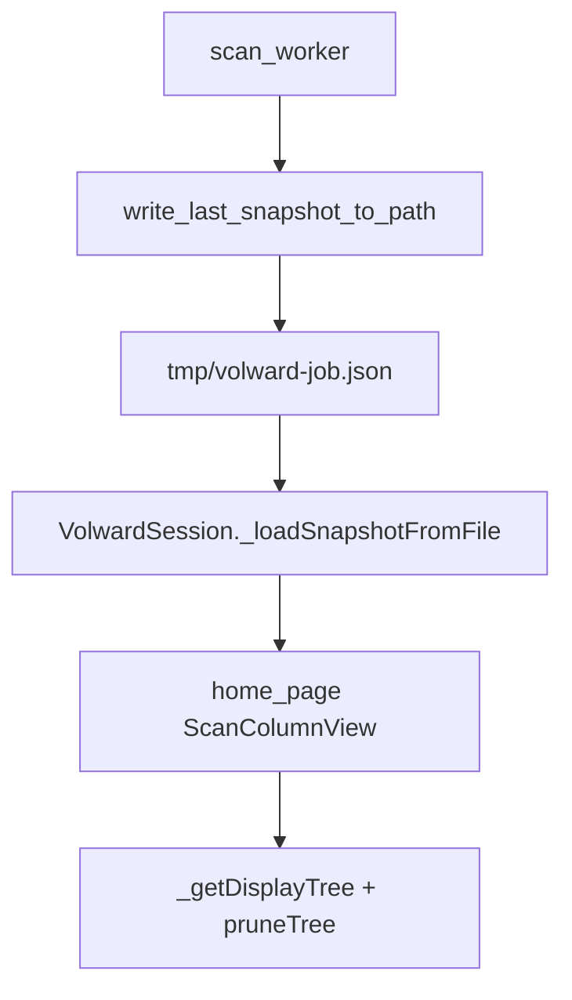
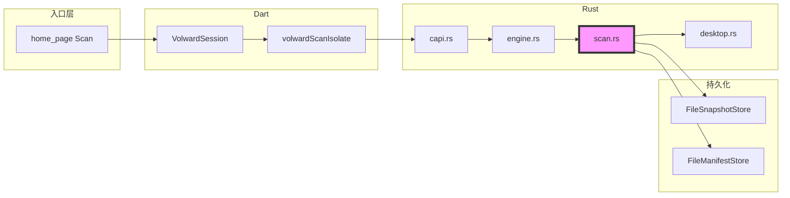

# 代码审查报告

---

## 一、基本信息

| 项目 | 内容 |
| :--- | :--- |
| **分支名称** | main |
| **审查时间** | 2026-07-23 17:42 |
| **变更规模** | 31 files changed, +2745 insertions, -607 deletions（含大量未跟踪新文件） |
| **变更类型** | 新功能 / 性能优化 / 代码重构 |
| **模型型号** | Claude (Cursor Agent) |

---

## 二、变更说明

### 变更概述

**变更主题**：
1. **全盘扫描性能优化（P1）**：Classify 快路径、流式 JSON 落盘、walk 剪枝、ScanTreeBuilder 索引加速
2. **增量扫描（P2 E1/E2）**：目录指纹 manifest、快照持久缓存、子树跳过与 tree/entries graft、Flutter 增量开关
3. **Finder 式扫描结果 UI**：Column 分栏浏览、tree 模型、筛选/排序缓存、Isolate 文件落盘加载
4. **macOS 工程与启动**：移除 CocoaPods、Build Rust script 修复、窗口置前、FDA 设置入口

**核心目的**：以全盘扫描为性能基准，缩短 walk 后处理与二次扫描耗时；扫描结果以 Finder 式目录树展示并保持 Cache 筛选/删除闭环。

**变更类型**：新功能 + 性能优化

### 变更明细

#### 主题1：扫描性能与增量复用 (⚠️)

**改动总结**：Rust 侧减少 classify/排序/序列化开销；walk 剪枝 dev/索引目录；增量模式对比 manifest 指纹跳过未变子树，从缓存 snapshot graft tree 与 entries。

**架构图**

**关键改动点**：
- `Classifier::path_might_match_rules` 零分配预检；`needs_regex_fallback` 与 `desktop.yaml` 对齐
- `write_last_snapshot_to_path` 改为 `BufWriter` + `serde_json::to_writer`
- `WalkOptions.baseline_fingerprints` 驱动 `process_read_dir` 子树跳过
- 扫描完成后 manifest + snapshot 原子落盘，增量扫描加载并 graft

**副作用（如有）**：
- **缓存**：默认 `$TMP/volward/{manifests,snapshots}`，可用 `VOLWARD_CACHE_DIR` 覆盖；系统清理 temp 后增量退化为全量 walk（功能仍可用）

#### 主题2：Finder 式结果展示与扫描链路 (⚠️)

**改动总结**：`ScanTreeNode` 全量 tree + 精简 `entries`（仅分类项）；Isolate 写 tmp JSON → 主线程 hydrate；Column 分栏 + 筛选 prune + `_sortTree` 缓存。

**架构图**

**关键改动点**：
- `StorageSnapshot.tree` + `entries` 分离；Column 浏览走 tree，Cache 筛选走 entries
- `hasSnapshotFileApi` / 旧 dylib 降级检测

#### 主题3：macOS 工程与启动修复 (👀)

**一句话总结**：Podfile 移除改 SPM；`build_rust.sh` 补 input/output；AppDelegate/MainFlutterWindow 主动 activate 修复无法置前。

---

## 三、影响面分析

**影响概述**：
- **对用户**：扫描更快；可选「增量扫描」加速二次扫描；结果以 Finder 分栏展示；FDA 引导更清晰
- **对业务**：Cache/Temp 筛选与删除仍依赖 `entries`；增量复用不改变删除语义（路径仍来自 snapshot）
- **对系统**：单次扫描内存与 JSON 体积随 tree 规模增长；manifest/snapshot 写 temp 目录

**业务功能影响概述**：
1. 全量/指定目录扫描 — 影响高，兼容性完全兼容，风险点：权限路径仍静默 skip
2. 增量扫描 — 影响中，需先有一次全量落盘缓存，风险点：指纹粒度导致内容变更未检出
3. 结果浏览/筛选/删除 — 影响高，兼容性完全兼容，风险点：旧 dylib 缺 FFI 时扫描禁用或增量无效
4. macOS 构建/启动 — 影响中，兼容性需 rebuild Rust dylib

**主链路**：Home Scan → Isolate → Rust walk/classify/tree → tmp JSON → Dart load → Column UI → Delete FFI

**调用链路图**

### 核心影响点明细

| 影响点 | 影响类型 | 风险等级 | 说明 | 验证/缓解 |
| :----- | :------- | :------- | :--- | :-------- |
| Walk 全量 tree 构建 | 性能/内存 | ⚠️ | 百万文件时 tree JSON 仍大 | P1 优化已落地；UI 仅渲染可见列 |
| 增量指纹匹配 | 正确性 | ⚠️ | 仅 mtime+children_count，内容变而指纹不变会 graft 旧数据 | 文档/Tooltip 说明；变更目录会 re-walk |
| FFI 符号版本 | 兼容性 | ⚠️ | 缺 `with_options`/snapshot file API 时增量或扫描失败 | `hasSnapshotFileApi`/`hasScanOptionsApi` 检测 + rebuild 提示 |
| Platform trait 签名 | 兼容性 | 👀 | `walk_entries` 增 `WalkOptions` | 内部 mock 已同步 |
| temp 缓存目录 | 可用性 | 👀 | 系统清理 temp 后增量无效 | 可配置 `VOLWARD_CACHE_DIR` 到 Application Support |

### 风险评估

| 风险点 | 风险等级 | 影响描述 | 缓解措施 |
| :----- | :------- | :------- | :------- |
| 增量扫描展示过期子树 | ⚠️ | 目录内文件内容变更但 mtime/子项数未变时仍复用缓存 | 用户改目录或关闭增量；后续可加 max-child-mtime |
| 旧 native dylib | ⚠️ | 未 rebuild 时缺符号，扫描报错或增量 silently 全量 | 启动日志 + UI 提示 rebuild |
| 权限跳过路径 | 👀 | walk 错误静默 continue，tree 缺子树 | warnings + paths_skipped 统计 |
| temp 缓存丢失 | 👀 | 重启后首次增量等同全量 | 可接受；后续持久化到 Application Support |

### 兼容性声明（如有）

- **API/DTO**：`StorageSnapshot` 含 `tree`；`ScanStats.files_in_snapshot` 语义改为「已分类 entries 数」；`ScanManifest.snapshot_path` 新增 optional；旧 manifest 可反序列化
- **FFI**：保留 `volward_start_scan_async`，新增 `volward_start_scan_async_with_options(incremental)`；旧 dylib 仍可调旧符号
- **数据**：增量依赖同 root 的上次 manifest+snapshot；snapshot_id 不匹配则退化为全量
