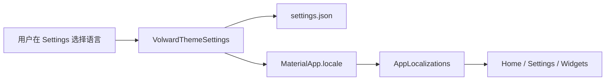

# Volward 中文/英文多语言能力 - 设计规格

## 1. 背景

Volward 当前 Flutter UI 没有统一多语言基础设施。`MaterialApp` 未配置 localization delegates / supported locales，`pubspec.yaml` 未启用 Flutter `gen_l10n`，用户可见文案散落在 `home_page.dart`、`settings_page.dart`、widgets、session 错误提示中。

最近将 `Deletable` 和 `Incremental` 移入设置页后，出现中英文混排，说明问题不是单点文案翻译，而是需要补齐系统性的 i18n 能力。

## 2. 目标

1. 使用 Flutter 官方 `gen_l10n` 建立类型安全的本地化基础设施。
2. 前期支持中文和英文。
3. 支持“跟随系统语言”和“用户手动选择语言”两种模式。
4. 设置页提供语言选择：`System / 中文 / English`。
5. 第一阶段覆盖 Flutter UI 外壳文案，避免新增功能继续硬编码中文或英文。
6. 不改变扫描、删除、目录浏览的数据结构和性能路径。
7. Rust 扫描得到的目录、文件、路径、大小、分类结果原样进入 UI，不因为多语言做内容转换。

## 3. 非目标

1. 第一阶段不改 Rust FFI ABI，不要求 Rust 直接返回本地化文案。
2. 不翻译 debugPrint、日志、JSON key、enum wire value、Rust CLI 输出。
3. 不在第一阶段引入第三方 i18n 框架。
4. 不一次性重写 Home 页结构，只做文案接入和必要的小边界拆分。
5. 不对 Rust 扫描结果做本地化改写，包括文件名、目录名、路径、原始 warning/error 和协议层分类值。

## 4. 方案选择

采用 Flutter 官方 `gen_l10n` + ARB：

- 新增 `l10n.yaml` 配置生成路径。
- 新增 `apps/volward/lib/l10n/app_zh.arb`。
- 新增 `apps/volward/lib/l10n/app_en.arb`。
- `apps/volward/pubspec.yaml` 增加 `flutter_localizations`，并在 `flutter:` 下启用 `generate: true`。
- UI 通过生成的 `AppLocalizations` 读取文案。

不采用手写 `Map<Locale, Map<String, String>>`，因为它没有编译期校验，参数化文案和后续扩语言都会变脆。

## 5. 架构设计

### 5.1 本地化资源

ARB 文件作为 Flutter UI 外壳文案源：

```text
apps/volward/lib/l10n/app_zh.arb
apps/volward/lib/l10n/app_en.arb
```

key 命名按功能区域分组：

- `appTitle`
- `settingsTitle`
- `settingsLanguageTitle`
- `settingsLanguageSystem`
- `settingsLanguageChinese`
- `settingsLanguageEnglish`
- `settingsDeletableOnlyTitle`
- `scanActionStart`
- `scanStatusIncremental`
- `filterCategoryCache`
- `sortSizeDesc`

参数化文案使用 ARB placeholder，例如扫描完成状态中的文件数量。

### 5.2 Context 访问

新增轻量 extension：

```dart
extension AppLocalizationsX on BuildContext {
  AppLocalizations get l10n => AppLocalizations.of(this)!;
}
```

业务 UI 使用 `context.l10n.xxx`。这样减少重复样板，也让后续 review 更容易识别硬编码文案。

### 5.3 语言偏好

新增枚举：

```dart
enum VolwardLocalePreference {
  system,
  zh,
  en,
}
```

`VolwardThemeSettings` 前期扩展为 UI preferences 容器，新增：

- `VolwardLocalePreference localePreference`
- `Locale? get localeOverride`
- `Future<void> setLocalePreference(VolwardLocalePreference preference)`

持久化字段：

```json
{
  "theme_preference": 0,
  "accent_color": 4278233023,
  "locale_preference": 0
}
```

兼容旧 settings：没有 `locale_preference` 时默认 `system`。

### 5.4 MaterialApp 接入

`main.dart` 中 `MaterialApp` 增加：

- `localizationsDelegates`
- `supportedLocales`
- `locale: _themeSettings.localeOverride`

行为：

- `system`：`localeOverride == null`，跟随系统语言。
- `zh`：固定中文。
- `en`：固定英文。

### 5.5 设置页

设置页新增 Language 分组或设置项：

- `System`
- `中文`
- `English`

现有 Appearance、扫描与结果设置全部改为本地化文案。`只显示可清理项` 和 `增量扫描` 继续放在设置页，文案分别解释：

- Deletable only：仅展示 Volward 判定为低风险清理候选的文件，目前主要是缓存和临时文件。
- Incremental scan：扫描同一目录时复用上次未变化的子目录结果，加快后续扫描。

### 5.6 Rust / Native 与扫描结果边界

Rust 负责扫描全盘目录、文件信息，并输出原始扫描结果。Dart/UI 层负责浏览、筛选、排序和展示，不在 i18n 层改写扫描内容。

处理规则：

1. 文件名、目录名、路径、大小、原始分类值、原始 warning/error 都保持 Rust/协议输出，不做翻译和语义映射。
2. 扫描 phase、按钮、状态标题、设置说明、空状态等由 Dart 自己生成的 UI 外壳文案走 `AppLocalizations`。
3. 如果 UI 需要解释某个扫描模式或筛选开关，由 Dart 使用本地化文案解释，不修改 Rust 返回内容。
4. Native 返回未知错误时直接展示原始错误，避免丢失诊断信息。
5. debugPrint 仍输出原始信息，不做本地化。

这样可以先补齐 UI 体验，不扩大 Rust ABI 改动范围，也不破坏“扫描结果保真”的产品原则。

## 6. 第一阶段覆盖范围

必须覆盖：

- `main.dart`：app title、本地化 delegate、supported locales。
- `settings_page.dart`：设置页所有用户可见文案。
- `home_page.dart`：导航、按钮、权限提示、扫描状态、删除结果、空状态。
- `widgets/scan_filter_bar.dart`：All、排序显示名；分类协议值保持不变，展示层可只对固定分类做 label 包装。
- `widgets/scan_column_view.dart`：准备中、无匹配结果。
- `widgets/scan_tree_view.dart`：分类/删除相关可见文案。
- `volward_session.dart`：Dart 自己生成的用户向错误；native 原始错误保留原文。

暂不覆盖：

- debugPrint 日志。
- JSON/protobuf 字段名。
- Rust CLI 输出。
- Rust/native 原始 warning/error。
- 扫描结果中的文件名、目录名、路径、协议层分类值。
- 测试 fixture 内的协议字符串。

## 7. 数据流



## 8. 错误处理

1. ARB 缺 key：由生成代码和 analyzer 暴露。
2. settings 读取失败：沿用当前设置读取失败降级逻辑，语言默认 `system`。
3. settings 中语言值非法：降级 `system`。
4. 系统语言不是中文或英文：Flutter fallback 到 supported locales 中的英文。
5. Native 返回错误：直接展示原始错误，不做吞噬。

## 9. 测试计划

### 9.1 Unit

- `VolwardThemeSettings`：
  - 旧 settings 无 `locale_preference` 时默认 `system`。
  - `zh/en/system` 可以持久化并恢复。
  - 非法 index 降级到 `system`。

### 9.2 Widget

- `SettingsPage`：
  - 中文 locale 下展示“扫描与结果”“只显示可清理项”“增量扫描”。
  - 英文 locale 下展示 “Scan & results”“Deletable only”“Incremental scan”。
  - 切换语言后 `MaterialApp` 文案更新。

- `ScanFilterBar`：
  - 中文 locale 下展示“全部”“大小降序”等。
  - 英文 locale 下展示 “All”“Size desc”等。

### 9.3 Regression

- `dart analyze apps/volward/lib apps/volward/test` 必须无 error。
- `fvm flutter test` 在本机可写 FVM cache 环境中通过。
- 手动验证：
  - 设置语言为 System / 中文 / English。
  - 切换语言不触发扫描、不重置扫描结果。
  - 扫描中设置项禁用逻辑不变。

## 10. 迁移策略

分两步落地：

1. 基础设施阶段：
   - 配置 `gen_l10n`。
   - 增加语言偏好持久化。
   - 设置页接入语言选择。
   - 迁移 SettingsPage 和 ScanFilterBar 文案。

2. 全面覆盖阶段：
   - 迁移 HomePage、ScanColumnView、ScanTreeView、VolwardSession 中由 Dart 生成的用户可见 UI 文案。
   - 保持 native warning/error 和扫描结果原样展示。
   - 补齐 widget / settings tests。

每一步都保持行为不变，只改变文案来源和 locale 选择。

## 11. 验收标准

1. App 支持中文、英文、跟随系统三种语言偏好。
2. 设置页可以切换语言，切换后无需重启即可更新 UI。
3. 第一阶段覆盖范围内没有新增硬编码 Flutter UI 外壳中文/英文文案。
4. 旧 settings 文件仍可正常读取。
5. 扫描、目录浏览、删除流程不因 i18n 接入出现性能退化或状态重置。
6. 扫描结果中的目录、文件、路径、原始 warning/error 与协议值保持保真展示。
7. `dart analyze apps/volward/lib apps/volward/test` 无 error。
